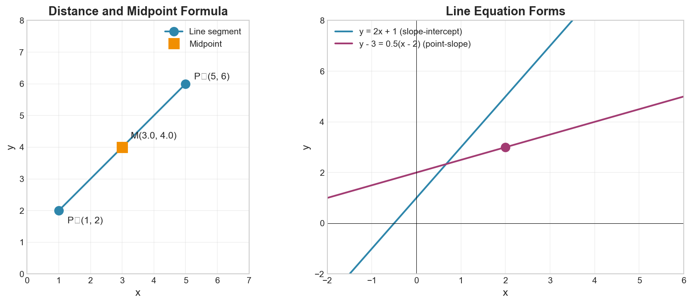

# Week 02: Coordinate Systems and Straight Lines

**Course**: BSMA1001 - Mathematics I
**Level**: Foundation

---

## Visual Summary

---

## 1. Rectangular Coordinate System

### 1.1 Theory

The Cartesian coordinate system represents points in a plane using ordered pairs $(x, y)$. This fundamental concept enables us to visualize relationships between variables.

### 1.2 Mathematical Definition

**Distance Formula**:
$$d = \sqrt{(x_2 - x_1)^2 + (y_2 - y_1)^2}$$

**Midpoint Formula**:
$$M = \left(\frac{x_1 + x_2}{2}, \frac{y_1 + y_2}{2}\right)$$

### 1.3 Key Concepts

- **Origin**: The point $(0, 0)$ where the x-axis and y-axis intersect
- **Quadrants**: The four regions created by the axes
  - Quadrant I: $(+, +)$
  - Quadrant II: $(-, +)$
  - Quadrant III: $(-, -)$
  - Quadrant IV: $(+, -)$

### 1.4 Supply Chain Application

**Retail Context**: Coordinate systems are essential for:
- Store location analysis
- Warehouse placement optimization
- Delivery route planning using geographic coordinates

---

## 2. Slope of a Line

### 2.1 Theory

Slope measures the steepness and direction of a line, representing the rate of change between two variables.

### 2.2 Mathematical Definition

$$m = \frac{y_2 - y_1}{x_2 - x_1} = \frac{\Delta y}{\Delta x} = \frac{\text{rise}}{\text{run}}$$

### 2.3 Types of Slope

| Slope Type | Value | Meaning |
|------------|-------|---------|
| Positive | $m > 0$ | Line rises from left to right |
| Negative | $m < 0$ | Line falls from left to right |
| Zero | $m = 0$ | Horizontal line |
| Undefined | $m = \frac{a}{0}$ | Vertical line |

### 2.4 Supply Chain Application

**Retail Context**: Slope represents rate of change:
- Sales growth rate
- Inventory depletion rate
- Cost increase per unit

A steeper slope indicates faster change.

---

## 3. Parallel and Perpendicular Lines

### 3.1 Theory

Lines with special relationships are identified by their slopes. Parallel lines never intersect, while perpendicular lines meet at right angles.

### 3.2 Mathematical Definition

**Parallel Lines**: Two lines are parallel if and only if they have equal slopes.
$$m_1 = m_2$$

**Perpendicular Lines**: Two lines are perpendicular if and only if the product of their slopes is $-1$.
$$m_1 \cdot m_2 = -1$$

Or equivalently: $m_2 = -\frac{1}{m_1}$ (negative reciprocal)

### 3.3 Supply Chain Application

**Retail Context**:
- Parallel trends indicate products with similar growth patterns
- Perpendicular relationships might indicate inverse demand patterns (substitutes)

---

## 4. Representations of a Line

### 4.1 Theory

Lines can be expressed in multiple forms, each useful for different purposes.

### 4.2 Mathematical Definitions

**Slope-Intercept Form**:
$$y = mx + b$$
- $m$ = slope
- $b$ = y-intercept (where line crosses y-axis)

**Point-Slope Form**:
$$y - y_1 = m(x - x_1)$$
- Useful when you know slope and one point

**General Form (Standard Form)**:
$$Ax + By + C = 0$$
- All terms on one side

**Two-Point Form**:
$$\frac{y - y_1}{y_2 - y_1} = \frac{x - x_1}{x_2 - x_1}$$
- Useful when you know two points

**Intercept Form**:
$$\frac{x}{a} + \frac{y}{b} = 1$$
- $a$ = x-intercept, $b$ = y-intercept

### 4.3 Converting Between Forms

| From | To | Method |
|------|-----|--------|
| Point-Slope | Slope-Intercept | Expand and solve for $y$ |
| Slope-Intercept | General | Rearrange: $mx - y + b = 0$ |
| General | Slope-Intercept | Solve for $y$: $y = -\frac{A}{B}x - \frac{C}{B}$ |

### 4.4 Supply Chain Application

**Retail Context**: Different line forms serve different needs:
- Slope-intercept for forecasting: $y = \text{baseline} + \text{growth} \times \text{time}$
- Point-slope for projections from known values

---

## 5. Straight-Line Fit (Least Squares)

### 5.1 Theory

Straight-line fitting finds the best line through a set of data points, minimizing the overall error between the line and actual values.

### 5.2 Mathematical Definition

**Objective**: Minimize the sum of squared errors
$$\text{Minimize } \sum_{i=1}^{n} (y_i - (mx_i + b))^2$$

**Least Squares Formulas**:

Slope:
$$m = \frac{n\sum xy - \sum x \sum y}{n\sum x^2 - (\sum x)^2}$$

Intercept:
$$b = \bar{y} - m\bar{x}$$

Where:
- $\bar{x}$ = mean of x values
- $\bar{y}$ = mean of y values
- $n$ = number of data points

### 5.3 Alternative Formula for Slope

$$m = \frac{\sum(x_i - \bar{x})(y_i - \bar{y})}{\sum(x_i - \bar{x})^2}$$

### 5.4 Supply Chain Application

**Retail Context**: Line fitting is fundamental to:
- Demand forecasting
- Identifying sales trends
- Projecting future inventory needs from historical data

---

## Summary

| Concept | Formula/Definition |
|---------|-------------------|
| Distance | $d = \sqrt{(x_2-x_1)^2 + (y_2-y_1)^2}$ |
| Midpoint | $M = \left(\frac{x_1+x_2}{2}, \frac{y_1+y_2}{2}\right)$ |
| Slope | $m = \frac{y_2-y_1}{x_2-x_1} = \frac{\Delta y}{\Delta x}$ |
| Parallel Lines | $m_1 = m_2$ |
| Perpendicular Lines | $m_1 \cdot m_2 = -1$ |
| Slope-Intercept Form | $y = mx + b$ |
| Point-Slope Form | $y - y_1 = m(x - x_1)$ |
| General Form | $Ax + By + C = 0$ |

## Key Takeaways

1. The **coordinate system** enables visualization and analysis of relationships between variables

2. **Slope** measures rate of change: $m = \Delta y / \Delta x$

3. **Parallel lines** share slope; **perpendicular lines** have slopes with product $-1$

4. **Multiple line representations** serve different analytical purposes

5. **Least squares fitting** finds the optimal line through data points

---

## Next Week Preview

Week 3 covers **Quadratic Functions** - we'll explore parabolas, finding minima/maxima, and quadratic equations with applications in optimization.

---

*IIT Madras BS Degree in Data Science*
