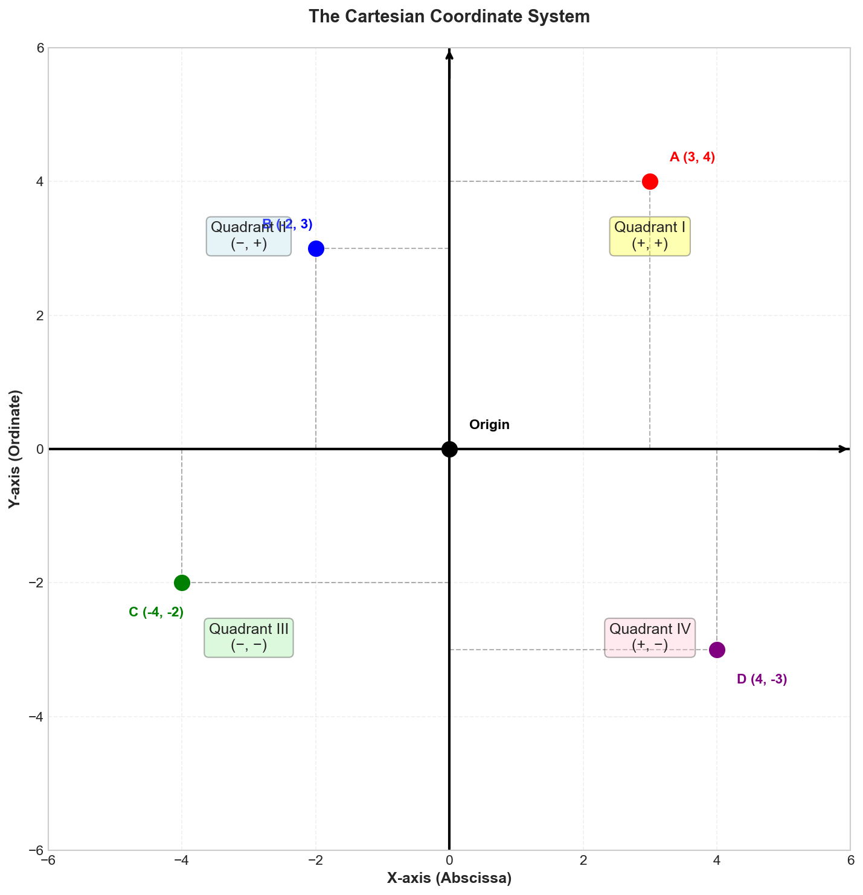
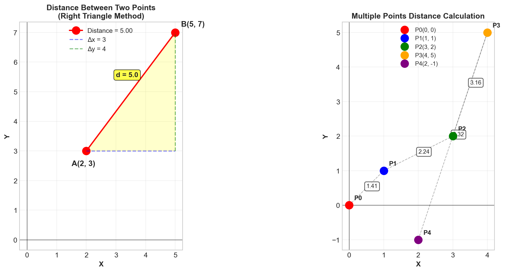
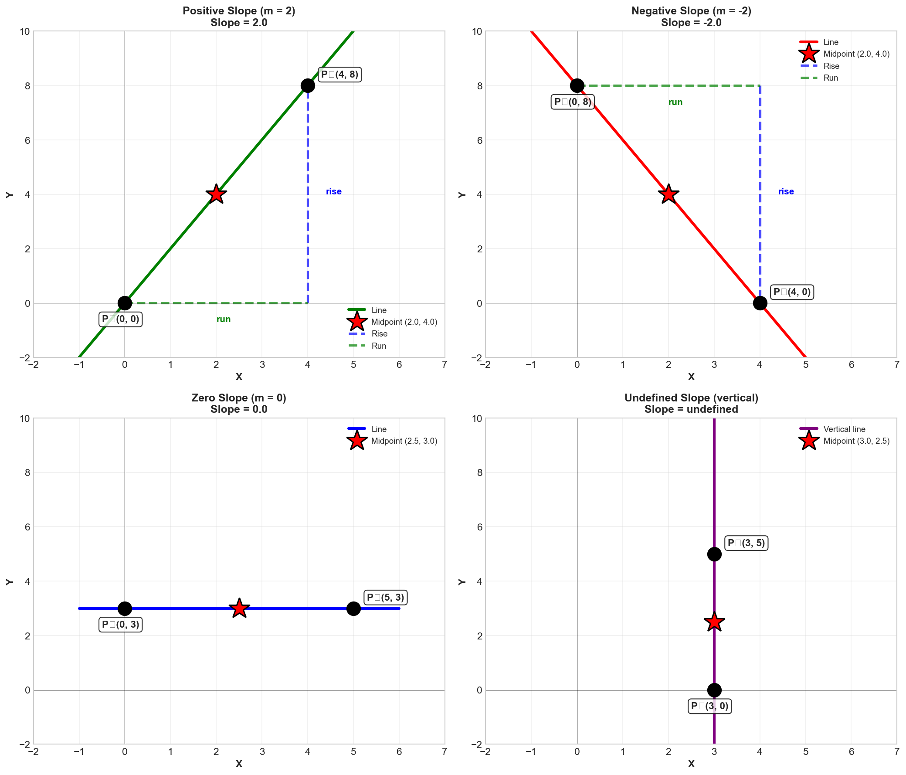
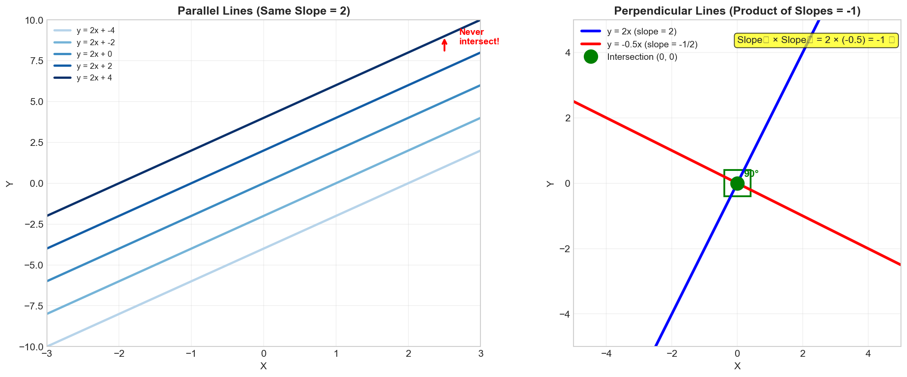
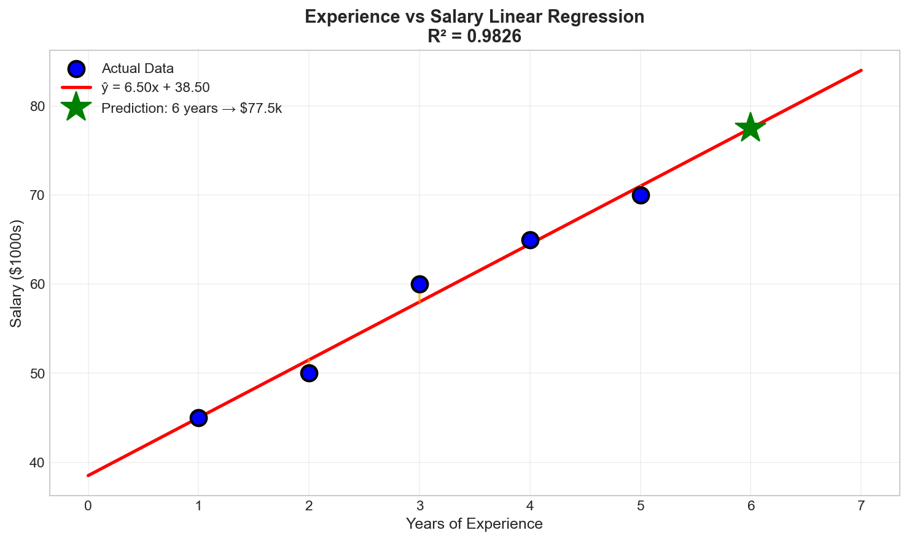

# Week 2: Coordinate Geometry and Straight Lines

**Date**: 2025-11-15  
**Course**: Mathematics for Data Science I (BSMA1001)

## Topics Covered

1. Rectangular Coordinate System
2. Distance and Midpoint Formulas
3. Slope of a Line
4. Parallel and Perpendicular Lines
5. Representations of a Line
6. General Equations of Lines
7. Straight-Line Fit (Linear Regression)

---

## Key Concepts

### 1. Rectangular Coordinate System (Cartesian Plane)

The **Cartesian coordinate system** represents points in 2D space using ordered pairs (x, y).

#### Components
- **X-axis (horizontal)**: Represents the first coordinate
- **Y-axis (vertical)**: Represents the second coordinate  
- **Origin (0, 0)**: Intersection of axes
- **Quadrants**: Four regions divided by the axes

```
Quadrant II (-,+)  |  Quadrant I (+,+)
        -------------------
Quadrant III (-,-) |  Quadrant IV (+,-)
```

#### Ordered Pairs
- **Point**: P = (x, y)
  - x-coordinate (abscissa): horizontal position
  - y-coordinate (ordinate): vertical position
- **(0, y)**: Points on y-axis
- **(x, 0)**: Points on x-axis

**Why important for DS**: Every data point can be plotted; scatter plots visualize relationships

#### Visual Representation



*Figure 1: The Cartesian coordinate system showing all four quadrants, axes, and sample points. This is the foundation for plotting any data visualization.*

### 2. Distance Formula

The **distance** between two points P₁ = (x₁, y₁) and P₂ = (x₂, y₂):

$$d = \sqrt{(x_2 - x_1)^2 + (y_2 - y_1)^2}$$

**Derived from**: Pythagorean theorem

**Applications**:
- Euclidean distance in machine learning
- K-Nearest Neighbors (KNN) algorithm
- Clustering algorithms (K-Means)
- Similarity measures

#### Visual Representation



*Figure 2: Distance formula illustrated with the Pythagorean theorem. Shows how to calculate distance between two points (1,2) and (5,5) using d = √[(x₂-x₁)² + (y₂-y₁)²] = 5.0 units.*

### 3. Midpoint Formula

The **midpoint** M of line segment P₁P₂:

$$M = \left(\frac{x_1 + x_2}{2}, \frac{x_1 + y_2}{2}\right)$$

**Interpretation**: Average of coordinates

### 4. Slope of a Line

**Slope (m)** measures the steepness and direction of a line:

$$m = \frac{y_2 - y_1}{x_2 - x_1} = \frac{\text{rise}}{\text{run}} = \frac{\Delta y}{\Delta x}$$

#### Types of Slopes
- **m > 0**: Line rises (positive correlation)
- **m < 0**: Line falls (negative correlation)
- **m = 0**: Horizontal line (no change in y)
- **m = undefined**: Vertical line (no change in x)

**Why important for DS**: Slope = rate of change = derivative = gradient in ML!

#### Visual Representation



*Figure 3: Four types of slopes visualized:*
- *Positive slope (m=2): Line rises from left to right*
- *Negative slope (m=-1.5): Line falls from left to right*
- *Zero slope (m=0): Horizontal line*
- *Undefined slope: Vertical line*

### 5. Parallel Lines

Two non-vertical lines are **parallel** if and only if:

$$m_1 = m_2$$

- Same slope, different y-intercepts
- Never intersect
- **Example**: y = 2x + 3 and y = 2x - 5 are parallel

### 6. Perpendicular Lines

Two non-vertical lines are **perpendicular** if and only if:

$$m_1 \cdot m_2 = -1 \quad \text{or} \quad m_2 = -\frac{1}{m_1}$$

- Slopes are negative reciprocals
- Intersect at 90°
- **Example**: y = 2x + 1 ⊥ y = -½x + 3

**Special cases**:
- Horizontal line (m = 0) ⊥ Vertical line (undefined)

#### Visual Representation



*Figure 4: Parallel lines (left) have equal slopes, while perpendicular lines (right) have slopes that multiply to -1 (negative reciprocals).*

### 7. Forms of Line Equations

#### Point-Slope Form
Given point (x₁, y₁) and slope m:

$$y - y_1 = m(x - x_1)$$

**When to use**: You know a point and the slope

#### Slope-Intercept Form
$$y = mx + b$$

where:
- m = slope
- b = y-intercept (where line crosses y-axis)

**When to use**: Easiest form for graphing; shows slope and intercept directly

**Why important for DS**: Standard form for linear regression!

#### Standard Form (General Form)
$$Ax + By + C = 0$$

where A, B, C are constants (A and B not both zero)

**When to use**: Mathematical proofs, systems of equations

#### Two-Point Form
Given two points (x₁, y₁) and (x₂, y₂):

$$\frac{y - y_1}{y_2 - y_1} = \frac{x - x_1}{x_2 - x_1}$$

**When to use**: You know two points

#### Intercept Form
Given x-intercept a and y-intercept b:

$$\frac{x}{a} + \frac{y}{b} = 1$$

#### Visual Representation


*Figure 5: All forms of line equations demonstrated with examples showing how to represent the same line in multiple ways - from point-slope to intercept form.*

### 8. Special Lines

- **Horizontal**: y = k (slope = 0)
- **Vertical**: x = h (slope undefined)
- **Identity**: y = x (slope = 1, passes through origin)
- **Origin through P**: y = (y₁/x₁)x

### 9. Linear Regression (Straight-Line Fit)

**Goal**: Find best-fitting line through data points

**Method**: Least Squares Regression
- Minimizes sum of squared vertical distances
- Line: ŷ = mx + b

**Formulas**:
$$m = \frac{n\sum xy - \sum x \sum y}{n\sum x^2 - (\sum x)^2}$$

$$b = \frac{\sum y - m\sum x}{n}$$

where n = number of data points

**Why fundamental**: Basis of all linear models in ML!

#### Visual Representation


*Figure 6: Linear regression comparison showing manual implementation vs sklearn. Both find the optimal best-fit line that minimizes prediction errors (MSE). The R² score of 0.951 indicates excellent fit.*



*Figure 7: Practical application - predicting exam scores from study hours. Shows data points, fitted line (Score = 6.94×Hours + 50.74), and how to use the model for predictions.*

---

## Definitions

- **Cartesian Plane**: 2D coordinate system with perpendicular x and y axes
- **Ordered Pair (x,y)**: Represents a point where x is horizontal, y is vertical position
- **Quadrant**: One of four regions created by coordinate axes
- **Slope**: Rate of change of y with respect to x; m = Δy/Δx
- **Collinear Points**: Three or more points that lie on the same line
- **Y-intercept**: Point where line crosses y-axis (x = 0)
- **X-intercept**: Point where line crosses x-axis (y = 0)
- **Parallel Lines**: Lines with equal slopes that never intersect
- **Perpendicular Lines**: Lines that intersect at 90°; slopes are negative reciprocals
- **Linear Function**: Function of form f(x) = mx + b

---

## Important Formulas

### Distance Formula
$$d = \sqrt{(x_2 - x_1)^2 + (y_2 - y_1)^2}$$

### Midpoint Formula
$$M = \left(\frac{x_1 + x_2}{2}, \frac{y_1 + y_2}{2}\right)$$

### Slope Formula
$$m = \frac{y_2 - y_1}{x_2 - x_1} = \frac{\text{rise}}{\text{run}}$$

### Equations of Lines

**Point-Slope Form**: $y - y_1 = m(x - x_1)$

**Slope-Intercept Form**: $y = mx + b$

**Standard Form**: $Ax + By + C = 0$

**Two-Point Form**: $\frac{y - y_1}{y_2 - y_1} = \frac{x - x_1}{x_2 - x_1}$

**Intercept Form**: $\frac{x}{a} + \frac{y}{b} = 1$

### Parallel & Perpendicular Lines
- **Parallel**: $m_1 = m_2$
- **Perpendicular**: $m_1 \cdot m_2 = -1$ or $m_2 = -\frac{1}{m_1}$

### Linear Regression (Least Squares)
$$m = \frac{n\sum xy - \sum x \sum y}{n\sum x^2 - (\sum x)^2}$$

$$b = \frac{\sum y - m\sum x}{n}$$

---

## Theorems & Proofs

### Theorem 1: Distance Formula Derivation

**Statement**: The distance between points P₁(x₁, y₁) and P₂(x₂, y₂) is:
$$d = \sqrt{(x_2 - x_1)^2 + (y_2 - y_1)^2}$$

**Proof**: 
1. Form a right triangle with P₁P₂ as hypotenuse
2. Horizontal leg: |x₂ - x₁|
3. Vertical leg: |y₂ - y₁|
4. By Pythagorean theorem: $d^2 = (x_2 - x_1)^2 + (y_2 - y_1)^2$
5. Taking square root: $d = \sqrt{(x_2 - x_1)^2 + (y_2 - y_1)^2}$ ∎

### Theorem 2: Perpendicular Lines

**Statement**: Two non-vertical lines are perpendicular if and only if $m_1 \cdot m_2 = -1$

**Intuition**: 
- If line has slope m, a 90° rotation gives slope -1/m
- Product of slopes of perpendicular lines = -1
- Special case: Horizontal (m=0) ⊥ Vertical (undefined)

### Theorem 3: Three Points Collinearity Test

**Statement**: Points A(x₁,y₁), B(x₂,y₂), C(x₃,y₃) are collinear if:
$$\frac{y_2 - y_1}{x_2 - x_1} = \frac{y_3 - y_2}{x_3 - x_2}$$

**Interpretation**: Slope AB = Slope BC

---

## Examples (Worked Problems)

### Example 1: Distance Between Points

**Problem**: Find the distance between A(2, 3) and B(5, 7)

**Solution**:
$$d = \sqrt{(5-2)^2 + (7-3)^2} = \sqrt{3^2 + 4^2} = \sqrt{9 + 16} = \sqrt{25} = 5$$

**Answer**: 5 units

### Example 2: Finding Midpoint

**Problem**: Find the midpoint of line segment joining P(-3, 4) and Q(7, -2)

**Solution**:
$$M = \left(\frac{-3 + 7}{2}, \frac{4 + (-2)}{2}\right) = \left(\frac{4}{2}, \frac{2}{2}\right) = (2, 1)$$

**Answer**: M = (2, 1)

### Example 3: Calculating Slope

**Problem**: Find slope of line through A(1, 2) and B(4, 8)

**Solution**:
$$m = \frac{8 - 2}{4 - 1} = \frac{6}{3} = 2$$

**Interpretation**: For every 1 unit right, line rises 2 units

**Answer**: m = 2

### Example 4: Equation in Slope-Intercept Form

**Problem**: Find equation of line with slope 3 passing through point (2, 5)

**Solution**:
Using point-slope form: $y - 5 = 3(x - 2)$

Expanding: $y - 5 = 3x - 6$

Slope-intercept form: $y = 3x - 1$

**Answer**: y = 3x - 1

### Example 5: Parallel Line Equation

**Problem**: Find equation of line parallel to y = 2x + 3 passing through (1, 4)

**Solution**:
- Parallel lines have equal slopes
- Original slope: m = 2
- Using point-slope: $y - 4 = 2(x - 1)$
- Simplifying: $y = 2x + 2$

**Answer**: y = 2x + 2

### Example 6: Perpendicular Line Equation

**Problem**: Find equation of line perpendicular to y = 2x + 1 through (4, 3)

**Solution**:
- Original slope: m₁ = 2
- Perpendicular slope: $m_2 = -\frac{1}{2}$
- Using point-slope: $y - 3 = -\frac{1}{2}(x - 4)$
- Simplifying: $y - 3 = -\frac{1}{2}x + 2$
- Final form: $y = -\frac{1}{2}x + 5$

**Answer**: $y = -\frac{1}{2}x + 5$

### Example 7: Simple Linear Regression

**Problem**: Given data points (1,2), (2,4), (3,5), (4,7), find best-fit line

**Solution**:
| x | y | xy | x² |
|---|---|----|----|
| 1 | 2 | 2  | 1  |
| 2 | 4 | 8  | 4  |
| 3 | 5 | 15 | 9  |
| 4 | 7 | 28 | 16 |
| **Σ=10** | **Σ=18** | **Σ=53** | **Σ=30** |

n = 4

$$m = \frac{4(53) - (10)(18)}{4(30) - (10)^2} = \frac{212 - 180}{120 - 100} = \frac{32}{20} = 1.6$$

$$b = \frac{18 - 1.6(10)}{4} = \frac{18 - 16}{4} = 0.5$$

**Answer**: ŷ = 1.6x + 0.5

---

## Data Science Applications

### Why Coordinate Geometry Matters

1. **Data Visualization**: Every scatter plot uses the Cartesian plane
2. **Linear Regression**: Foundation of supervised learning
3. **Distance Metrics**: KNN, K-Means clustering rely on distance formulas
4. **Feature Scaling**: Understanding coordinate transformations
5. **Gradient Descent**: Slope concept generalizes to gradients in ML

### Real-World Applications

**Application 1: Housing Price Prediction**
- x-axis: Square footage
- y-axis: Price
- Slope: Price per square foot
- Linear regression finds best-fit line

**Application 2: Sales Forecasting**
- x-axis: Time (months)
- y-axis: Sales
- Slope: Growth rate
- Positive slope = increasing trend

**Application 3: Euclidean Distance in KNN**
- Each data point = coordinates in feature space
- Distance formula finds nearest neighbors
- Classification based on proximity

---

## Practice Problems

### Basic Level
1. Find distance between A(0, 0) and B(3, 4)
2. Find midpoint of segment joining P(-2, 5) and Q(6, -3)
3. Calculate slope of line through (1, 3) and (5, 11)
4. Does point (2, 5) lie on line y = 2x + 1?
5. Find y-intercept of line 3x + 4y = 12

### Intermediate Level
6. Find equation of line with slope -2 through point (3, 7)
7. Determine if lines y = 3x + 2 and y = 3x - 5 are parallel
8. Find equation perpendicular to y = ½x + 3 through origin
9. Check if points A(0,0), B(2,2), C(4,4) are collinear
10. Convert 2x - 3y + 6 = 0 to slope-intercept form

### Advanced Level
11. Find equation of line through (1, 2) and (4, 8). Convert to all forms.
12. Line passes through (2, -3) and is perpendicular to 3x + 4y = 5. Find its equation.
13. Find point on line y = 2x + 1 that is closest to (3, 5)
14. Three vertices of parallelogram are A(0,0), B(2,3), C(6,4). Find fourth vertex D.
15. Perform linear regression on data: (0,1), (1,3), (2,3), (3,6), (4,8)

### Challenge Problems
16. Line L₁: 2x + 3y = 6 intersects L₂: x - y = 1. Find intersection point.
17. Find equation of perpendicular bisector of segment AB where A(1,2), B(7,6)
18. A line passes through (1,3) with slope 2. Find area of triangle formed by this line and coordinate axes.

---

## Questions/Doubts

- [ ] Why is slope undefined for vertical lines?
- [ ] How does linear regression minimize error?
- [ ] What's the geometric interpretation of perpendicular slopes multiplying to -1?
- [ ] When should I use point-slope vs slope-intercept form?
- [ ] How does coordinate geometry extend to 3D?

---

## Action Items

- [x] Review lecture slides on coordinate systems
- [x] Complete distance and slope calculations
- [ ] Work through all notebook examples
- [ ] Practice linear regression by hand
- [ ] Plot lines in Python to visualize concepts
- [ ] Solve textbook exercises: Chapter 2, problems 1-25
- [ ] Connect concepts to previous week's functions

---

## Key Takeaways

1. **Cartesian plane organizes space**: Every point has unique coordinates (x, y)
2. **Distance formula comes from Pythagorean theorem**: Foundation for ML metrics
3. **Slope measures rate of change**: Central concept in calculus and optimization
4. **Multiple forms of line equations**: Choose based on given information
5. **Parallel lines**: Same slope; Perpendicular lines: Negative reciprocal slopes
6. **Linear regression**: Mathematical foundation of machine learning
7. **Visualization matters**: Plotting reveals patterns invisible in numbers

---

## References

- **Textbook**: 
  - Rosen, K.H. - *Discrete Mathematics*, Chapter 2 (Coordinate Geometry)
  - Stewart - *Calculus*, Chapter 1 (Functions and Models)
- **Video Lectures**: 
  - IIT Madras Week 2 lectures
  - Khan Academy: Linear Equations
- **Practice**: 
  - Week 2 Practice Notebook
  - Desmos.com for interactive graphing

---

## Connection to Next Week

Week 3 will introduce:
- **Quadratic functions** (parabolas in coordinate plane)
- **Vertex form** and transformations
- **Graphical analysis** building on linear functions
- **Optimization** using coordinate geometry

The lines we studied this week are special cases of more general functions!

---

**Last Updated**: 2025-11-15  
**Next Class**: Week 3 - Quadratic Functions
