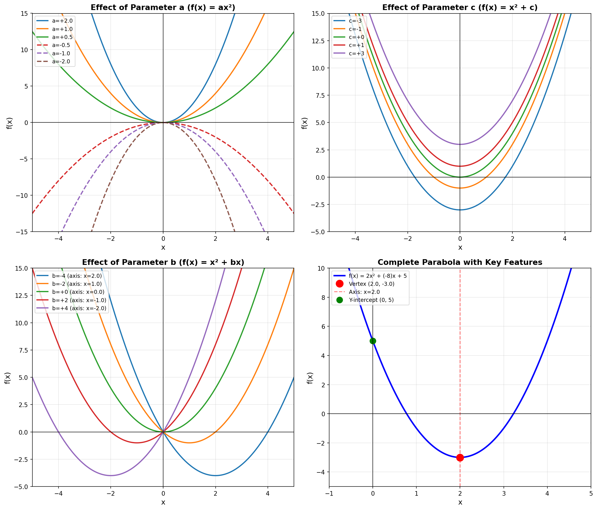
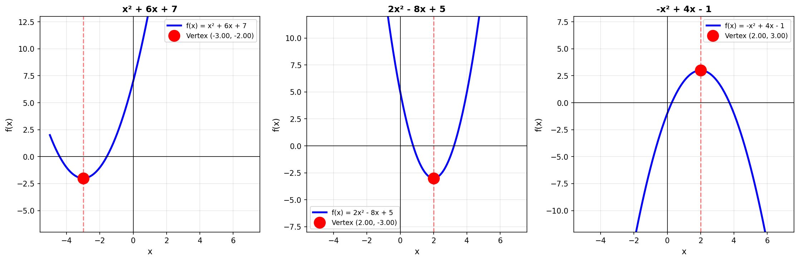
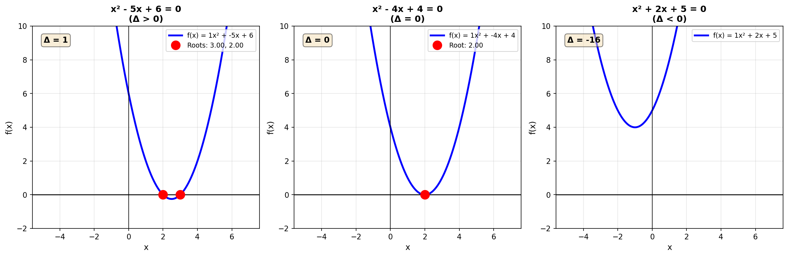

# Week 3: Quadratic Functions and Parabolas

**Date**: 2025-11-16  
**Course**: Mathematics for Data Science I (BSMA1001)

## Topics Covered

1. Quadratic Functions and Standard Form
2. Parabolas and Their Properties
3. Vertex Form and Transformations
4. Completing the Square
5. Quadratic Formula and Discriminant
6. Maxima and Minima (Optimization)
7. Axis of Symmetry and Vertex
8. Roots and Factoring
9. Applications to Real-World Problems

---

## Key Concepts

### 1. Quadratic Functions

A **quadratic function** is a polynomial function of degree 2:

$$f(x) = ax^2 + bx + c$$

where a, b, c are constants and **a ≠ 0**.

**Components**:
- **a**: Leading coefficient (determines opening direction and width)
- **b**: Linear coefficient (affects axis of symmetry)
- **c**: Constant term (y-intercept)

**Graph**: Always a **parabola**

**Why important for DS**: 
- Modeling non-linear relationships
- Loss functions in ML (squared error)
- Optimization problems
- Feature engineering (polynomial features)

### 2. Standard Form vs Vertex Form

#### Standard Form
$$f(x) = ax^2 + bx + c$$

**Advantages**:
- Easy to identify y-intercept (c)
- Simple to evaluate
- Common form for algebraic operations

#### Vertex Form
$$f(x) = a(x - h)^2 + k$$

where (h, k) is the **vertex**

**Advantages**:
- Vertex coordinates immediately visible
- Transformations clearly shown
- Easy to sketch graph
- Optimal form for finding max/min

**Conversion**: Use completing the square

### 3. Parabola Properties

**Opening Direction**:
- **a > 0**: Opens upward (∪) — has minimum
- **a < 0**: Opens downward (∩) — has maximum

**Width**:
- **|a| > 1**: Narrower than y = x²
- **|a| < 1**: Wider than y = x²
- **|a| = 1**: Same width as y = x²

**Vertex**: Turning point (h, k)
- Maximum if a < 0
- Minimum if a > 0

**Axis of Symmetry**: Vertical line through vertex
$$x = h = -\frac{b}{2a}$$

**Y-intercept**: Point where x = 0
$$(0, c)$$

**X-intercepts (Roots)**: Points where y = 0
- Found using quadratic formula
- May be 0, 1, or 2 real roots

#### Visual Representation

*Figure 1: Effects of parameters a, b, c on parabola shape:*
- *Top-left: Parameter 'a' controls opening direction (upward/downward) and width*
- *Top-right: Parameter 'c' shifts parabola vertically (y-intercept)*
- *Bottom-left: Parameter 'b' shifts axis of symmetry horizontally*
- *Bottom-right: Complete example showing all key features (vertex, axis, y-intercept)*

### 4. Finding the Vertex

**Method 1: From Standard Form**
$$h = -\frac{b}{2a}, \quad k = f(h) = f\left(-\frac{b}{2a}\right)$$

**Method 2: Completing the Square**
Convert ax² + bx + c to a(x - h)² + k

**Method 3: From Vertex Form**
Read directly: (h, k)

### 5. Completing the Square

**Purpose**: Convert standard form to vertex form

**Steps** for f(x) = ax² + bx + c:

1. Factor out **a** from first two terms:
   $$f(x) = a(x^2 + \frac{b}{a}x) + c$$

2. Complete the square inside parentheses:
   - Take half of coefficient of x: $\frac{b}{2a}$
   - Square it: $\left(\frac{b}{2a}\right)^2$
   - Add and subtract inside: $x^2 + \frac{b}{a}x + \left(\frac{b}{2a}\right)^2 - \left(\frac{b}{2a}\right)^2$

3. Factor the perfect square:
   $$f(x) = a\left[\left(x + \frac{b}{2a}\right)^2 - \left(\frac{b}{2a}\right)^2\right] + c$$

4. Distribute and simplify:
   $$f(x) = a\left(x + \frac{b}{2a}\right)^2 - \frac{b^2}{4a} + c$$

**Result**: Vertex form with h = -b/(2a), k = c - b²/(4a)

#### Visual Representation

*Figure 2: Completing the square demonstrated with three examples showing how to convert standard form to vertex form. Each graph shows the vertex clearly marked and the parabola's key features.*

### 6. Quadratic Formula

**Solves**: ax² + bx + c = 0

$$x = \frac{-b \pm \sqrt{b^2 - 4ac}}{2a}$$

**Discriminant**: Δ = b² - 4ac

**Nature of Roots**:
- **Δ > 0**: Two distinct real roots
- **Δ = 0**: One repeated real root (touches x-axis)
- **Δ < 0**: No real roots (two complex roots)

**Geometric Meaning**: X-intercepts of parabola

#### Visual Representation

*Figure 3: Three cases of discriminant showing how Δ determines the number and nature of roots. Left: Two distinct roots (Δ>0), Center: One repeated root (Δ=0), Right: No real roots (Δ<0).*

### 7. Optimization (Max/Min)

**Key Insight**: Vertex is the optimal point!

**Finding Maximum/Minimum**:
1. Determine if max or min:
   - a > 0 → minimum at vertex
   - a < 0 → maximum at vertex

2. Find vertex (h, k):
   - h = -b/(2a) (x-coordinate)
   - k = f(h) (y-coordinate = optimal value)

**Application**: 
- Maximizing profit/revenue
- Minimizing cost/error
- Projectile motion (max height)

#### Visual Representation

*Figure 4: Three real-world optimization problems solved using quadratic functions. Left: Revenue maximization, Center: Projectile motion (max height), Right: Area optimization with constraints.*

### 8. Transformations

Starting from f(x) = x²:

| Transformation | Equation | Effect |
|---------------|----------|---------|
| Vertical shift up | f(x) = x² + k | Move up k units |
| Vertical shift down | f(x) = x² - k | Move down k units |
| Horizontal shift right | f(x) = (x - h)² | Move right h units |
| Horizontal shift left | f(x) = (x + h)² | Move left h units |
| Vertical stretch | f(x) = ax² (a>1) | Narrower |
| Vertical compression | f(x) = ax² (0<a<1) | Wider |
| Reflection | f(x) = -x² | Flip over x-axis |
| Combined | f(x) = a(x-h)² + k | All transformations |

### 9. Factored Form

$$f(x) = a(x - r_1)(x - r_2)$$

where r₁ and r₂ are the **roots** (x-intercepts)

**Advantages**:
- Roots immediately visible
- Easy to find x-intercepts
- Useful for solving equations

**Finding roots**: Set f(x) = 0 and solve

---

## Definitions

- **Quadratic Function**: Polynomial of degree 2; f(x) = ax² + bx + c where a ≠ 0
- **Parabola**: U-shaped curve that is the graph of a quadratic function
- **Vertex**: Turning point of parabola; maximum or minimum point
- **Axis of Symmetry**: Vertical line through vertex; divides parabola into mirror images
- **Discriminant (Δ)**: b² - 4ac; determines nature of roots
- **Roots/Zeros**: X-intercepts; values of x where f(x) = 0
- **Leading Coefficient**: The coefficient 'a' of x² term
- **Completing the Square**: Algebraic technique to convert standard form to vertex form
- **Optimization**: Finding maximum or minimum value of a function
- **Y-intercept**: Point where graph crosses y-axis (x = 0)

---

## Important Formulas

### Standard Form
$$f(x) = ax^2 + bx + c$$

### Vertex Form
$$f(x) = a(x - h)^2 + k$$

where (h, k) is the vertex

### Vertex Coordinates
$$h = -\frac{b}{2a}, \quad k = f(h) = c - \frac{b^2}{4a}$$

### Axis of Symmetry
$$x = -\frac{b}{2a}$$

### Quadratic Formula
$$x = \frac{-b \pm \sqrt{b^2 - 4ac}}{2a}$$

### Discriminant
$$\Delta = b^2 - 4ac$$

### Factored Form
$$f(x) = a(x - r_1)(x - r_2)$$

### Completing the Square Template
$$ax^2 + bx + c = a\left(x + \frac{b}{2a}\right)^2 + c - \frac{b^2}{4a}$$

---

## Theorems & Proofs

### Theorem 1: Vertex is Extremum

**Statement**: For f(x) = ax² + bx + c:
- If a > 0, f has a minimum at x = -b/(2a)
- If a < 0, f has a maximum at x = -b/(2a)

**Proof** (using calculus preview):
1. The parabola is symmetric about x = -b/(2a)
2. This point is equidistant from any two points with equal function values
3. Therefore, it must be the turning point (vertex)
4. Since parabola only turns once, this is the global extremum

### Theorem 2: Discriminant Determines Root Nature

**Statement**: For ax² + bx + c = 0:
- Δ > 0 → two distinct real roots
- Δ = 0 → one repeated real root
- Δ < 0 → two complex conjugate roots

**Geometric Interpretation**:
- Δ > 0: Parabola crosses x-axis twice
- Δ = 0: Parabola touches x-axis once (vertex on x-axis)
- Δ < 0: Parabola doesn't touch x-axis

### Theorem 3: Completing the Square Always Works

**Statement**: Any quadratic ax² + bx + c can be written as a(x - h)² + k

**Proof**: See completing the square algorithm in Key Concepts section

---

## Examples (Worked Problems)

### Example 1: Finding Vertex from Standard Form

**Problem**: Find the vertex of f(x) = 2x² - 8x + 5

**Solution**:
$$h = -\frac{b}{2a} = -\frac{-8}{2(2)} = \frac{8}{4} = 2$$

$$k = f(2) = 2(2)^2 - 8(2) + 5 = 8 - 16 + 5 = -3$$

**Answer**: Vertex = (2, -3)

Since a = 2 > 0, this is a **minimum** point.

### Example 2: Converting to Vertex Form

**Problem**: Write f(x) = x² + 6x + 7 in vertex form

**Solution** (completing the square):
$$f(x) = x^2 + 6x + 7$$
$$= (x^2 + 6x + 9) - 9 + 7$$
$$= (x + 3)^2 - 2$$

**Answer**: f(x) = (x + 3)² - 2

**Vertex**: (-3, -2)

### Example 3: Using Quadratic Formula

**Problem**: Solve 2x² - 5x - 3 = 0

**Solution**:
- a = 2, b = -5, c = -3
- Discriminant: Δ = (-5)² - 4(2)(-3) = 25 + 24 = 49

$$x = \frac{-(-5) \pm \sqrt{49}}{2(2)} = \frac{5 \pm 7}{4}$$

$$x_1 = \frac{5 + 7}{4} = 3, \quad x_2 = \frac{5 - 7}{4} = -\frac{1}{2}$$

**Answer**: x = 3 or x = -1/2

**Check**: Δ > 0 ✓ (two distinct real roots)

### Example 4: Optimization Problem

**Problem**: A farmer has 100 meters of fencing. What dimensions maximize the rectangular area?

**Solution**:
Let width = x, then length = (100 - 2x)/2 = 50 - x

Area: A(x) = x(50 - x) = 50x - x² = -x² + 50x

This is quadratic with a = -1 < 0 → has maximum

Vertex: $h = -\frac{50}{2(-1)} = 25$

Maximum area: $A(25) = 25(50 - 25) = 625$ m²

**Answer**: 25m × 25m (square gives maximum area)

### Example 5: Analyzing Discriminant

**Problem**: Find k such that x² + kx + 9 = 0 has exactly one real solution

**Solution**:
For one solution, discriminant must equal zero:

$$\Delta = k^2 - 4(1)(9) = 0$$
$$k^2 - 36 = 0$$
$$k^2 = 36$$
$$k = \pm 6$$

**Answer**: k = 6 or k = -6

### Example 6: Application - Projectile Motion

**Problem**: A ball is thrown with height h(t) = -16t² + 64t + 5 feet, where t is time in seconds.
- (a) Find maximum height
- (b) When does it hit the ground?

**Solution**:

**(a) Maximum height** (vertex):
$$t = -\frac{64}{2(-16)} = 2 \text{ seconds}$$

$$h(2) = -16(2)^2 + 64(2) + 5 = -64 + 128 + 5 = 69 \text{ feet}$$

**(b) Ground level** (h = 0):
$$-16t^2 + 64t + 5 = 0$$

Using quadratic formula:
$$t = \frac{-64 \pm \sqrt{64^2 - 4(-16)(5)}}{2(-16)}$$
$$t = \frac{-64 \pm \sqrt{4096 + 320}}{-32}$$
$$t = \frac{-64 \pm 66.4}{-32}$$

Taking positive solution: t ≈ 4.08 seconds

**Answer**: 
- (a) Maximum height = 69 feet at t = 2 seconds
- (b) Hits ground at t ≈ 4.08 seconds

---

## Data Science Applications

### 1. Loss Functions in Machine Learning

**Mean Squared Error (MSE)**:
$$MSE = \frac{1}{n}\sum_{i=1}^n (y_i - \hat{y}_i)^2$$

This is a quadratic function of prediction errors!
- Optimization minimizes this quadratic
- Gradient descent follows the parabola's slope

### 2. Polynomial Features

Creating quadratic features: x → (x, x²)
- Captures non-linear relationships
- Linear regression on (x, x²) fits parabola
- Improves model flexibility

### 3. Regularization

Ridge regression adds quadratic penalty:
$$J(\theta) = MSE + \lambda \sum \theta_i^2$$

The penalty term is quadratic in parameters.

### 4. Optimization Problems

Many real-world problems are quadratic:
- Portfolio optimization
- Resource allocation
- Revenue maximization
- Cost minimization

### 5. Projectile Motion & Physics Simulations

Trajectory of objects under gravity:
$$y = v_0 \sin(\theta) \cdot t - \frac{1}{2}gt^2$$

Quadratic in time!

#### Visual Representation

*Figure 5: Quadratics in machine learning:*
- *Left: Polynomial regression - linear model fails (R²=0.809), quadratic model succeeds (R²=0.953)*
- *Right: MSE as quadratic function - parabola shape guarantees unique minimum for gradient descent optimization*
- *Key insight: Quadratic loss functions make ML optimization reliable and convergent!*

---

## Practice Problems

### Basic Level
1. Find the vertex of f(x) = x² - 4x + 3
2. Does f(x) = -2x² + 8x - 1 have a maximum or minimum? Find it.
3. Find y-intercept of f(x) = 3x² - 6x + 2
4. Determine axis of symmetry for f(x) = x² + 8x + 12
5. Solve x² - 5x + 6 = 0 by factoring

### Intermediate Level
6. Convert f(x) = x² - 6x + 11 to vertex form using completing the square
7. Use quadratic formula to solve 2x² + 7x - 4 = 0
8. Find discriminant and nature of roots for 3x² - 2x + 5 = 0
9. Write quadratic with roots x = 2 and x = -3, passing through (0, -6)
10. Find range of f(x) = -x² + 4x + 1

### Advanced Level
11. Optimization: Rectangle has perimeter 60m. Find dimensions for maximum area.
12. Find all values of k for which x² - kx + 16 = 0 has equal roots
13. Parabola passes through (0,3), (1,0), (2,5). Find its equation.
14. For what values of m does mx² - 4x + m = 0 have two distinct real roots?
15. Prove that sum of roots of ax² + bx + c = 0 is -b/a

### Challenge Problems
16. Find minimum value of f(x) = x² + (1/x²) for x > 0
17. Projectile: h(t) = -4.9t² + 20t + 2. Find max height and time to hit ground.
18. Revenue R(x) = -2x² + 60x - 100 where x is price. Find optimal price.
19. Complete the square to derive the quadratic formula from ax² + bx + c = 0
20. Find intersection points of y = x² - 2x + 1 and y = 3 - x

---

## Questions/Doubts

- [ ] Why does completing the square always work?
- [ ] What's the relationship between discriminant and graph?
- [ ] How does quadratic formula connect to vertex?
- [ ] Why is squared error used in machine learning?
- [ ] How do complex roots appear geometrically?
- [ ] What's the connection between factored form and roots?
- [ ] Why do parabolas have an axis of symmetry?

---

## Action Items

- [x] Review lecture slides on quadratic functions
- [x] Master completing the square technique
- [ ] Practice all three forms of quadratic equations
- [ ] Work through all notebook examples
- [ ] Solve 20 practice problems
- [ ] Graph multiple parabolas to understand transformations
- [ ] Apply optimization to real-world problem
- [ ] Create visualization comparing different discriminants
- [ ] Textbook exercises: Chapter 3, problems 1-30

---

## Key Takeaways

1. **Three forms, three purposes**: Standard (algebra), Vertex (graphing), Factored (roots)
2. **Vertex is key**: Always the maximum or minimum point
3. **Discriminant tells all**: Number and nature of roots from one value
4. **Parabolas are symmetric**: Axis of symmetry through vertex
5. **Quadratic formula never fails**: Always works when other methods don't
6. **Completing the square bridges forms**: Converts standard to vertex
7. **Applications everywhere**: ML loss functions, optimization, physics
8. **Sign of 'a' determines everything**: Opening direction, max/min, width

---

## References

- **Textbook**: 
  - Stewart - *Precalculus*, Chapter 3 (Quadratic Functions)
  - Rosen - *Discrete Mathematics*, Applications of Quadratics
- **Video Lectures**: 
  - IIT Madras Week 3 lectures
  - Khan Academy: Quadratic Functions
  - 3Blue1Brown: Essence of Calculus (derivatives, optimization)
- **Practice**: 
  - Week 3 Practice Notebook
  - Desmos.com for interactive parabola exploration

---

## Connection to Next Week

Week 4 will explore:
- **Polynomials** (quadratics are degree-2 polynomials!)
- **Higher-degree functions**
- **Polynomial operations** and factoring
- **Complex numbers** (needed when Δ < 0)

Quadratic functions are your gateway to understanding all polynomial functions!

---

**Last Updated**: 2025-11-16  
**Next Class**: Week 4 - Algebra and Polynomials
