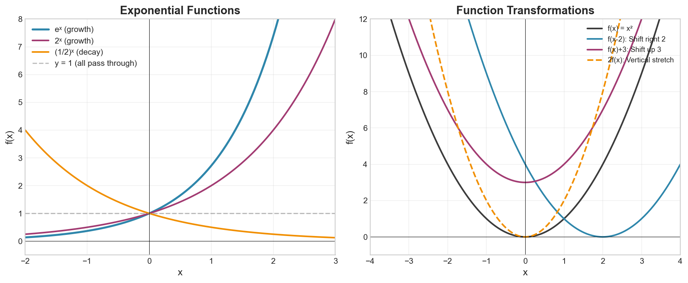

# Week 05: Functions and Transformations

**Course**: BSMA1001 - Mathematics I
**Level**: Foundation

---

## Visual Summary

---

## 1. Horizontal and Vertical Line Tests

### 1.1 Theory

The vertical line test determines if a relation is a function. The horizontal line test determines if a function is one-to-one (has an inverse).

### 1.2 Mathematical Definition

**Vertical Line Test**:
A relation is a **function** if and only if every vertical line intersects the graph at most once.

**Horizontal Line Test**:
A function is **one-to-one** (injective) if and only if every horizontal line intersects the graph at most once.

### 1.3 Summary Table

| Test | What It Determines | Pass Condition |
|------|-------------------|----------------|
| Vertical Line Test | Is it a function? | Each vertical line hits graph ≤ 1 time |
| Horizontal Line Test | Is it one-to-one? | Each horizontal line hits graph ≤ 1 time |

### 1.4 Implications

- Passes **Vertical Test** → Valid function (each input has exactly one output)
- Passes **Horizontal Test** → One-to-one function (has an inverse)
- Passes **Both Tests** → Bijective function (one-to-one correspondence)

### 1.5 Supply Chain Application

**Retail Context**:
- One-to-one mappings ensure unique assignments: each SKU to one bin location, each order to one tracking number
- Non-one-to-one functions group items: many products to one category

---

## 2. Exponential Functions

### 2.1 Theory

Exponential functions model growth or decay where the rate of change is proportional to the current value.

### 2.2 Mathematical Definition

$$f(x) = a \cdot b^x$$

Where:
- $a \neq 0$ (initial value/vertical stretch)
- $b > 0$, $b \neq 1$ (base)

### 2.3 Growth vs Decay

| Condition | Behavior | Example |
|-----------|----------|---------|
| $b > 1$ | Exponential **growth** | Population, compound interest |
| $0 < b < 1$ | Exponential **decay** | Radioactive decay, depreciation |

### 2.4 Natural Exponential Function

$$f(x) = e^x$$

Where $e \approx 2.71828$ (Euler's number)

**Properties of $e^x$**:
- Domain: All real numbers
- Range: $(0, \infty)$
- Always positive
- Passes through $(0, 1)$
- Horizontal asymptote: $y = 0$

### 2.5 General Exponential Model

$$f(t) = A_0 \cdot e^{kt}$$

Where:
- $A_0$ = initial amount
- $k > 0$ = growth rate
- $k < 0$ = decay rate
- $t$ = time

### 2.6 Doubling Time and Half-Life

**Doubling Time** (for growth): $t_d = \frac{\ln 2}{k}$

**Half-Life** (for decay): $t_{1/2} = \frac{\ln 2}{|k|}$

### 2.7 Supply Chain Application

**Retail Context**: Exponential models capture:
- Viral demand growth (new product launches)
- Perishable inventory decay
- Compound growth in customer acquisition
- Product lifecycle adoption curves

---

## 3. Composite Functions

### 3.1 Theory

Composite functions chain operations together — the output of one function becomes the input of another.

### 3.2 Mathematical Definition

$$(f \circ g)(x) = f(g(x))$$

Read as "$f$ composed with $g$" or "$f$ of $g$ of $x$"

### 3.3 Order Matters

**Important**: $f \circ g \neq g \circ f$ in general!

Example:
- Let $f(x) = x^2$ and $g(x) = x + 1$
- $(f \circ g)(x) = f(g(x)) = (x+1)^2$
- $(g \circ f)(x) = g(f(x)) = x^2 + 1$

### 3.4 Domain of Composite Functions

The domain of $f \circ g$ consists of all $x$ such that:
1. $x$ is in the domain of $g$, AND
2. $g(x)$ is in the domain of $f$

### 3.5 Decomposing Functions

Any complex function can be broken down into simpler compositions:

Example: $h(x) = \sqrt{x^2 + 1}$
- Let $g(x) = x^2 + 1$ (inner function)
- Let $f(x) = \sqrt{x}$ (outer function)
- Then $h(x) = (f \circ g)(x)$

### 3.6 Supply Chain Application

**Retail Context**: Composite functions model multi-step processes:
- Raw cost → wholesale price → retail price → discounted price
- Data pipelines as compositions of transformations
- Multi-stage manufacturing cost calculations

---

## 4. Inverse Functions

### 4.1 Theory

An inverse function reverses the action of the original function. Only one-to-one functions have inverses.

### 4.2 Mathematical Definition

If $f(a) = b$, then $f^{-1}(b) = a$

**Notation**: $f^{-1}$ denotes the inverse function (not $\frac{1}{f}$!)

### 4.3 Properties of Inverse Functions

1. **Composition Property**:
   - $(f^{-1} \circ f)(x) = x$ for all $x$ in domain of $f$
   - $(f \circ f^{-1})(x) = x$ for all $x$ in domain of $f^{-1}$

2. **Domain/Range Swap**:
   - Domain of $f^{-1}$ = Range of $f$
   - Range of $f^{-1}$ = Domain of $f$

3. **Graphical Relationship**:
   - Graph of $f^{-1}$ is the reflection of graph of $f$ across the line $y = x$

### 4.4 Finding Inverse Functions

Steps to find $f^{-1}(x)$:
1. Write $y = f(x)$
2. Swap $x$ and $y$
3. Solve for $y$
4. Replace $y$ with $f^{-1}(x)$

### 4.5 Verifying Inverses

To verify that $g = f^{-1}$, check both:
- $f(g(x)) = x$
- $g(f(x)) = x$

### 4.6 Supply Chain Application

**Retail Context**: Inverse functions solve reverse problems:
- Given a target profit, find required sales volume
- Given a delivery deadline, find latest shipping date
- Given target inventory level, find required order quantity
- Essential for planning and goal-setting

---

## Summary

| Concept | Key Formula/Definition |
|---------|----------------------|
| Vertical Line Test | Determines if relation is a function |
| Horizontal Line Test | Determines if function is one-to-one |
| Exponential Function | $f(x) = a \cdot b^x$ |
| Natural Exponential | $f(x) = e^x$, where $e \approx 2.71828$ |
| Composite Function | $(f \circ g)(x) = f(g(x))$ |
| Inverse Function | $f(f^{-1}(x)) = f^{-1}(f(x)) = x$ |
| Inverse Graph | Reflection of $f$ across $y = x$ |

## Key Takeaways

1. **Vertical line test** identifies functions; **horizontal line test** identifies one-to-one functions

2. **Exponential functions** $f(x) = ab^x$ model proportional growth ($b > 1$) or decay ($0 < b < 1$)

3. **Composite functions** $(f \circ g)(x) = f(g(x))$ chain operations — order matters!

4. **Inverse functions** reverse mappings; only one-to-one functions have inverses

5. The graph of $f^{-1}$ is the **reflection** of $f$ across the line $y = x$

---

## Next Week Preview

Week 6 covers **Logarithmic Functions** — the inverses of exponential functions with powerful applications in data analysis.

---

*IIT Madras BS Degree in Data Science*
