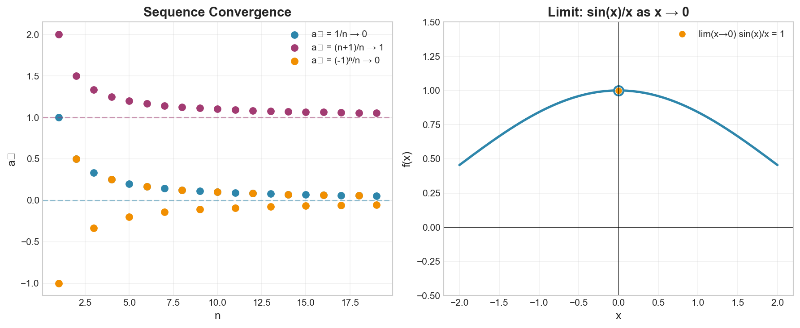

# Week 07: Sequences, Limits, and Continuity

**Course**: BSMA1001 - Mathematics I
**Level**: Foundation

---

## Visual Summary

---

## 1. Sequences

### 1.1 Theory

A sequence is an ordered list of numbers following a pattern. Understanding sequence behavior (convergent, divergent, oscillating) is essential for analyzing iterative processes.

### 1.2 Mathematical Definition

A sequence is a function $a: \mathbb{N} \to \mathbb{R}$, written as $\{a_n\}$ or $a_1, a_2, a_3, ...$

**Convergence**: A sequence $\{a_n\}$ converges to limit $L$ if:
$$\lim_{n \to \infty} a_n = L$$

Formally (epsilon-N definition):
$$\forall \epsilon > 0, \exists N \in \mathbb{N}: n > N \Rightarrow |a_n - L| < \epsilon$$

### 1.3 Types of Sequences

| Type | Behavior | Example |
|------|----------|---------|
| Convergent | Approaches a finite limit | $a_n = \frac{1}{n} \to 0$ |
| Divergent | Goes to $\pm\infty$ | $a_n = n \to \infty$ |
| Oscillating | Alternates without settling | $a_n = (-1)^n$ |
| Bounded | Stays within finite bounds | $a_n = \sin(n)$ |

### 1.4 Common Sequences and Their Limits

| Sequence | Limit |
|----------|-------|
| $\frac{1}{n}$ | $0$ |
| $\frac{n}{n+1}$ | $1$ |
| $\left(1 + \frac{1}{n}\right)^n$ | $e$ |
| $\frac{a^n}{n!}$ for any $a$ | $0$ |
| $r^n$ where $\|r\| < 1$ | $0$ |

### 1.5 Arithmetic and Geometric Sequences

**Arithmetic Sequence**: $a_n = a_1 + (n-1)d$
- Common difference: $d = a_{n+1} - a_n$

**Geometric Sequence**: $a_n = a_1 \cdot r^{n-1}$
- Common ratio: $r = \frac{a_{n+1}}{a_n}$
- Converges if $|r| < 1$

### 1.6 Supply Chain Application

**Retail Context**:
- Iterative forecasting methods
- Inventory smoothing (exponential smoothing)
- Optimization algorithms converging to solutions
- Successive approximation methods

---

## 2. Functions of One Variable and Graphs

### 2.1 Theory

A function of one variable maps each input to exactly one output. The graph provides a visual representation of this mapping.

### 2.2 Mathematical Definition

For $f: D \rightarrow \mathbb{R}$ where $D \subseteq \mathbb{R}$:

- **Domain**: Set of valid inputs (all $x$ values where $f(x)$ is defined)
- **Range**: Set of outputs (all possible $f(x)$ values)
- **Graph**: Set of points $\{(x, f(x)) : x \in D\}$

### 2.3 Key Concepts

**Increasing Function**: $x_1 < x_2 \Rightarrow f(x_1) < f(x_2)$

**Decreasing Function**: $x_1 < x_2 \Rightarrow f(x_1) > f(x_2)$

**Tangent Line** at point $(a, f(a))$: Line that touches the curve at exactly one point locally, with slope equal to the derivative $f'(a)$

### 2.4 Supply Chain Application

**Retail Context**: Single-variable functions model relationships like:
- Price-to-demand curves
- Time-to-sales relationships
- Inventory-level-to-cost functions
- Tangent lines represent instantaneous rates of change

---

## 3. Limits of Functions

### 3.1 Theory

The limit describes the value a function approaches as the input approaches a certain value. Limits are foundational for derivatives and integrals.

### 3.2 Mathematical Definition

$$\lim_{x \to a} f(x) = L$$

Means: As $x$ gets arbitrarily close to $a$, $f(x)$ gets arbitrarily close to $L$.

**Formal (epsilon-delta) definition**:
$$\forall \epsilon > 0, \exists \delta > 0: 0 < |x - a| < \delta \Rightarrow |f(x) - L| < \epsilon$$

### 3.3 Limit Laws

If $\lim_{x \to a} f(x) = L$ and $\lim_{x \to a} g(x) = M$, then:

| Law | Formula |
|-----|---------|
| Sum | $\lim[f(x) + g(x)] = L + M$ |
| Difference | $\lim[f(x) - g(x)] = L - M$ |
| Product | $\lim[f(x) \cdot g(x)] = L \cdot M$ |
| Quotient | $\lim\frac{f(x)}{g(x)} = \frac{L}{M}$ (if $M \neq 0$) |
| Constant Multiple | $\lim[c \cdot f(x)] = c \cdot L$ |
| Power | $\lim[f(x)]^n = L^n$ |

### 3.4 One-Sided Limits

**Left-hand limit**: $\lim_{x \to a^-} f(x)$ (approaching from the left)

**Right-hand limit**: $\lim_{x \to a^+} f(x)$ (approaching from the right)

**Limit exists** if and only if both one-sided limits exist and are equal:
$$\lim_{x \to a} f(x) = L \iff \lim_{x \to a^-} f(x) = \lim_{x \to a^+} f(x) = L$$

### 3.5 Limits at Infinity

$$\lim_{x \to \infty} f(x) = L$$

Describes horizontal asymptote behavior as $x$ grows without bound.

### 3.6 Supply Chain Application

**Retail Context**: Limits describe behavior at boundaries:
- What happens as inventory approaches zero (stockout behavior)
- As demand approaches capacity (saturation effects)
- As time approaches deadline (urgency impact)

---

## 4. Continuity

### 4.1 Theory

A continuous function has no breaks, jumps, or holes. Continuity ensures predictable behavior and is required for many calculus operations.

### 4.2 Mathematical Definition

Function $f$ is **continuous at $x = a$** if all three conditions hold:

1. $f(a)$ is **defined**
2. $\lim_{x \to a} f(x)$ **exists**
3. $\lim_{x \to a} f(x) = f(a)$ (limit equals function value)

**Continuous on interval**: $f$ is continuous at every point in the interval.

### 4.3 Types of Discontinuity

| Type | Description | Visual |
|------|-------------|--------|
| **Removable** | Limit exists but $f(a)$ is undefined or different | Hole in graph |
| **Jump** | Left and right limits exist but are different | Step/jump |
| **Infinite** | Function approaches $\pm\infty$ | Vertical asymptote |
| **Oscillating** | Function oscillates infinitely near point | Wild oscillation |

### 4.4 Properties of Continuous Functions

If $f$ and $g$ are continuous at $a$, then:
- $f + g$ is continuous at $a$
- $f - g$ is continuous at $a$
- $f \cdot g$ is continuous at $a$
- $\frac{f}{g}$ is continuous at $a$ (if $g(a) \neq 0$)
- $f \circ g$ is continuous at $a$ (if applicable)

### 4.5 Important Theorems

**Intermediate Value Theorem**: If $f$ is continuous on $[a, b]$ and $k$ is between $f(a)$ and $f(b)$, then there exists $c \in (a, b)$ such that $f(c) = k$.

**Extreme Value Theorem**: If $f$ is continuous on $[a, b]$, then $f$ attains a maximum and minimum on $[a, b]$.

### 4.6 Supply Chain Application

**Retail Context**: Discontinuities represent threshold effects:
- Tiered pricing (jump discontinuities)
- Quantity discounts at breakpoints
- Seasonal transitions
- Capacity constraints

---

## Summary

| Concept | Key Definition |
|---------|---------------|
| Sequence Convergence | $\lim_{n \to \infty} a_n = L$ |
| Function Limit | $\lim_{x \to a} f(x) = L$ |
| Continuity at $a$ | $f(a)$ defined, limit exists, limit = $f(a)$ |
| One-Sided Limits | $\lim_{x \to a^-}$ and $\lim_{x \to a^+}$ |
| Removable Discontinuity | Limit exists but ≠ $f(a)$ |
| Jump Discontinuity | Left limit ≠ Right limit |

## Key Takeaways

1. **Sequences** converge when terms approach a finite limit as $n \to \infty$

2. **Functions of one variable** map inputs to outputs; graphs visualize this mapping

3. **Limits** describe function behavior as inputs approach specific values

4. **Continuity** requires: function defined, limit exists, and limit equals function value

5. **Discontinuities** are classified as removable, jump, or infinite

6. **Intermediate Value Theorem** guarantees roots exist for continuous functions

---

## Next Week Preview

Week 8 covers **Derivatives and Critical Points** — we'll learn to find rates of change and optimize functions.

---

*IIT Madras BS Degree in Data Science*
