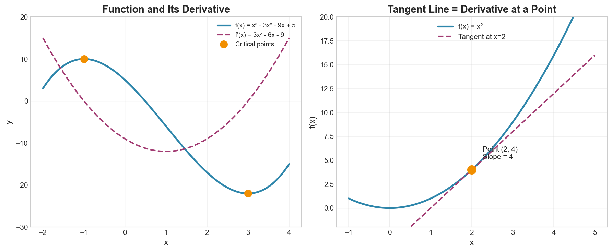

# Week 08: Derivatives and Critical Points

**Course**: BSMA1001 - Mathematics I
**Level**: Foundation

---

## Visual Summary

---

## 1. Differentiability and the Derivative

### 1.1 Theory

The derivative measures the instantaneous rate of change of a function. It represents the slope of the tangent line at any point.

### 1.2 Mathematical Definition

$$f'(x) = \lim_{h \to 0} \frac{f(x+h) - f(x)}{h}$$

**Alternative Notations**:
- $f'(x)$ — Lagrange notation
- $\frac{df}{dx}$ — Leibniz notation
- $\frac{d}{dx}f(x)$ — Operator notation
- $Df(x)$ — Euler notation

### 1.3 Differentiability

A function is **differentiable at $x = a$** if the limit defining $f'(a)$ exists.

**Important**: If $f$ is differentiable at $a$, then $f$ is continuous at $a$.
(The converse is NOT true — continuous functions may not be differentiable.)

### 1.4 Geometric Interpretation

- **Derivative** = Slope of the tangent line at a point
- **Positive derivative**: Function is increasing
- **Negative derivative**: Function is decreasing
- **Zero derivative**: Function has a horizontal tangent (potential extremum)

### 1.5 Supply Chain Application

**Retail Context**: Derivatives give instantaneous rates:
- Sales velocity at any moment
- Rate of inventory depletion
- Marginal cost (cost of one additional unit)
- Marginal revenue (revenue from one more sale)

---

## 2. Computing Derivatives and L'Hôpital's Rule

### 2.1 Basic Derivative Rules

| Function | Derivative |
|----------|------------|
| $c$ (constant) | $0$ |
| $x^n$ | $nx^{n-1}$ |
| $e^x$ | $e^x$ |
| $\ln(x)$ | $\frac{1}{x}$ |
| $\sin(x)$ | $\cos(x)$ |
| $\cos(x)$ | $-\sin(x)$ |
| $a^x$ | $a^x \ln(a)$ |

### 2.2 Combination Rules

**Constant Multiple Rule**:
$$\frac{d}{dx}[cf(x)] = c \cdot f'(x)$$

**Sum/Difference Rule**:
$$\frac{d}{dx}[f(x) \pm g(x)] = f'(x) \pm g'(x)$$

**Product Rule**:
$$\frac{d}{dx}[f(x) \cdot g(x)] = f'(x)g(x) + f(x)g'(x)$$

**Quotient Rule**:
$$\frac{d}{dx}\left[\frac{f(x)}{g(x)}\right] = \frac{f'(x)g(x) - f(x)g'(x)}{[g(x)]^2}$$

**Chain Rule**:
$$\frac{d}{dx}[f(g(x))] = f'(g(x)) \cdot g'(x)$$

### 2.3 L'Hôpital's Rule

For indeterminate forms $\frac{0}{0}$ or $\frac{\infty}{\infty}$:

$$\lim_{x \to a} \frac{f(x)}{g(x)} = \lim_{x \to a} \frac{f'(x)}{g'(x)}$$

(provided the right-hand limit exists)

**When to use**: When direct substitution gives $\frac{0}{0}$ or $\frac{\pm\infty}{\pm\infty}$

### 2.4 Supply Chain Application

**Retail Context**: Chain rule applies when quantities are functions of functions:
- Revenue depends on demand
- Demand depends on price
- Price depends on season
- Sensitivity analysis through cascading effects

---

## 3. Tangent Lines and Linear Approximation

### 3.1 Theory

The tangent line at a point provides the best linear approximation to the function near that point.

### 3.2 Equation of Tangent Line

At point $(a, f(a))$:

$$y - f(a) = f'(a)(x - a)$$

Or equivalently:
$$y = f(a) + f'(a)(x - a)$$

### 3.3 Linear Approximation (Linearization)

For $x$ near $a$:

$$f(x) \approx f(a) + f'(a)(x - a)$$

This is also called the **first-order Taylor approximation**.

### 3.4 Error in Linear Approximation

The error decreases as $x$ gets closer to $a$. For better accuracy:
- Use approximation only for small $|x - a|$
- Consider higher-order terms (Taylor series)

### 3.5 Common Linear Approximations (near $x = 0$)

| Function | Approximation |
|----------|---------------|
| $(1 + x)^n$ | $\approx 1 + nx$ |
| $e^x$ | $\approx 1 + x$ |
| $\ln(1 + x)$ | $\approx x$ |
| $\sin(x)$ | $\approx x$ |
| $\cos(x)$ | $\approx 1$ |

### 3.6 Supply Chain Application

**Retail Context**: Linear approximation simplifies complex models:
- Quick estimates for non-linear demand curves
- Short-term planning approximations
- Fast sensitivity analysis
- What-if scenarios near current operating point

---

## 4. Critical Points: Local Maxima and Minima

### 4.1 Theory

Critical points occur where the derivative is zero or undefined. These are candidates for local extrema (peaks and valleys).

### 4.2 Definition of Critical Point

$c$ is a **critical point** of $f$ if:
- $f'(c) = 0$, OR
- $f'(c)$ is undefined (but $f(c)$ exists)

### 4.3 First Derivative Test

Analyze sign changes of $f'(x)$ around critical point $c$:

| $f'$ before $c$ | $f'$ after $c$ | Conclusion |
|-----------------|----------------|------------|
| $+$ (increasing) | $-$ (decreasing) | **Local Maximum** |
| $-$ (decreasing) | $+$ (increasing) | **Local Minimum** |
| Same sign | Same sign | **Neither** (inflection point) |

### 4.4 Second Derivative Test

If $f'(c) = 0$:

| $f''(c)$ | Conclusion |
|----------|------------|
| $f''(c) > 0$ | **Local Minimum** (concave up) |
| $f''(c) < 0$ | **Local Maximum** (concave down) |
| $f''(c) = 0$ | **Inconclusive** (use first derivative test) |

### 4.5 Finding Absolute Extrema on Closed Interval $[a, b]$

1. Find all critical points in $(a, b)$
2. Evaluate $f$ at critical points AND endpoints $a$, $b$
3. Compare values: largest is absolute max, smallest is absolute min

### 4.6 Optimization Procedure

1. **Define** the objective function to optimize
2. **Find** critical points by solving $f'(x) = 0$
3. **Classify** using first or second derivative test
4. **Verify** the solution makes sense in context

### 4.7 Supply Chain Application

**Retail Context**: Critical points identify optimal decisions:
- Price that maximizes revenue
- Order quantity that minimizes total cost (EOQ)
- Inventory level balancing holding vs. stockout costs
- Production level maximizing profit

---

## Summary

| Concept | Key Formula |
|---------|-------------|
| Derivative Definition | $f'(x) = \lim_{h \to 0} \frac{f(x+h) - f(x)}{h}$ |
| Power Rule | $\frac{d}{dx}x^n = nx^{n-1}$ |
| Product Rule | $(fg)' = f'g + fg'$ |
| Chain Rule | $\frac{d}{dx}f(g(x)) = f'(g(x)) \cdot g'(x)$ |
| Tangent Line | $y = f(a) + f'(a)(x - a)$ |
| Linear Approximation | $f(x) \approx f(a) + f'(a)(x - a)$ |
| Critical Point | $f'(c) = 0$ or undefined |
| Second Derivative Test | $f''(c) > 0$: min; $f''(c) < 0$: max |

## Key Takeaways

1. **Derivative** measures instantaneous rate of change: $f'(x) = \lim_{h \to 0} \frac{f(x+h) - f(x)}{h}$

2. **Derivative rules** (power, product, quotient, chain) enable efficient computation

3. **Tangent lines** provide linear approximations near a point

4. **Critical points** where $f'(x) = 0$ are candidates for local extrema

5. **First derivative test**: Sign change determines max/min

6. **Second derivative test**: $f''(c) > 0$ means min, $f''(c) < 0$ means max

---

## Next Week Preview

Week 9 covers **Integration** — the reverse of differentiation, used for computing areas and cumulative quantities.

---

*IIT Madras BS Degree in Data Science*
