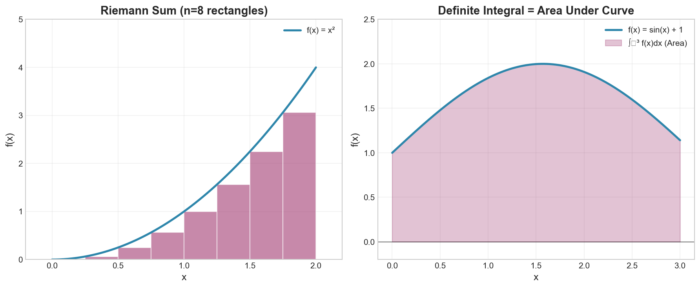

# Week 09: Integration

**Course**: BSMA1001 - Mathematics I
**Level**: Foundation

---

## Visual Summary

---

## 1. Computing Areas

### 1.1 Theory

Integration originates from the problem of computing areas. We approximate the area under a curve by summing rectangles, then take the limit as rectangles become infinitesimally thin.

### 1.2 Riemann Sums

**Definition**: Approximation of area under curve using rectangles

$$\text{Riemann Sum} = \sum_{i=1}^{n} f(x_i^*) \Delta x$$

Where:
- $\Delta x = \frac{b-a}{n}$ (width of each rectangle)
- $x_i^*$ = sample point in the $i$-th subinterval
- $n$ = number of rectangles

### 1.3 Types of Riemann Sums

| Type | Sample Point $x_i^*$ |
|------|---------------------|
| Left Riemann Sum | Left endpoint of each subinterval |
| Right Riemann Sum | Right endpoint of each subinterval |
| Midpoint Rule | Midpoint of each subinterval |

### 1.4 Convergence

As $n \to \infty$ (more rectangles, thinner width):
$$\lim_{n \to \infty} \sum_{i=1}^{n} f(x_i^*) \Delta x = \int_a^b f(x) \, dx$$

### 1.5 Supply Chain Application

**Retail Context**: Cumulative quantities are integrals:
- Total sales over a period = integral of sales rate
- Total inventory held = integral of inventory level over time
- Total costs incurred = integral of cost rate

---

## 2. The Definite Integral

### 2.1 Theory

The definite integral represents the **signed area** between a function and the x-axis over an interval.

### 2.2 Mathematical Definition

$$\int_a^b f(x) \, dx = \lim_{n \to \infty} \sum_{i=1}^{n} f(x_i^*) \Delta x$$

**Notation**:
- $\int$ = integral sign
- $a$ = lower limit of integration
- $b$ = upper limit of integration
- $f(x)$ = integrand
- $dx$ = variable of integration

### 2.3 Signed Area

- Area **above** x-axis: **positive**
- Area **below** x-axis: **negative**
- Net (signed) area can be zero even if there's area on both sides

### 2.4 Properties of Definite Integrals

| Property | Formula |
|----------|---------|
| Linearity (Sum) | $\int_a^b [f(x) + g(x)] \, dx = \int_a^b f(x) \, dx + \int_a^b g(x) \, dx$ |
| Constant Multiple | $\int_a^b cf(x) \, dx = c \int_a^b f(x) \, dx$ |
| Reversal of Limits | $\int_a^b f(x) \, dx = -\int_b^a f(x) \, dx$ |
| Zero Width | $\int_a^a f(x) \, dx = 0$ |
| Additivity | $\int_a^b f(x) \, dx + \int_b^c f(x) \, dx = \int_a^c f(x) \, dx$ |

### 2.5 Supply Chain Application

**Retail Context**: Definite integrals calculate totals over time periods:
- Total demand during a season
- Total holding costs over a planning horizon
- Work content in operations
- Cumulative production over a shift

---

## 3. Fundamental Theorem of Calculus

### 3.1 Theory

The Fundamental Theorem connects differentiation and integration as **inverse operations**, providing an efficient way to evaluate definite integrals.

### 3.2 Part 1: Derivative of Integral

If $F(x) = \int_a^x f(t) \, dt$, then:
$$F'(x) = f(x)$$

**Meaning**: The derivative of a cumulative function gives back the rate function.

### 3.3 Part 2: Evaluation of Definite Integrals

$$\int_a^b f(x) \, dx = F(b) - F(a)$$

Where $F$ is any **antiderivative** of $f$ (i.e., $F'(x) = f(x)$).

**Notation**: $F(b) - F(a)$ is often written as $\Big[F(x)\Big]_a^b$ or $F(x)\Big|_a^b$

### 3.4 Antiderivative (Indefinite Integral)

$$F(x) = \int f(x) \, dx$$

means $F'(x) = f(x)$

**Note**: Antiderivatives include a constant of integration $+C$

### 3.5 Supply Chain Application

**Retail Context**:
- If we know cumulative sales $S(t)$, then $S'(t)$ gives instantaneous sales rate
- Conversely, integrating sales rate gives cumulative sales
- This relationship is fundamental to inventory modeling

---

## 4. Derivatives and Integrals Connection

### 4.1 Theory

Understanding the inverse relationship between derivatives and integrals enables solving:
- **Accumulation problems** (integration)
- **Rate problems** (differentiation)

### 4.2 Key Antiderivatives (Integration Formulas)

| Function $f(x)$ | Antiderivative $\int f(x) \, dx$ |
|-----------------|----------------------------------|
| $x^n$ (for $n \neq -1$) | $\frac{x^{n+1}}{n+1} + C$ |
| $\frac{1}{x}$ | $\ln|x| + C$ |
| $e^x$ | $e^x + C$ |
| $a^x$ | $\frac{a^x}{\ln a} + C$ |
| $\sin(x)$ | $-\cos(x) + C$ |
| $\cos(x)$ | $\sin(x) + C$ |
| $\sec^2(x)$ | $\tan(x) + C$ |

### 4.3 Integration Rules

**Constant Multiple Rule**:
$$\int cf(x) \, dx = c \int f(x) \, dx$$

**Sum/Difference Rule**:
$$\int [f(x) \pm g(x)] \, dx = \int f(x) \, dx \pm \int g(x) \, dx$$

### 4.4 Verification

To verify an antiderivative, **differentiate** it — you should get back the original function.

### 4.5 The Inverse Relationship

| Operation | What It Does | Question It Answers |
|-----------|--------------|---------------------|
| Derivative | Rate of change | "How fast is it changing?" |
| Integral | Accumulation | "How much has accumulated?" |

$$\frac{d}{dx}\left[\int_a^x f(t) \, dt\right] = f(x)$$

$$\int_a^b f'(x) \, dx = f(b) - f(a)$$

### 4.6 Supply Chain Application

**Retail Context**:
- Given a demand rate function → integrate to find total demand
- Given total cost function → differentiate to find marginal cost
- These operations are fundamental to supply chain optimization

---

## Summary

| Concept | Key Formula |
|---------|-------------|
| Riemann Sum | $\sum_{i=1}^{n} f(x_i^*) \Delta x$ |
| Definite Integral | $\int_a^b f(x) \, dx = \lim_{n \to \infty} \sum f(x_i^*) \Delta x$ |
| FTC Part 1 | $\frac{d}{dx}\int_a^x f(t) \, dt = f(x)$ |
| FTC Part 2 | $\int_a^b f(x) \, dx = F(b) - F(a)$ |
| Power Rule (Integration) | $\int x^n \, dx = \frac{x^{n+1}}{n+1} + C$ |
| Exponential | $\int e^x \, dx = e^x + C$ |
| Reciprocal | $\int \frac{1}{x} \, dx = \ln|x| + C$ |

## Key Takeaways

1. **Integration** computes areas as limits of Riemann sums

2. **Definite integral** $\int_a^b f(x) \, dx$ gives signed area under the curve

3. **Fundamental Theorem**: $\int_a^b f(x) \, dx = F(b) - F(a)$ where $F' = f$

4. **Differentiation and integration are inverse operations**

5. The **constant of integration** $C$ appears in indefinite integrals

6. Integration answers: "How much has accumulated over time?"

---

## Next Week Preview

Week 10 covers **Graph Theory Basics** — we'll explore graph representations and traversal algorithms.

---

*IIT Madras BS Degree in Data Science*
