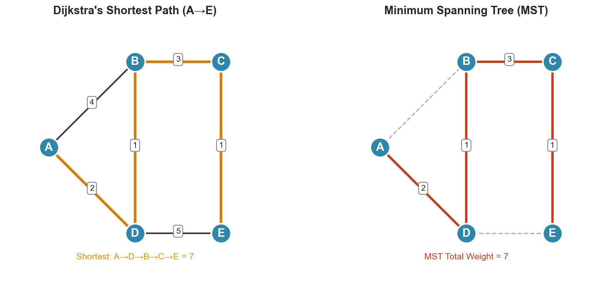

# Week 11: Graph Algorithms

**Course**: BSMA1001 - Mathematics I
**Level**: Foundation

---

## Visual Summary

---

## Learning Objectives
- Understand single-source shortest path algorithms
- Master Dijkstra's algorithm for non-negative weights
- Learn Bellman-Ford algorithm for negative weights
- Apply Floyd-Warshall for all-pairs shortest paths
- Understand Minimum Spanning Trees (Prim's and Kruskal's)

---

## 1. Single-Source Shortest Paths

### 1.1 Theory

Finding the shortest path from one source to all destinations is fundamental to route optimization. Different algorithms handle different graph types.

### 1.2 Mathematical Definition

**Shortest Path**: Path minimizing $\sum_{e \in path} weight(e)$

**Relaxation**: If $d[v] > d[u] + w(u,v)$, update $d[v] = d[u] + w(u,v)$

The relaxation operation is the core building block of all shortest path algorithms.

### 1.3 Supply Chain Application

**Retail Context**: Finding optimal routes from a central warehouse to all stores, considering distance, time, or cost as edge weights.

---

## 2. Dijkstra's Algorithm

### 2.1 Theory

Dijkstra's algorithm finds shortest paths in graphs with **non-negative edge weights**. It uses a greedy approach, always expanding the closest unvisited vertex.

### 2.2 Algorithm

1. Initialize distances: $d[source] = 0$, $d[v] = \infty$ for all other vertices
2. Use priority queue, extract minimum distance vertex
3. Relax all neighbors of extracted vertex
4. Repeat until all vertices processed

### 2.3 Key Properties

| Property | Value |
|----------|-------|
| **Time Complexity** | $O((V + E) \log V)$ with binary heap |
| **Space Complexity** | $O(V)$ |
| **Edge Weights** | Non-negative only |
| **Optimality** | Guaranteed shortest paths |

### 2.4 Supply Chain Application

**Retail Context**: Finding minimum-distance or minimum-time routes for delivery trucks. Edge weights represent travel time or fuel cost.

---

## 3. Bellman-Ford Algorithm

### 3.1 Theory

Bellman-Ford handles graphs with **negative edge weights** and can detect negative cycles. It's slower than Dijkstra but more versatile.

### 3.2 Algorithm

1. Initialize distances: $d[source] = 0$, $d[v] = \infty$ for others
2. Repeat $V-1$ times: relax all edges
3. Check for negative cycles (if any distance improves on $V$-th iteration, negative cycle exists)

### 3.3 Key Properties

| Property | Value |
|----------|-------|
| **Time Complexity** | $O(VE)$ |
| **Space Complexity** | $O(V)$ |
| **Edge Weights** | Can be negative |
| **Special Feature** | Detects negative cycles |

### 3.4 Supply Chain Application

**Retail Context**: When costs can be negative (rebates, subsidies, arbitrage opportunities), Bellman-Ford finds optimal paths. Negative cycle detection prevents infinite profit loops in currency exchange or pricing arbitrage.

---

## 4. Floyd-Warshall Algorithm

### 4.1 Theory

Floyd-Warshall computes shortest paths between **all pairs** of vertices. Useful when you need distances between every origin-destination pair.

### 4.2 Mathematical Definition

**Dynamic Programming Recurrence**:
$$d^{(k)}[i][j] = \min(d^{(k-1)}[i][j], d^{(k-1)}[i][k] + d^{(k-1)}[k][j])$$

Where $d^{(k)}[i][j]$ is the shortest path from $i$ to $j$ using only vertices $\{1, 2, ..., k\}$ as intermediates.

### 4.3 Key Properties

| Property | Value |
|----------|-------|
| **Time Complexity** | $O(V^3)$ |
| **Space Complexity** | $O(V^2)$ |
| **Output** | All-pairs distance matrix |
| **Edge Weights** | Can be negative (no negative cycles) |

### 4.4 Supply Chain Application

**Retail Context**: Computing all warehouse-to-warehouse distances for network design, or pre-computing all store-to-store distances for transfer planning.

---

## 5. Minimum Spanning Trees

### 5.1 Theory

A **Minimum Spanning Tree (MST)** connects all vertices with minimum total edge weight. Essential for designing low-cost networks.

### 5.2 Algorithms

#### Prim's Algorithm
- Grow tree from starting vertex
- Always add minimum-weight edge connecting tree to non-tree vertex
- Similar to Dijkstra (uses priority queue)

#### Kruskal's Algorithm
- Sort all edges by weight
- Add edges in order that don't create cycles
- Uses Union-Find data structure

### 5.3 Key Properties

| Property | Prim's | Kruskal's |
|----------|--------|-----------|
| **Time Complexity** | $O(E \log V)$ | $O(E \log E)$ |
| **Approach** | Vertex-based (grow tree) | Edge-based (sort & add) |
| **Best For** | Dense graphs | Sparse graphs |
| **Data Structure** | Priority Queue | Union-Find |

### 5.4 Supply Chain Application

**Retail Context**: Designing minimum-cost distribution networks - connecting warehouses with minimum total infrastructure cost, or designing communication networks between facilities.

---

## Algorithm Comparison

| Algorithm | Problem Type | Time Complexity | Edge Weights | Use Case |
|-----------|--------------|-----------------|--------------|----------|
| **Dijkstra** | Single-source | $O((V+E)\log V)$ | Non-negative | Fast delivery routing |
| **Bellman-Ford** | Single-source | $O(VE)$ | Any (detects cycles) | Cost arbitrage |
| **Floyd-Warshall** | All-pairs | $O(V^3)$ | Any | Distance matrices |
| **Prim's** | MST | $O(E \log V)$ | Any | Dense network design |
| **Kruskal's** | MST | $O(E \log E)$ | Any | Sparse network design |

---

## Summary Table

| Concept | Definition | Key Property | Supply Chain Application |
|---------|------------|--------------|--------------------------|
| **Relaxation** | Update distance if shorter path found | Core of shortest path algorithms | Route cost updates |
| **Dijkstra** | Greedy shortest path | Non-negative weights only | Delivery optimization |
| **Bellman-Ford** | Iterative relaxation | Handles negative weights | Arbitrage detection |
| **Floyd-Warshall** | DP all-pairs | $O(V^3)$ for complete matrix | Network planning |
| **MST** | Minimum total edge weight tree | Connects all vertices | Infrastructure design |

---

## Key Takeaways

1. **Dijkstra is fastest** for single-source with non-negative weights - use for most routing problems
2. **Bellman-Ford handles negative weights** and detects negative cycles - essential for financial applications
3. **Floyd-Warshall computes all pairs** in one pass - efficient when all distances needed
4. **MST algorithms optimize network design** - Prim's for dense, Kruskal's for sparse graphs

---

## Next Week Preview

Week 12 is **Revision** - comprehensive review of all Mathematics I topics.

---

*IIT Madras BS Degree in Data Science*
