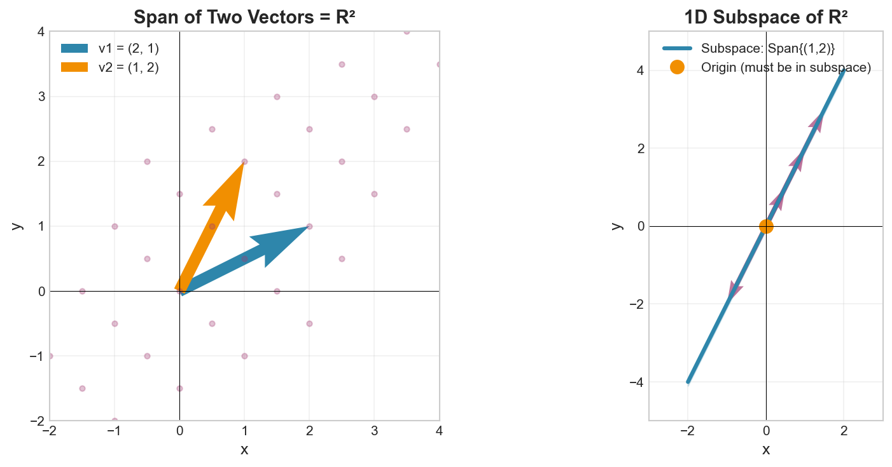

# Week 03: Introduction to Vector Spaces

**Course**: BSMA1003 - Mathematics II
**Level**: Foundation

---

## Visual Summary

---

## Learning Objectives
- Understand the abstract definition of vector spaces
- Learn the axioms that define a vector space
- Master the concept of linear dependence and independence

---

## 1. Vector Spaces

### 1.1 Theory

A **vector space** is a set equipped with addition and scalar multiplication satisfying specific axioms. This abstraction unifies many mathematical structures including:
- $\mathbb{R}^n$ (standard coordinate vectors)
- Matrices
- Polynomials
- Functions

### 1.2 Mathematical Definition

A vector space $V$ over field $\mathbb{F}$ (usually $\mathbb{R}$ or $\mathbb{C}$) must satisfy:

#### Axioms for Addition
| Axiom | Description |
|-------|-------------|
| **Closure** | $\mathbf{u} + \mathbf{v} \in V$ for all $\mathbf{u}, \mathbf{v} \in V$ |
| **Commutativity** | $\mathbf{u} + \mathbf{v} = \mathbf{v} + \mathbf{u}$ |
| **Associativity** | $(\mathbf{u} + \mathbf{v}) + \mathbf{w} = \mathbf{u} + (\mathbf{v} + \mathbf{w})$ |
| **Zero Vector** | There exists $\mathbf{0}$ such that $\mathbf{v} + \mathbf{0} = \mathbf{v}$ |
| **Additive Inverse** | For each $\mathbf{v}$, there exists $-\mathbf{v}$ such that $\mathbf{v} + (-\mathbf{v}) = \mathbf{0}$ |

#### Axioms for Scalar Multiplication
| Axiom | Description |
|-------|-------------|
| **Closure** | $c\mathbf{v} \in V$ for all $c \in \mathbb{F}$, $\mathbf{v} \in V$ |
| **Distributivity (scalar)** | $c(\mathbf{u} + \mathbf{v}) = c\mathbf{u} + c\mathbf{v}$ |
| **Distributivity (vector)** | $(c + d)\mathbf{v} = c\mathbf{v} + d\mathbf{v}$ |
| **Associativity** | $c(d\mathbf{v}) = (cd)\mathbf{v}$ |
| **Identity** | $1 \cdot \mathbf{v} = \mathbf{v}$ |

### 1.3 Common Vector Space Examples

| Space | Elements | Addition | Scalar Multiplication |
|-------|----------|----------|----------------------|
| $\mathbb{R}^n$ | n-tuples | Component-wise | Component-wise |
| $M_{m \times n}$ | Matrices | Matrix addition | Scalar × matrix |
| $P_n$ | Polynomials degree ≤ n | Polynomial addition | Scalar × polynomial |

### 1.4 Supply Chain Application

**Retail Context**:
- **Feature spaces** in ML models form vector spaces
- **Product attribute vectors** live in feature spaces
- **Customer segmentation features** enable clustering in vector spaces
- **Time series representations** as vectors for forecasting

---

## 2. Linear Dependence and Independence

### 2.1 Theory

Vectors are **linearly dependent** if one can be expressed as a combination of others. **Independent vectors** contain no redundant information.

### 2.2 Mathematical Definition

#### Linear Dependence
Vectors $\{\mathbf{v}_1, \mathbf{v}_2, ..., \mathbf{v}_n\}$ are **linearly dependent** if:
$$c_1\mathbf{v}_1 + c_2\mathbf{v}_2 + ... + c_n\mathbf{v}_n = \mathbf{0}$$
for some scalars $c_i$ **not all zero**.

#### Linear Independence
Vectors are **linearly independent** if the only solution to:
$$c_1\mathbf{v}_1 + c_2\mathbf{v}_2 + ... + c_n\mathbf{v}_n = \mathbf{0}$$
is $c_1 = c_2 = ... = c_n = 0$ (the trivial solution).

### 2.3 Testing for Independence

| Method | Approach |
|--------|----------|
| **Determinant** | For $n$ vectors in $\mathbb{R}^n$: independent $\iff \det \neq 0$ |
| **Row Reduction** | Form matrix with vectors as columns, reduce to REF |
| **Rank** | Independent if rank equals number of vectors |

### 2.4 Key Properties

- Any set containing $\mathbf{0}$ is linearly dependent
- A single nonzero vector is linearly independent
- In $\mathbb{R}^n$, at most $n$ vectors can be independent
- If $\{\mathbf{v}_1, ..., \mathbf{v}_k\}$ is independent, any subset is also independent

### 2.5 Supply Chain Application

**Retail Context**:
- **Independent features** in ML models provide unique information
- **Dependent features** (multicollinearity) cause issues in regression
- **Feature selection** removes redundant dependent features
- **Dimensionality reduction** exploits dependence to compress data

---

## Summary Table

| Concept | Definition | Key Property | Supply Chain Application |
|---------|------------|--------------|--------------------------|
| **Vector Space** | Set with addition & scalar multiplication | Satisfies 10 axioms | Feature spaces for ML |
| **Linear Dependence** | Non-trivial combination equals zero | Redundancy exists | Multicollinearity |
| **Linear Independence** | Only trivial combination equals zero | No redundancy | Unique feature information |

---

## Key Takeaways

1. **Vector spaces** abstract the concept of vectors with axioms - many structures qualify
2. **Linear dependence** means redundancy - one vector can be written in terms of others
3. **Independence testing** uses determinants, row reduction, or rank
4. These concepts **underlie feature selection** and dimensionality reduction in ML

---

## Next Week Preview

Week 4 covers **Basis and Dimension** - minimal spanning sets for vector spaces.

---

*IIT Madras BS Degree in Data Science*
