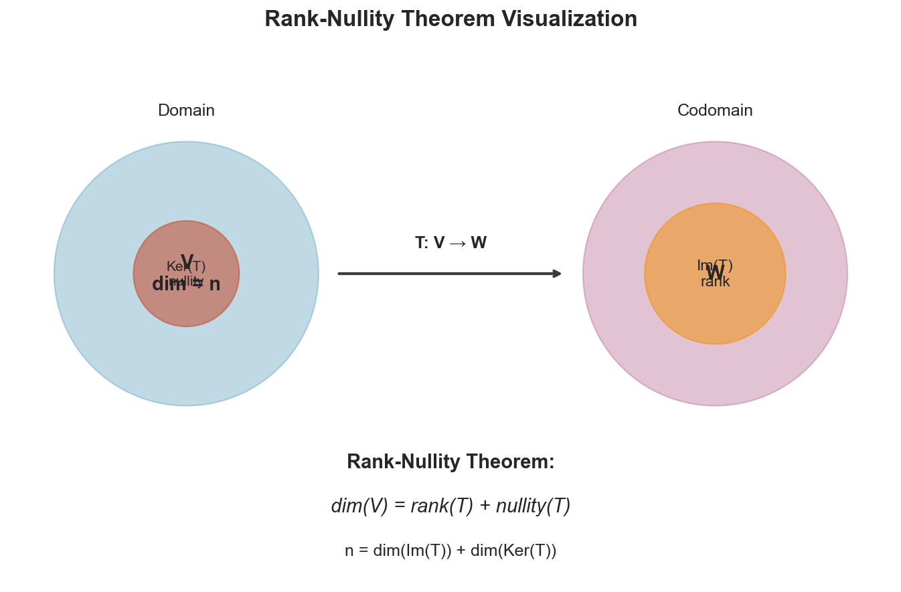

# Week 05: Rank, Nullity, and Linear Transformations

**Course**: BSMA1003 - Mathematics II
**Level**: Foundation

---

## Visual Summary

---

## Learning Objectives
- Understand null space and nullity
- Master the Rank-Nullity Theorem
- Learn the definition and properties of linear transformations

---

## 1. Null Space and Nullity

### 1.1 Theory

The **null space** contains all vectors that the matrix maps to zero. Its dimension (**nullity**) represents the degrees of freedom in the system.

### 1.2 Mathematical Definition

**Null Space** (Kernel):
$$\text{null}(A) = \{\mathbf{x} : A\mathbf{x} = \mathbf{0}\}$$

**Nullity**:
$$\text{nullity}(A) = \dim(\text{null}(A))$$

### 1.3 Finding the Null Space

1. Set up homogeneous system $A\mathbf{x} = \mathbf{0}$
2. Reduce $A$ to RREF
3. Express solution in terms of free variables
4. Write as linear combination of basis vectors

### 1.4 Key Properties

| Property | Description |
|----------|-------------|
| **Always a subspace** | $\text{null}(A)$ is a subspace of $\mathbb{R}^n$ |
| **Contains zero** | $\mathbf{0} \in \text{null}(A)$ always |
| **Trivial null space** | $\text{null}(A) = \{\mathbf{0}\} \iff A$ has full column rank |

### 1.5 Supply Chain Application

**Retail Context**: Nullity represents the number of **free variables** in an optimization problem. Higher nullity means more flexibility in choosing solutions (e.g., multiple optimal allocation strategies).

---

## 2. The Rank-Nullity Theorem

### 2.1 Theorem Statement

For any $m \times n$ matrix $A$:

$$\boxed{\text{rank}(A) + \text{nullity}(A) = n}$$

where $n$ is the number of columns.

### 2.2 Interpretation

| Component | Meaning |
|-----------|---------|
| **Rank** | Number of pivot columns (leading variables) |
| **Nullity** | Number of free columns (free variables) |
| **n** | Total number of variables |

### 2.3 Implications

| Condition | Implication |
|-----------|-------------|
| $\text{nullity}(A) = 0$ | Unique solution (if consistent) |
| $\text{nullity}(A) > 0$ | Infinite solutions (if consistent) |
| $\text{rank}(A) = n$ | Columns are independent |
| $\text{rank}(A) = m$ | Rows are independent |

---

## 3. Linear Transformations

### 3.1 Theory

**Linear transformations** preserve vector addition and scalar multiplication. Every linear transformation between finite-dimensional spaces can be represented by a matrix.

### 3.2 Mathematical Definition

A function $T: V \rightarrow W$ is **linear** if for all $\mathbf{u}, \mathbf{v} \in V$ and scalar $c$:

1. **Additivity**: $T(\mathbf{u} + \mathbf{v}) = T(\mathbf{u}) + T(\mathbf{v})$
2. **Homogeneity**: $T(c\mathbf{v}) = cT(\mathbf{v})$

Equivalently: $T(c_1\mathbf{u} + c_2\mathbf{v}) = c_1T(\mathbf{u}) + c_2T(\mathbf{v})$

### 3.3 Matrix Representation

Every linear transformation $T: \mathbb{R}^n \rightarrow \mathbb{R}^m$ has a matrix representation:

$$T(\mathbf{x}) = A\mathbf{x}$$

where $A$ is an $m \times n$ matrix.

### 3.4 Common Linear Transformations

| Transformation | Matrix (2D) | Effect |
|----------------|-------------|--------|
| **Scaling** | $\begin{pmatrix} s & 0 \\ 0 & s \end{pmatrix}$ | Uniform resize |
| **Rotation** | $\begin{pmatrix} \cos\theta & -\sin\theta \\ \sin\theta & \cos\theta \end{pmatrix}$ | Rotate by $\theta$ |
| **Reflection** | $\begin{pmatrix} 1 & 0 \\ 0 & -1 \end{pmatrix}$ | Reflect over x-axis |
| **Projection** | $\begin{pmatrix} 1 & 0 \\ 0 & 0 \end{pmatrix}$ | Project onto x-axis |

### 3.5 Key Properties

| Property | Description |
|----------|-------------|
| $T(\mathbf{0}) = \mathbf{0}$ | Zero maps to zero |
| $T(-\mathbf{v}) = -T(\mathbf{v})$ | Preserves negation |
| Composition | $(S \circ T)(\mathbf{x}) = S(T(\mathbf{x})) = BA\mathbf{x}$ |

### 3.6 Supply Chain Application

**Retail Context**:
- **Scaling and normalization** are linear transformations
- **Seasonal decomposition** and trend extraction are linear operations on time series
- **Feature engineering** often involves linear transformations

---

## Summary Table

| Concept | Definition | Key Property | Supply Chain Application |
|---------|------------|--------------|--------------------------|
| **Null Space** | $\{\mathbf{x} : A\mathbf{x} = \mathbf{0}\}$ | Subspace of domain | Solution flexibility |
| **Nullity** | $\dim(\text{null}(A))$ | Free variable count | Degrees of freedom |
| **Rank-Nullity** | rank + nullity = n | Fundamental theorem | Constraint analysis |
| **Linear Transformation** | Preserves addition & scaling | Matrix representation | Feature transformations |

---

## Key Takeaways

1. **Null space** contains all solutions to $A\mathbf{x} = \mathbf{0}$ - represents system flexibility
2. **Rank-Nullity Theorem** connects rank and nullity: their sum equals number of columns
3. **Linear transformations** are the structure-preserving maps - all representable by matrices
4. These concepts are **fundamental to understanding solution spaces** and data transformations

---

## Next Week Preview

Week 6 covers **Kernel and Images** - deeper exploration of linear transformation structure.

---

*IIT Madras BS Degree in Data Science*
