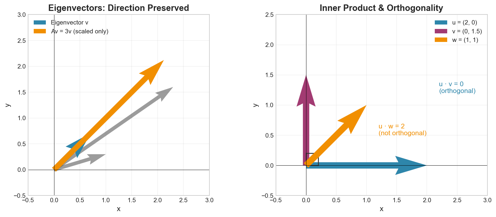

# Week 07: Similar Matrices and Inner Products

**Course**: BSMA1003 - Mathematics II
**Level**: Foundation

---

## Visual Summary

---

## Learning Objectives
- Understand matrix equivalence and similarity
- Master inner products and norms
- Learn affine mappings and their properties

---

## 1. Matrix Equivalence and Similarity

### 1.1 Theory

**Similar matrices** represent the same linear transformation in different bases. They share important properties like eigenvalues, determinant, and trace.

### 1.2 Mathematical Definitions

| Concept | Definition |
|---------|------------|
| **Equivalent** | $B = PAQ$ for invertible $P$, $Q$ |
| **Similar** | $B = P^{-1}AP$ for invertible $P$ |

### 1.3 Invariants Under Similarity

Similar matrices share these properties:

| Invariant | Description |
|-----------|-------------|
| **Eigenvalues** | Same eigenvalues (including multiplicities) |
| **Determinant** | $\det(B) = \det(A)$ |
| **Trace** | $\text{tr}(B) = \text{tr}(A)$ |
| **Rank** | $\text{rank}(B) = \text{rank}(A)$ |
| **Characteristic Polynomial** | Same polynomial |

### 1.4 Supply Chain Application

**Retail Context**: Change of basis is like viewing data from different perspectives. Similar matrices help compare models across different coordinate systems (e.g., different feature encodings).

---

## 2. Inner Products and Norms

### 2.1 Theory

**Inner products** generalize the dot product, enabling measurement of angles and lengths. **Norms** measure vector magnitude.

### 2.2 Inner Product Definition

An **inner product** $\langle \cdot, \cdot \rangle: V \times V \to \mathbb{R}$ satisfies:

| Property | Definition |
|----------|------------|
| **Linearity** | $\langle a\mathbf{u} + b\mathbf{v}, \mathbf{w} \rangle = a\langle \mathbf{u}, \mathbf{w} \rangle + b\langle \mathbf{v}, \mathbf{w} \rangle$ |
| **Symmetry** | $\langle \mathbf{u}, \mathbf{v} \rangle = \langle \mathbf{v}, \mathbf{u} \rangle$ |
| **Positive-definiteness** | $\langle \mathbf{v}, \mathbf{v} \rangle \geq 0$, with equality iff $\mathbf{v} = \mathbf{0}$ |

**Standard dot product**: $\langle \mathbf{u}, \mathbf{v} \rangle = \mathbf{u} \cdot \mathbf{v} = \sum_{i=1}^n u_i v_i$

### 2.3 Norm Definition

A **norm** induced by an inner product:

$$\|\mathbf{v}\| = \sqrt{\langle \mathbf{v}, \mathbf{v} \rangle}$$

### 2.4 Common Norms

| Norm | Formula | Name | Use Case |
|------|---------|------|----------|
| $\|\mathbf{v}\|_1$ | $\sum_i \|v_i\|$ | L1 / Manhattan | Sparse solutions, MAE |
| $\|\mathbf{v}\|_2$ | $\sqrt{\sum_i v_i^2}$ | L2 / Euclidean | RMSE, standard distance |
| $\|\mathbf{v}\|_\infty$ | $\max_i \|v_i\|$ | L∞ / Max | Worst-case error |

### 2.5 Derived Concepts

| Concept | Formula |
|---------|---------|
| **Distance** | $d(\mathbf{u}, \mathbf{v}) = \|\mathbf{u} - \mathbf{v}\|$ |
| **Angle** | $\cos\theta = \frac{\langle \mathbf{u}, \mathbf{v} \rangle}{\|\mathbf{u}\| \|\mathbf{v}\|}$ |
| **Cosine Similarity** | $\frac{\mathbf{u} \cdot \mathbf{v}}{\|\mathbf{u}\|_2 \|\mathbf{v}\|_2}$ |

### 2.6 Supply Chain Application

**Retail Context**:
- **Norms measure prediction error** (RMSE uses L2 norm, MAE uses L1)
- **Cosine similarity** measures product or customer similarity for recommendations
- **Distance metrics** cluster similar stores or products

---

## 3. Affine Mappings

### 3.1 Theory

**Affine mappings** are linear transformations plus translations. They preserve parallelism and ratios of distances.

### 3.2 Mathematical Definition

$$T(\mathbf{x}) = A\mathbf{x} + \mathbf{b}$$

where:
- $A$ is a matrix (linear part)
- $\mathbf{b}$ is a vector (translation)

### 3.3 Properties

| Property | Preserved? |
|----------|------------|
| **Parallelism** | ✓ Yes |
| **Ratios of distances** | ✓ Yes |
| **Origin** | ✗ No (unless $\mathbf{b} = \mathbf{0}$) |
| **Linear combinations** | ✗ No |

### 3.4 Composition

$$T_2 \circ T_1(\mathbf{x}) = A_2(A_1\mathbf{x} + \mathbf{b}_1) + \mathbf{b}_2 = A_2A_1\mathbf{x} + (A_2\mathbf{b}_1 + \mathbf{b}_2)$$

### 3.5 Supply Chain Application

**Retail Context**: Feature normalization (standardization) is an affine mapping: $z = \frac{x - \mu}{\sigma}$

---

## Summary Table

| Concept | Definition | Key Property | Supply Chain Application |
|---------|------------|--------------|--------------------------|
| **Similar Matrices** | $B = P^{-1}AP$ | Same eigenvalues | Coordinate system comparison |
| **Inner Product** | Generalized dot product | Enables geometry | Similarity measurement |
| **Norm** | $\|\mathbf{v}\| = \sqrt{\langle \mathbf{v}, \mathbf{v} \rangle}$ | Measures magnitude | Error metrics (RMSE, MAE) |
| **Affine Mapping** | $T(\mathbf{x}) = A\mathbf{x} + \mathbf{b}$ | Linear + translation | Feature normalization |

---

## Key Takeaways

1. **Similar matrices** represent the same transformation in different bases - they share eigenvalues and determinant
2. **Inner products** enable geometry - angles, lengths, and similarity measures
3. **Different norms** capture different notions of distance (L1 for sparsity, L2 for smoothness)
4. **Affine mappings** = linear + translation - covers most data preprocessing

---

## Next Week Preview

Week 8 covers **Orthogonality and Gram-Schmidt** - creating orthonormal bases.

---

*IIT Madras BS Degree in Data Science*
