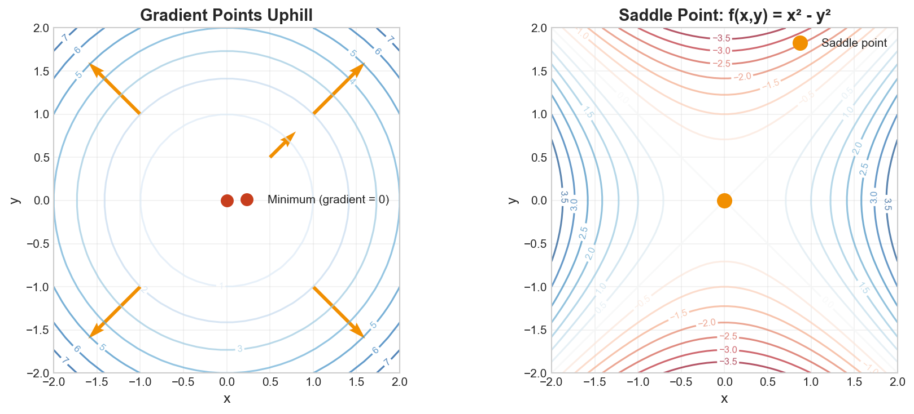

# Week 10: Gradient and Critical Points

**Course**: BSMA1003 - Mathematics II
**Level**: Foundation

---

## Visual Summary

---

## Learning Objectives
- Understand the gradient vector and its properties
- Learn tangent plane approximation
- Master critical points and steepest descent optimization

---

## 1. The Gradient Vector

### 1.1 Theory

The **gradient** collects all partial derivatives into a vector. It points in the direction of steepest increase and is perpendicular to level curves.

### 1.2 Mathematical Definition

$$\nabla f = \left( \frac{\partial f}{\partial x_1}, \frac{\partial f}{\partial x_2}, ..., \frac{\partial f}{\partial x_n} \right)$$

For $f(x, y)$:
$$\nabla f = \left( \frac{\partial f}{\partial x}, \frac{\partial f}{\partial y} \right) = (f_x, f_y)$$

### 1.3 Key Properties

| Property | Description |
|----------|-------------|
| **Direction** | Points toward steepest ascent |
| **Magnitude** | $\|\nabla f\|$ = maximum rate of change |
| **Perpendicular** | $\nabla f \perp$ level curves/surfaces |
| **Zero gradient** | At critical points (max, min, saddle) |

### 1.4 Relationship to Directional Derivative

$$D_{\mathbf{u}}f = \nabla f \cdot \mathbf{u} = \|\nabla f\| \cos\theta$$

- Maximum when $\mathbf{u}$ parallel to $\nabla f$
- Zero when $\mathbf{u}$ perpendicular to $\nabla f$
- Minimum when $\mathbf{u}$ anti-parallel to $\nabla f$

### 1.5 Supply Chain Application

**Retail Context**:
- **Gradient descent** optimizes ML models for demand forecasting
- Finding optimal inventory policies by following the negative gradient of cost
- Sensitivity analysis: gradient indicates which parameters most affect cost

---

## 2. Tangent Planes

### 2.1 Theory

The **tangent plane** is the best linear approximation to a surface at a point. It's used for local analysis and approximations.

### 2.2 Mathematical Definition

At point $(a, b)$ with $z = f(a, b)$:

$$z = f(a,b) + f_x(a,b)(x-a) + f_y(a,b)(y-b)$$

Or equivalently:
$$z - f(a,b) = \nabla f(a,b) \cdot (x-a, y-b)$$

### 2.3 Linear Approximation

For small changes $\Delta x$, $\Delta y$:

$$\Delta f \approx f_x \Delta x + f_y \Delta y = \nabla f \cdot \Delta \mathbf{x}$$

### 2.4 Supply Chain Application

**Retail Context**: Linear approximation near current operating point helps with **sensitivity analysis** - small changes in inputs lead to predictable changes in output.

---

## 3. Critical Points

### 3.1 Theory

**Critical points** occur where the gradient is zero. They're candidates for maxima, minima, or saddle points.

### 3.2 Mathematical Definition

A point $\mathbf{x}^*$ is a **critical point** if:

$$\nabla f(\mathbf{x}^*) = \mathbf{0}$$

For $f(x, y)$: both $f_x = 0$ and $f_y = 0$

### 3.3 Types of Critical Points

| Type | Description |
|------|-------------|
| **Local Maximum** | $f$ decreases in all directions |
| **Local Minimum** | $f$ increases in all directions |
| **Saddle Point** | $f$ increases in some directions, decreases in others |

### 3.4 Supply Chain Application

**Retail Context**: Finding the **optimal order quantity (EOQ)** is finding a critical point of the total cost function.

---

## 4. Steepest Descent (Gradient Descent)

### 4.1 Theory

**Steepest descent** is an iterative optimization algorithm that moves in the direction opposite to the gradient.

### 4.2 Algorithm

$$\mathbf{x}_{k+1} = \mathbf{x}_k - \alpha \nabla f(\mathbf{x}_k)$$

where $\alpha > 0$ is the **learning rate** (step size).

### 4.3 Key Considerations

| Parameter | Effect |
|-----------|--------|
| **Large $\alpha$** | Faster but may overshoot/diverge |
| **Small $\alpha$** | Stable but slow convergence |
| **Optimal $\alpha$** | Depends on function curvature |

### 4.4 Convergence

- Converges to local minimum for convex functions
- May get stuck in local minima for non-convex functions
- Stopping criteria: $\|\nabla f\| < \epsilon$ or max iterations

### 4.5 Supply Chain Application

**Retail Context**:
- **Training ML models** for demand forecasting
- **Optimizing pricing** to maximize revenue
- **Inventory optimization** to minimize costs

---

## Summary Table

| Concept | Definition | Key Property | Supply Chain Application |
|---------|------------|--------------|--------------------------|
| **Gradient** | $\nabla f = (f_{x_1}, ..., f_{x_n})$ | Steepest ascent direction | Sensitivity analysis |
| **Tangent Plane** | Linear approximation at point | Best local fit | Small change predictions |
| **Critical Point** | $\nabla f = \mathbf{0}$ | Candidate for optimum | EOQ, optimal policies |
| **Gradient Descent** | $\mathbf{x}_{k+1} = \mathbf{x}_k - \alpha\nabla f$ | Iterative minimization | ML training, optimization |

---

## Key Takeaways

1. **Gradient** points to steepest ascent - its negative points to steepest descent
2. **Tangent planes** provide linear approximations for local sensitivity analysis
3. **Critical points** where $\nabla f = 0$ are candidates for optima
4. **Gradient descent** iteratively finds minima by following negative gradient

---

## Next Week Preview

Week 11 covers **Hessian Matrix and Optimization** - classifying critical points as maxima, minima, or saddle points.

---

*IIT Madras BS Degree in Data Science*
