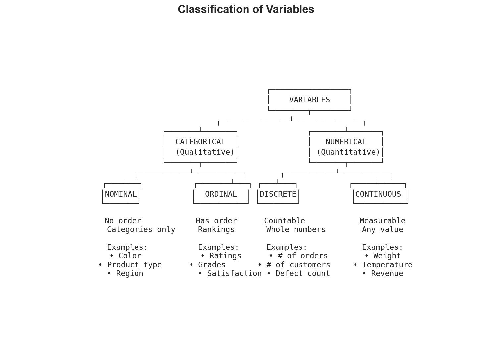

# Week 01: Data Types

**Course**: BSST1001 - Statistics I
**Level**: Foundation

---

## Visual Summary



---

## Learning Objectives
- Understand the classification of variables
- Distinguish between categorical and numerical data
- Learn appropriate methods for each data type

---

## 1. Variable Classification

### 1.1 Theory

The first step in any data analysis is understanding what type of data you have. This determines appropriate visualizations, summary statistics, and modeling approaches.

### 1.2 Data Type Hierarchy

```
Variables
├── Categorical (Qualitative)
│   ├── Nominal (no order): Color, Category, Region
│   └── Ordinal (ordered): Rating, Size (S/M/L)
└── Numerical (Quantitative)
    ├── Discrete (countable): Units sold, Number of stores
    └── Continuous (measurable): Price, Weight, Time
```

### 1.3 Detailed Definitions

| Type | Description | Examples |
|------|-------------|----------|
| **Nominal** | Categories with no inherent order | Product category, Supplier name, Color |
| **Ordinal** | Categories with meaningful order | Satisfaction rating (1-5), Size (S/M/L/XL) |
| **Discrete** | Countable values (integers) | Units sold, Number of defects, SKU count |
| **Continuous** | Measurable values (any real number) | Price, Weight, Lead time, Temperature |

### 1.4 Supply Chain Application

**Retail Context**:

| Type | Supply Chain Examples |
|------|----------------------|
| **Nominal** | Product category, Supplier name, Store location, Warehouse ID |
| **Ordinal** | Customer satisfaction (1-5), Priority level (Low/Medium/High), Quality grade (A/B/C) |
| **Discrete** | Units ordered, Stockouts per month, Number of SKUs, Delivery attempts |
| **Continuous** | Lead time (days), Order value ($), Fill rate (%), Forecast error |

---

## 2. Appropriate Methods by Data Type

### 2.1 Summary Statistics

| Data Type | Central Tendency | Spread | Example |
|-----------|-----------------|--------|---------|
| **Nominal** | Mode | — | Most common product category |
| **Ordinal** | Median, Mode | IQR | Median satisfaction rating |
| **Discrete** | Mean, Median | Std, IQR | Average units per order |
| **Continuous** | Mean, Median | Std, Range | Mean lead time |

### 2.2 Visualizations

| Data Type | Recommended Visualizations |
|-----------|---------------------------|
| **Nominal** | Bar chart, Pie chart, Treemap |
| **Ordinal** | Ordered bar chart, Stacked bar |
| **Discrete** | Histogram, Bar chart, Dot plot |
| **Continuous** | Histogram, Box plot, KDE, Violin plot |

### 2.3 Key Considerations

| Data Type | Can Calculate Mean? | Can Calculate Median? | Can Order? |
|-----------|--------------------|-----------------------|------------|
| **Nominal** | ✗ No | ✗ No | ✗ No |
| **Ordinal** | ⚠ Sometimes | ✓ Yes | ✓ Yes |
| **Discrete** | ✓ Yes | ✓ Yes | ✓ Yes |
| **Continuous** | ✓ Yes | ✓ Yes | ✓ Yes |

---

## 3. Identifying Data Types in Practice

### 3.1 Decision Process

1. **Is it a number?**
   - No → Categorical
   - Yes → Could be either (check next question)

2. **Do the numbers represent categories?**
   - Yes (e.g., 1=Male, 2=Female) → Categorical (encoded)
   - No → Numerical

3. **Can you have fractional values?**
   - Yes → Continuous
   - No → Discrete

4. **Is there a natural order?**
   - Yes → Ordinal (if categorical) or Numerical
   - No → Nominal

### 3.2 Common Pitfalls

| Pitfall | Example | Correct Classification |
|---------|---------|----------------------|
| Zip codes as numbers | 10001, 90210 | Nominal (not numeric!) |
| Ratings as continuous | 1-5 stars | Ordinal |
| Encoded categories | 1=Low, 2=Med, 3=High | Ordinal (not discrete) |
| ID numbers | Customer ID: 12345 | Nominal |

---

## Summary Table

| Concept | Definition | Key Property | Supply Chain Application |
|---------|------------|--------------|--------------------------|
| **Nominal** | Categories without order | Mode only | Product categories |
| **Ordinal** | Ordered categories | Median appropriate | Priority levels |
| **Discrete** | Countable numbers | Integer values | Units sold |
| **Continuous** | Measurable numbers | Any real value | Lead time, cost |

---

## Key Takeaways

1. **Always classify your data first** - it determines all subsequent analysis choices
2. **Categorical data** is qualitative (nominal = unordered, ordinal = ordered)
3. **Numerical data** is quantitative (discrete = countable, continuous = measurable)
4. **Wrong classification leads to wrong analysis** - don't calculate mean of zip codes!

---

## Next Week Preview

Week 2 covers **Categorical Data Analysis** - frequencies, proportions, and visualizations.

---

*IIT Madras BS Degree in Data Science*
