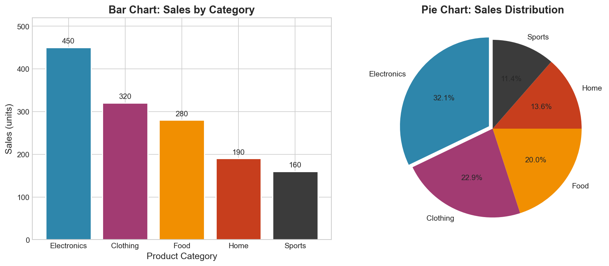

# Week 02: Categorical Data

**Course**: BSST1001 - Statistics I
**Level**: Foundation

---

## Visual Summary

---

## Learning Objectives
- Understand frequency tables and their construction
- Calculate relative and cumulative frequencies
- Master visualization techniques for categorical data

---

## 1. Frequency Tables

### 1.1 Theory

**Frequency tables** summarize categorical data by counting occurrences. Relative frequencies show proportions, enabling comparisons across groups.

### 1.2 Mathematical Definitions

| Measure | Formula | Description |
|---------|---------|-------------|
| **Frequency** | $f_i$ | Count of category $i$ |
| **Relative Frequency** | $p_i = \frac{f_i}{n}$ | Proportion (where $n$ = total) |
| **Percentage** | $p_i \times 100\%$ | Relative frequency as percent |
| **Cumulative Frequency** | $F_i = \sum_{j=1}^{i} f_j$ | Running total up to category $i$ |

### 1.3 Properties

- Sum of all frequencies: $\sum f_i = n$
- Sum of all relative frequencies: $\sum p_i = 1$
- Cumulative frequency of last category equals $n$

### 1.4 Supply Chain Application

**Retail Context**:
- **Product category distribution** - which categories dominate sales
- **Supplier breakdown** - concentration of purchases by vendor
- **Defect types analysis** - identify most common quality issues
- **Regional sales composition** - geographic distribution

---

## 2. Visualizing Categorical Data

### 2.1 Theory

**Bar charts** compare magnitudes across categories. **Pie charts** show parts of a whole (use sparingly - often bar charts are clearer).

### 2.2 Visualization Types

| Chart Type | Best For | Avoid When |
|------------|----------|------------|
| **Bar Chart** | Comparing categories | Too many categories (>15) |
| **Horizontal Bar** | Long category names | Few categories |
| **Pie Chart** | Parts of whole (5-7 cats) | >7 categories, comparing sizes |
| **Stacked Bar** | Composition over groups | Too many sub-categories |
| **Treemap** | Hierarchical categories | Non-hierarchical data |

### 2.3 Best Practices

| Practice | Reason |
|----------|--------|
| **Order bars by frequency** | Reveals patterns, not alphabetical noise |
| **Limit pie charts to 5-7 categories** | Too many slices are unreadable |
| **Use horizontal bars for long names** | Text remains readable |
| **Start y-axis at zero** | Prevents misleading comparisons |
| **Use consistent colors** | Same category = same color across charts |

### 2.4 Supply Chain Application

**Retail Context**:
- **Revenue by product category** - identify top performers
- **Order distribution by fulfillment center** - capacity planning
- **Inventory breakdown by status** - available, reserved, backorder
- **Shipments by carrier** - vendor performance comparison

---

## 3. Pareto Analysis (80/20 Rule)

### 3.1 Theory

The **Pareto principle** states that roughly 80% of effects come from 20% of causes. Visualized with a Pareto chart (bars + cumulative line).

### 3.2 Construction

1. Calculate frequencies for each category
2. Sort in descending order
3. Calculate cumulative percentages
4. Plot bars (frequency) and line (cumulative %)

### 3.3 Supply Chain Application

- **80% of revenue** from 20% of products (SKU rationalization)
- **80% of defects** from 20% of causes (quality focus)
- **80% of costs** from 20% of suppliers (vendor management)

---

## Summary Table

| Concept | Definition | Key Property | Supply Chain Application |
|---------|------------|--------------|--------------------------|
| **Frequency** | Count of category | $\sum f_i = n$ | Category counts |
| **Relative Frequency** | $f_i / n$ | $\sum p_i = 1$ | Proportions |
| **Bar Chart** | Bars compare categories | Order by frequency | Category comparison |
| **Pareto Chart** | Bars + cumulative line | 80/20 identification | Focus prioritization |

---

## Key Takeaways

1. **Frequency tables** are the foundation - always start with counts
2. **Relative frequencies** enable fair comparison across different group sizes
3. **Bar charts** are usually better than pie charts for categorical data
4. **Order categories by frequency** (not alphabetically) to reveal insights

---

## Next Week Preview

Week 3 covers **Numerical Data Analysis** - histograms, measures of center and spread.

---

*IIT Madras BS Degree in Data Science*
