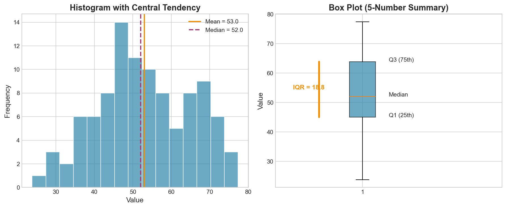

# Week 03: Numerical Data

**Course**: BSST1001 - Statistics I
**Level**: Foundation

---

## Visual Summary



---

## Learning Objectives
- Master measures of central tendency (mean, median, mode)
- Understand measures of spread (variance, standard deviation, IQR)
- Learn distribution visualization techniques

---

## 1. Measures of Central Tendency

### 1.1 Theory

**Central tendency** describes the "typical" value in a dataset. Different measures are appropriate for different distributions.

### 1.2 Mathematical Definitions

| Measure | Formula | Description |
|---------|---------|-------------|
| **Mean** | $\bar{x} = \frac{1}{n}\sum_{i=1}^n x_i$ | Arithmetic average |
| **Median** | Middle value when sorted | 50th percentile |
| **Mode** | Most frequent value | Can have multiple modes |

### 1.3 When to Use Each

| Measure | Best For | Sensitive To |
|---------|----------|--------------|
| **Mean** | Symmetric distributions | Outliers, skewness |
| **Median** | Skewed distributions, outliers | Nothing (robust) |
| **Mode** | Categorical or discrete data | Sampling variability |

### 1.4 Relationship in Different Distributions

| Distribution Shape | Relationship |
|-------------------|--------------|
| **Symmetric** | Mean ≈ Median ≈ Mode |
| **Right-skewed** | Mean > Median > Mode |
| **Left-skewed** | Mean < Median < Mode |

### 1.5 Supply Chain Application

**Retail Context**:
- **Mean daily sales** - for normally distributed demand
- **Median lead time** - when supplier delays create outliers
- **Mode of order quantity** - common reorder amounts for EOQ validation

---

## 2. Measures of Spread

### 2.1 Theory

**Spread** measures variability - how much values differ from the center.

### 2.2 Mathematical Definitions

| Measure | Formula | Description |
|---------|---------|-------------|
| **Range** | $\max - \min$ | Total spread (sensitive to outliers) |
| **Variance** | $s^2 = \frac{1}{n-1}\sum_{i=1}^n (x_i - \bar{x})^2$ | Average squared deviation |
| **Standard Deviation** | $s = \sqrt{s^2}$ | Typical distance from mean |
| **IQR** | $Q_3 - Q_1$ | Spread of middle 50% |

### 2.3 Important Note on Calculation

**Use sample standard deviation** (dividing by $n-1$):

```python
np.std(x, ddof=1)  # Sample std (correct for samples)
np.std(x, ddof=0)  # Population std (only if you have entire population)
```

### 2.4 Comparing Measures

| Measure | Robust to Outliers? | Units |
|---------|--------------------| ------|
| **Range** | ✗ No | Same as data |
| **Variance** | ✗ No | Squared units |
| **Std Dev** | ✗ No | Same as data |
| **IQR** | ✓ Yes | Same as data |

### 2.5 Supply Chain Application

**Retail Context**:
- **Demand std dev** - determines safety stock levels
- **Lead time variability** - affects reorder point calculations
- **IQR of order sizes** - identifies unusual orders (outliers)

---

## 3. Visualizing Distributions

### 3.1 Histograms

**Histograms** show the shape of a distribution by grouping data into bins.

| Feature | Interpretation |
|---------|---------------|
| **Symmetric** | Mean ≈ Median |
| **Right-skewed** | Long tail to right, Mean > Median |
| **Left-skewed** | Long tail to left, Mean < Median |
| **Bimodal** | Two peaks, possibly two populations |

### 3.2 Box Plots

**Box plots** summarize distributions compactly and highlight outliers.

**Anatomy**:
| Component | Represents |
|-----------|------------|
| **Box** | Q1 to Q3 (contains middle 50% = IQR) |
| **Line in box** | Median |
| **Whiskers** | Extend to 1.5 × IQR from box edges |
| **Points beyond** | Outliers |

### 3.3 Outlier Detection

Using IQR method:
- **Lower fence**: $Q_1 - 1.5 \times IQR$
- **Upper fence**: $Q_3 + 1.5 \times IQR$
- Values outside fences are **outliers**

### 3.4 Supply Chain Application

**Retail Context**:
- **Histograms of lead times** - identify distribution shape for modeling
- **Box plots by category** - compare performance across product lines
- **Outlier detection** - flag unusual orders or demand spikes

---

## Summary Table

| Concept | Definition | Key Property | Supply Chain Application |
|---------|------------|--------------|--------------------------|
| **Mean** | $\bar{x} = \sum x_i / n$ | Sensitive to outliers | Average demand |
| **Median** | Middle value | Robust | Lead time with delays |
| **Std Dev** | $\sqrt{\text{Var}}$ | Typical spread | Safety stock calculation |
| **IQR** | $Q_3 - Q_1$ | Robust spread | Outlier detection |
| **Box Plot** | 5-number summary visual | Shows outliers | Distribution comparison |

---

## Key Takeaways

1. **Mean** for symmetric data, **median** for skewed data or when outliers exist
2. **Standard deviation** measures typical distance from mean - key for safety stock
3. **IQR** is robust and used for outlier detection (1.5 × IQR rule)
4. **Always visualize** before choosing summary statistics

---

## Next Week Preview

Week 4 covers **Association and Correlation** - relationships between variables.

---

*IIT Madras BS Degree in Data Science*
