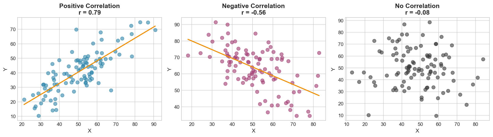

# Week 04: Association and Correlation

**Course**: BSST1001 - Statistics I
**Level**: Foundation

---

## Visual Summary

---

## Learning Objectives
- Understand association between categorical variables
- Master correlation for numerical variables
- Distinguish correlation from causation

---

## 1. Association in Categorical Variables

### 1.1 Theory

**Association** measures whether the distribution of one variable differs across levels of another. Two categorical variables are **associated** if knowing the value of one provides information about the other.

### 1.2 Contingency Tables

A **contingency table** (cross-tabulation) displays frequencies for combinations of two categorical variables.

| | Category B₁ | Category B₂ | Total |
|---|---|---|---|
| **Category A₁** | n₁₁ | n₁₂ | n₁• |
| **Category A₂** | n₂₁ | n₂₂ | n₂• |
| **Total** | n•₁ | n•₂ | n |

### 1.3 Chi-Square Test

The **chi-square statistic** tests for independence between categorical variables:

$$\chi^2 = \sum \frac{(O - E)^2}{E}$$

Where:
- $O$ = Observed frequency
- $E$ = Expected frequency under independence

**Expected frequency**: $E_{ij} = \frac{(\text{row total}) \times (\text{column total})}{\text{grand total}}$

### 1.4 Interpreting Chi-Square

| Result | Interpretation |
|--------|---------------|
| **Large χ²** | Strong evidence against independence |
| **Small χ²** | Observed ≈ Expected (consistent with independence) |
| **p-value < 0.05** | Reject independence, variables are associated |

### 1.5 Supply Chain Application

**Retail Context**:
- Is **product category** associated with **return rate**?
- Is **supplier** associated with **defect occurrence**?
- Is **shipping method** associated with **on-time delivery**?

---

## 2. Correlation for Numerical Variables

### 2.1 Theory

**Correlation** measures the strength and direction of a **linear relationship** between two numerical variables.

### 2.2 Pearson Correlation Coefficient

$$r = \frac{\sum (x_i - \bar{x})(y_i - \bar{y})}{\sqrt{\sum (x_i - \bar{x})^2 \sum (y_i - \bar{y})^2}}$$

### 2.3 Properties of Correlation

| Property | Value |
|----------|-------|
| **Range** | $-1 \leq r \leq 1$ |
| **Perfect positive** | $r = 1$ |
| **Perfect negative** | $r = -1$ |
| **No linear relationship** | $r = 0$ |
| **Symmetric** | $r(X,Y) = r(Y,X)$ |
| **Unitless** | Not affected by scale or units |

### 2.4 Interpreting Correlation Strength

| \|r\| Value | Strength |
|-------------|----------|
| 0.0 - 0.3 | Weak |
| 0.3 - 0.7 | Moderate |
| 0.7 - 1.0 | Strong |

### 2.5 Pearson vs Spearman

| Correlation | Use When | Robust To |
|-------------|----------|-----------|
| **Pearson (r)** | Linear relationship, no outliers | — |
| **Spearman (ρ)** | Monotonic relationship, outliers exist | Outliers, non-linearity |

**Spearman's ρ** uses ranks instead of raw values, making it robust.

### 2.6 Supply Chain Application

**Retail Context**:
- **Price-demand correlation** - price elasticity analysis
- **Advertising-sales relationship** - marketing effectiveness
- **Lead time-stockout correlation** - inventory optimization
- **Store size-revenue relationship** - expansion decisions

---

## 3. Correlation ≠ Causation

### 3.1 Theory

**Correlation indicates association, NOT causation.** A strong correlation does not prove that one variable causes changes in another.

### 3.2 Why Correlation Can Be Misleading

| Issue | Description | Example |
|-------|-------------|---------|
| **Confounding** | Third variable causes both | Ice cream sales ↔ drownings (summer causes both) |
| **Reverse causation** | Direction unclear | Advertising → sales OR sales → advertising budget? |
| **Spurious correlation** | Pure coincidence | Nicolas Cage movies ↔ pool drownings |

### 3.3 Establishing Causation

Causation requires:
1. **Temporal precedence** - cause comes before effect
2. **Covariation** - changes in X associated with changes in Y
3. **No confounding** - rule out alternative explanations
4. **Mechanism** - plausible causal pathway

**Gold standard**: Randomized controlled experiments

### 3.4 Supply Chain Application

**Critical thinking examples**:
- High inventory correlated with high sales → Does inventory cause sales, or do expected sales cause inventory buildup?
- Promotional price correlated with higher volume → Is it price, or marketing, or seasonality?

---

## Summary Table

| Concept | Definition | Key Property | Supply Chain Application |
|---------|------------|--------------|--------------------------|
| **Contingency Table** | Cross-tab of categorical frequencies | Shows joint distribution | Category × defect analysis |
| **Chi-Square (χ²)** | $\sum (O-E)^2/E$ | Tests independence | Supplier-quality association |
| **Pearson (r)** | Linear correlation coefficient | $-1 \leq r \leq 1$ | Price-demand relationship |
| **Spearman (ρ)** | Rank-based correlation | Robust to outliers | Lead time analysis |
| **Causation** | X directly produces Y | Requires experimentation | A/B testing promotions |

---

## Key Takeaways

1. **Chi-square test** assesses association between categorical variables
2. **Pearson correlation** measures linear relationship strength ($-1$ to $1$)
3. **Spearman correlation** is robust to outliers and non-linearity
4. **Correlation ≠ Causation** - always consider confounders

---

## Next Week Preview

Week 5 covers **Counting Principles** - the foundation for probability.

---

*IIT Madras BS Degree in Data Science*
