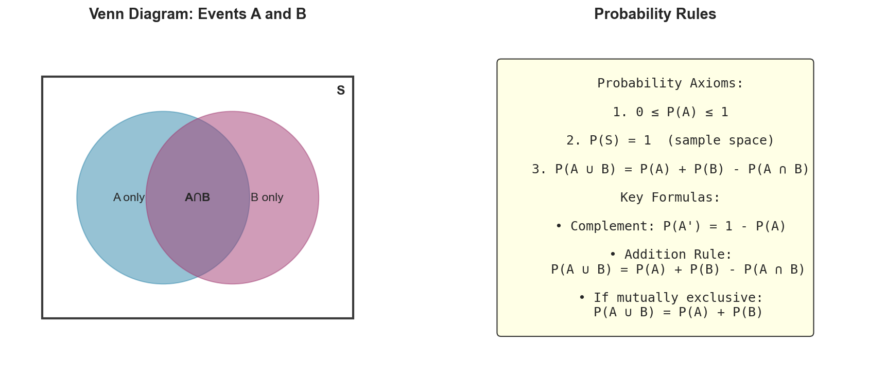

# Week 07: Introduction to Probability

**Course**: BSST1001 - Statistics I
**Level**: Foundation

---

## Visual Summary

---

## Learning Objectives
- Understand sample spaces and events
- Master probability axioms and derived rules
- Distinguish probability interpretations (classical vs frequentist)

---

## 1. Sample Spaces and Events

### 1.1 Theory

**Probability theory** begins with defining what outcomes are possible (sample space) and what we care about (events).

### 1.2 Definitions

| Term | Symbol | Definition | Example |
|------|--------|------------|---------|
| **Sample Space** | $S$ or $\Omega$ | Set of all possible outcomes | $S = \{1, 2, 3, 4, 5, 6\}$ for a die |
| **Event** | $A, B, ...$ | Subset of sample space | $A = \{2, 4, 6\}$ (even numbers) |
| **Simple Event** | — | Single outcome | $\{3\}$ |
| **Compound Event** | — | Multiple outcomes | $\{1, 2, 3\}$ |

### 1.3 Event Operations

| Operation | Notation | Meaning |
|-----------|----------|---------|
| **Union** | $A \cup B$ | A OR B (at least one occurs) |
| **Intersection** | $A \cap B$ | A AND B (both occur) |
| **Complement** | $A^c$ or $A'$ | NOT A (A does not occur) |
| **Mutually Exclusive** | $A \cap B = \emptyset$ | Cannot occur together |

### 1.4 Supply Chain Application

**Retail Context**:
- **Sample space**: Demand levels $S = \{0, 1, 2, \ldots, \text{max}\}$
- **Events**: "Demand exceeds stock", "Supplier delivers on time"
- **Compound events**: "High demand AND late delivery"

---

## 2. Probability Axioms and Rules

### 2.1 Kolmogorov's Axioms

Probability is a function $P$ that assigns numbers to events satisfying:

| Axiom | Statement | Meaning |
|-------|-----------|---------|
| **Axiom 1** | $P(A) \geq 0$ | Probabilities are non-negative |
| **Axiom 2** | $P(S) = 1$ | Something must happen |
| **Axiom 3** | If $A \cap B = \emptyset$: $P(A \cup B) = P(A) + P(B)$ | Additive for mutually exclusive |

### 2.2 Derived Rules

From the axioms, we derive:

| Rule | Formula |
|------|---------|
| **Complement Rule** | $P(A^c) = 1 - P(A)$ |
| **Impossible Event** | $P(\emptyset) = 0$ |
| **Probability Bounds** | $0 \leq P(A) \leq 1$ |
| **General Addition** | $P(A \cup B) = P(A) + P(B) - P(A \cap B)$ |

### 2.3 The Complement Rule

One of the most useful rules in practice:

$$P(A^c) = 1 - P(A)$$

**Use when**: It's easier to calculate the probability of the opposite event.

### 2.4 General Addition Rule

For any two events (not necessarily mutually exclusive):

$$P(A \cup B) = P(A) + P(B) - P(A \cap B)$$

**Why subtract?**: To avoid double-counting the overlap.

### 2.5 Supply Chain Application

**Retail Context**:
- $P(\text{stockout}) = 1 - P(\text{sufficient stock})$ — Complement rule
- $P(\text{late OR wrong item}) = P(\text{late}) + P(\text{wrong}) - P(\text{both})$ — Addition rule

---

## 3. Probability Interpretations

### 3.1 Classical (Theoretical) Probability

$$P(A) = \frac{\text{number of favorable outcomes}}{\text{total number of outcomes}}$$

**Assumption**: All outcomes are equally likely.

**Example**: Fair die: $P(\text{even}) = \frac{3}{6} = 0.5$

### 3.2 Frequentist (Empirical) Probability

$$P(A) = \lim_{n \to \infty} \frac{\text{times A occurs}}{n}$$

**Interpretation**: Long-run relative frequency from repeated experiments.

**Example**: After 10,000 orders, 850 were late → $P(\text{late}) \approx 0.085$

### 3.3 Comparison

| Aspect | Classical | Frequentist |
|--------|-----------|-------------|
| **Basis** | Theory/symmetry | Data/observation |
| **Requirement** | Equally likely outcomes | Many trials |
| **Use** | Games, simple models | Real-world data |

### 3.4 Law of Large Numbers

As the number of trials increases, the empirical probability converges to the true probability.

**Implication**: More data → better probability estimates.

---

## 4. Calculating Probabilities

### 4.1 For Equally Likely Outcomes

$$P(A) = \frac{|A|}{|S|} = \frac{\text{count of outcomes in A}}{\text{count of outcomes in S}}$$

### 4.2 Using Counting Principles

Combine with Week 5-6 counting:

$$P(\text{event}) = \frac{C(n, r) \text{ or } P(n, r) \text{ for favorable}}{\text{total arrangements}}$$

---

## Summary Table

| Concept | Definition | Formula | Supply Chain Application |
|---------|------------|---------|--------------------------|
| **Sample Space** | All possible outcomes | $S$ | Demand levels |
| **Event** | Subset of interest | $A \subseteq S$ | Stockout occurrence |
| **Complement** | Opposite event | $P(A^c) = 1 - P(A)$ | Service level from stockout rate |
| **Addition Rule** | A or B | $P(A \cup B) = P(A) + P(B) - P(A \cap B)$ | Multiple failure modes |

---

## Key Takeaways

1. **Sample space** ($S$) contains all possible outcomes; **events** are subsets
2. **Three axioms** define valid probability measures
3. **Complement rule**: $P(A^c) = 1 - P(A)$ — often easier to compute
4. **Classical** uses counting; **Frequentist** uses data

---

## Next Week Preview

Week 8 covers **Conditional Probability** - updating probabilities with new information.

---

*IIT Madras BS Degree in Data Science*
