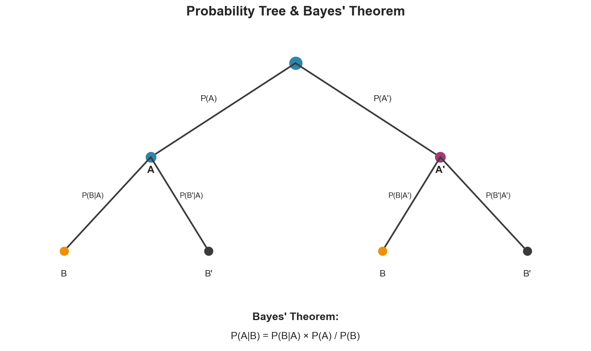

# Week 08: Conditional Probability

**Course**: BSST1001 - Statistics I
**Level**: Foundation

---

## Visual Summary

---

## Learning Objectives
- Master conditional probability calculations
- Understand and apply Bayes' theorem
- Identify independence between events

---

## 1. Conditional Probability

### 1.1 Theory

**Conditional probability** updates our beliefs given new information. It answers: "What is the probability of A, given that B has occurred?"

### 1.2 Mathematical Definition

$$P(A|B) = \frac{P(A \cap B)}{P(B)}$$

Where:
- $P(A|B)$ = probability of A given B
- $P(A \cap B)$ = probability of both A and B
- $P(B)$ = probability of B (must be > 0)

### 1.3 Multiplication Rule

Rearranging the conditional probability formula:

$$P(A \cap B) = P(A|B) \cdot P(B) = P(B|A) \cdot P(A)$$

**Use when**: You need the probability of both events occurring.

### 1.4 Interpreting Conditional Probability

| Expression | Meaning |
|------------|---------|
| $P(A \mid B)$ | Probability of A, given B occurred |
| $P(B \mid A)$ | Probability of B, given A occurred |
| $P(A \cap B)$ | Probability of both A and B |

**Warning**: $P(A|B) \neq P(B|A)$ in general!

### 1.5 Supply Chain Application

**Retail Context**:
- $P(\text{stockout} \mid \text{high demand day})$ — risk during peak periods
- $P(\text{defective} \mid \text{supplier A})$ — supplier quality assessment
- $P(\text{return} \mid \text{online purchase})$ — channel-specific return rates

---

## 2. Bayes' Theorem

### 2.1 Theory

**Bayes' theorem** reverses the direction of conditioning. It updates prior beliefs with new evidence.

### 2.2 Mathematical Definition

$$P(A|B) = \frac{P(B|A) \cdot P(A)}{P(B)}$$

### 2.3 Components of Bayes' Theorem

| Term | Name | Meaning |
|------|------|---------|
| $P(A)$ | **Prior** | Initial belief about A |
| $P(B \mid A)$ | **Likelihood** | Probability of evidence given A |
| $P(A \mid B)$ | **Posterior** | Updated belief after seeing B |
| $P(B)$ | **Marginal** | Total probability of evidence |

### 2.4 Law of Total Probability

To find $P(B)$ when not directly available:

$$P(B) = P(B|A) \cdot P(A) + P(B|A^c) \cdot P(A^c)$$

**Generalized** (for partitions $A_1, A_2, \ldots, A_n$):

$$P(B) = \sum_{i=1}^{n} P(B|A_i) \cdot P(A_i)$$

### 2.5 Full Bayes' Formula

$$P(A|B) = \frac{P(B|A) \cdot P(A)}{P(B|A) \cdot P(A) + P(B|A^c) \cdot P(A^c)}$$

### 2.6 Supply Chain Application

**Retail Context**: Given a product was returned, what's the probability it came from Supplier A?

- **Prior**: $P(\text{Supplier A}) = 0.6$
- **Likelihood**: $P(\text{return} \mid \text{Supplier A}) = 0.02$
- **Posterior**: $P(\text{Supplier A} \mid \text{return}) = ?$

This helps identify supplier quality issues and allocate quality control resources.

---

## 3. Independence

### 3.1 Theory

Events are **independent** if knowing one occurred tells you nothing about the other.

### 3.2 Mathematical Definition

A and B are **independent** if any of these equivalent conditions hold:

| Condition | Formula |
|-----------|---------|
| Conditional = Marginal | $P(A|B) = P(A)$ |
| Conditional = Marginal | $P(B|A) = P(B)$ |
| Multiplication Rule | $P(A \cap B) = P(A) \cdot P(B)$ |

### 3.3 Testing for Independence

Given data, check if:

$$P(A \cap B) \approx P(A) \cdot P(B)$$

If not approximately equal, events are **dependent**.

### 3.4 Independence vs. Mutually Exclusive

| Concept | Definition | Relationship |
|---------|------------|--------------|
| **Mutually Exclusive** | Cannot occur together | $P(A \cap B) = 0$ |
| **Independent** | One doesn't affect other | $P(A \cap B) = P(A) \cdot P(B)$ |

**Key insight**: Mutually exclusive events (with non-zero probabilities) are **never independent**.

### 3.5 Supply Chain Application

**Retail Context**:
- Are **weekend** and **high demand** independent? (If not, adjust weekend staffing)
- Are **product category** and **return rate** independent? (If not, category-specific return policies)

---

## 4. Common Problem Types

### 4.1 Diagnostic Testing (Classic Bayes Application)

| Term | Definition |
|------|------------|
| **Sensitivity** | $P(\text{positive} \mid \text{defective})$ — true positive rate |
| **Specificity** | $P(\text{negative} \mid \text{non-defective})$ — true negative rate |
| **False Positive Rate** | $1 - \text{Specificity}$ |
| **False Negative Rate** | $1 - \text{Sensitivity}$ |

**Question**: Given a positive test, what's the probability the item is actually defective?

$$P(\text{defective} \mid \text{positive}) = \frac{P(\text{positive} \mid \text{defective}) \cdot P(\text{defective})}{P(\text{positive})}$$

---

## Summary Table

| Concept | Definition | Formula | Supply Chain Application |
|---------|------------|---------|--------------------------|
| **Conditional Probability** | P(A) given B occurred | $P(A \mid B) = \frac{P(A \cap B)}{P(B)}$ | Stockout risk on peak days |
| **Bayes' Theorem** | Reverse conditioning | $P(A \mid B) = \frac{P(B \mid A) P(A)}{P(B)}$ | Identify defect source |
| **Independence** | Events don't affect each other | $P(A \cap B) = P(A) P(B)$ | Demand pattern analysis |
| **Law of Total Probability** | Partition-based calculation | $P(B) = \sum P(B \mid A_i) P(A_i)$ | Overall defect rate |

---

## Key Takeaways

1. **Conditional probability**: $P(A|B) = \frac{P(A \cap B)}{P(B)}$ — updates probability given new info
2. **Bayes' theorem**: Reverses conditioning direction — $P(A|B)$ from $P(B|A)$
3. **Independence**: $P(A|B) = P(A)$ — knowing B doesn't change belief about A
4. These concepts underlie **Bayesian forecasting** and **diagnostic testing**

---

## Next Week Preview

Week 9 covers **Random Variables** - formalizing uncertain quantities.

---

*IIT Madras BS Degree in Data Science*
