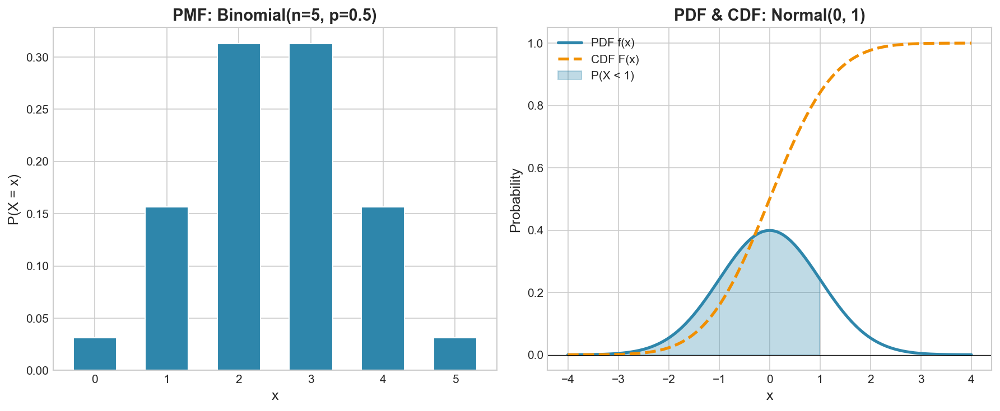

# Week 09: Random Variables

**Course**: BSST1001 - Statistics I
**Level**: Foundation

---

## Visual Summary

---

## Learning Objectives
- Understand discrete random variables and PMF
- Master continuous random variables and PDF
- Apply CDF for cumulative probability calculations

---

## 1. Random Variables

### 1.1 Definition

A **random variable** is a function that assigns a numerical value to each outcome in a sample space.

$$X: S \to \mathbb{R}$$

### 1.2 Types of Random Variables

| Type | Values | Example |
|------|--------|---------|
| **Discrete** | Countable (integers) | Demand count, defects |
| **Continuous** | Any value in interval | Lead time, weight |

---

## 2. Discrete Random Variables

### 2.1 Theory

A **discrete random variable** takes countable values (usually integers). Probabilities are assigned to each specific value.

### 2.2 Probability Mass Function (PMF)

The **PMF** gives the probability that $X$ equals a specific value:

$$p(x) = P(X = x)$$

### 2.3 Properties of PMF

| Property | Requirement |
|----------|-------------|
| Non-negative | $p(x) \geq 0$ for all $x$ |
| Sums to 1 | $\sum_{\text{all } x} p(x) = 1$ |

### 2.4 Cumulative Distribution Function (CDF)

The **CDF** gives the probability that $X$ is less than or equal to a value:

$$F(x) = P(X \leq x) = \sum_{t \leq x} p(t)$$

### 2.5 CDF Properties

| Property | Description |
|----------|-------------|
| Range | $0 \leq F(x) \leq 1$ |
| Non-decreasing | If $a < b$, then $F(a) \leq F(b)$ |
| Limits | $F(-\infty) = 0$, $F(\infty) = 1$ |

### 2.6 Relationship Between PMF and CDF

| From | To | Formula |
|------|-----|---------|
| PMF → CDF | Cumulative sum | $F(x) = \sum_{t \leq x} p(t)$ |
| CDF → PMF | Difference | $p(x) = F(x) - F(x^-)$ |

### 2.7 Supply Chain Application

**Retail Context**:
- **Daily demand** — number of units sold
- **Defects per batch** — quality control
- **Orders per hour** — staffing decisions
- **Units in stock** — inventory levels

---

## 3. Continuous Random Variables

### 3.1 Theory

A **continuous random variable** can take any value in an interval. Individual points have probability zero; we find probability over intervals.

### 3.2 Probability Density Function (PDF)

The **PDF** $f(x)$ describes the relative likelihood at each point:

$$P(a < X < b) = \int_a^b f(x) \, dx$$

**Note**: $P(X = x) = 0$ for any specific value $x$.

### 3.3 Properties of PDF

| Property | Requirement |
|----------|-------------|
| Non-negative | $f(x) \geq 0$ for all $x$ |
| Integrates to 1 | $\int_{-\infty}^{\infty} f(x) \, dx = 1$ |

### 3.4 CDF for Continuous Variables

$$F(x) = P(X \leq x) = \int_{-\infty}^{x} f(t) \, dt$$

### 3.5 Relationship Between PDF and CDF

| From | To | Formula |
|------|-----|---------|
| PDF → CDF | Integration | $F(x) = \int_{-\infty}^{x} f(t) \, dt$ |
| CDF → PDF | Differentiation | $f(x) = \frac{dF(x)}{dx}$ |

### 3.6 Supply Chain Application

**Retail Context**:
- **Lead time** — days from order to delivery
- **Time between orders** — demand patterns
- **Shipment weight** — logistics planning
- **Transaction values** — revenue analysis

---

## 4. Discrete vs Continuous Comparison

| Aspect | Discrete | Continuous |
|--------|----------|------------|
| **Values** | Countable | Uncountable |
| **Probability Function** | PMF: $p(x) = P(X = x)$ | PDF: $f(x)$ (density) |
| **Point Probability** | $P(X = x) > 0$ possible | $P(X = x) = 0$ always |
| **Interval Probability** | Sum: $\sum p(x)$ | Integral: $\int f(x) dx$ |
| **CDF** | Step function | Smooth curve |

---

## 5. Computing Probabilities

### 5.1 Discrete: Using PMF and CDF

| Probability | Formula |
|-------------|---------|
| $P(X = x)$ | $p(x)$ |
| $P(X \leq x)$ | $F(x)$ |
| $P(X < x)$ | $F(x) - p(x)$ |
| $P(X > x)$ | $1 - F(x)$ |
| $P(a \leq X \leq b)$ | $F(b) - F(a) + p(a)$ |

### 5.2 Continuous: Using CDF

| Probability | Formula |
|-------------|---------|
| $P(X \leq x)$ | $F(x)$ |
| $P(X > x)$ | $1 - F(x)$ |
| $P(a < X < b)$ | $F(b) - F(a)$ |

**Note**: For continuous, $P(X < x) = P(X \leq x)$ since point probability is zero.

---

## Summary Table

| Concept | Discrete | Continuous | Supply Chain Application |
|---------|----------|------------|--------------------------|
| **Probability Function** | PMF: $p(x)$ | PDF: $f(x)$ | Demand modeling |
| **Cumulative Function** | CDF: $\sum p(t)$ | CDF: $\int f(t) dt$ | Service level calculation |
| **Point Probability** | $P(X = x) = p(x)$ | $P(X = x) = 0$ | Exact demand probability |
| **Interval Probability** | Sum PMF | Integrate PDF | Stockout risk |

---

## Key Takeaways

1. **Random variables** map outcomes to numbers
2. **Discrete**: PMF gives $P(X = x)$; sum for probabilities
3. **Continuous**: PDF gives density; integrate for probabilities
4. **CDF** gives $P(X \leq x)$ — useful for percentiles and service levels

---

## Next Week Preview

Week 10 covers **Expectation and Variance** - summarizing random variables.

---

*IIT Madras BS Degree in Data Science*
