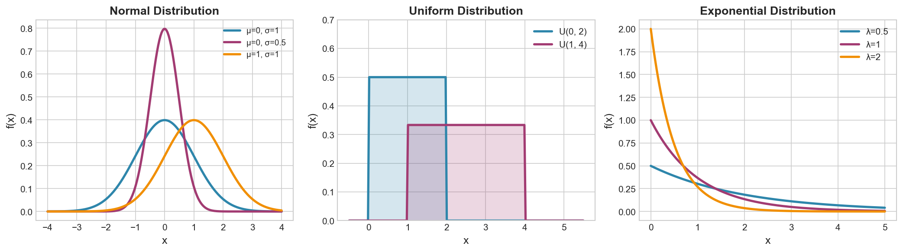

# Week 12: Continuous Distributions

**Course**: BSST1001 - Statistics I
**Level**: Foundation

---

## Visual Summary



---

## Learning Objectives
- Master the Normal distribution and its applications
- Understand the Uniform distribution
- Learn the Exponential distribution for waiting times

---

## 1. Normal Distribution

### 1.1 Theory

The **Normal (Gaussian) distribution** is the most important continuous distribution. It arises from the Central Limit Theorem and describes many natural phenomena.

### 1.2 Mathematical Definition

$$f(x) = \frac{1}{\sigma\sqrt{2\pi}} e^{-\frac{(x-\mu)^2}{2\sigma^2}}$$

### 1.3 Parameters and Moments

| Property | Value |
|----------|-------|
| **Parameters** | $\mu$ (mean), $\sigma$ (std dev) |
| **Notation** | $X \sim N(\mu, \sigma^2)$ |
| **Expected Value** | $E[X] = \mu$ |
| **Variance** | $\text{Var}(X) = \sigma^2$ |

### 1.4 Standard Normal Distribution

**Standardization** converts any Normal to Standard Normal:

$$Z = \frac{X - \mu}{\sigma}$$

Where $Z \sim N(0, 1)$

### 1.5 Empirical Rule (68-95-99.7)

| Range | Probability |
|-------|-------------|
| $\mu \pm 1\sigma$ | 68% |
| $\mu \pm 2\sigma$ | 95% |
| $\mu \pm 3\sigma$ | 99.7% |

### 1.6 Key Z-Scores for Service Levels

| Service Level | Z-Score |
|---------------|---------|
| 90% | 1.28 |
| 95% | 1.645 |
| 97.5% | 1.96 |
| 99% | 2.33 |
| 99.9% | 3.09 |

### 1.7 Python Implementation

```python
from scipy import stats
# X ~ Normal(μ=100, σ=15)
norm = stats.norm(loc=100, scale=15)
norm.pdf(x)      # Density at x
norm.cdf(x)      # P(X ≤ x)
norm.ppf(p)      # Inverse CDF (quantile)
norm.mean()      # μ
norm.std()       # σ
```

### 1.8 Supply Chain Application

**Retail Context**:
- **Demand for fast-moving items** — often approximately Normal
- **Lead times** — aggregated lead times tend toward Normal
- **Measurement errors** — quality control measurements

**Safety Stock Formula** (Normal demand assumption):

$$SS = z_{\alpha} \cdot \sigma_D \cdot \sqrt{L}$$

Where:
- $z_{\alpha}$ = z-score for desired service level
- $\sigma_D$ = demand standard deviation
- $L$ = lead time

---

## 2. Uniform Distribution

### 2.1 Theory

The **Uniform distribution** assigns equal probability to all values in an interval $[a, b]$.

### 2.2 Mathematical Definition

$$f(x) = \frac{1}{b-a} \text{ for } a \leq x \leq b$$

$$f(x) = 0 \text{ otherwise}$$

### 2.3 Parameters and Moments

| Property | Formula |
|----------|---------|
| **Parameters** | $a$ (min), $b$ (max) |
| **Notation** | $X \sim \text{Uniform}(a, b)$ |
| **Expected Value** | $E[X] = \frac{a+b}{2}$ |
| **Variance** | $\text{Var}(X) = \frac{(b-a)^2}{12}$ |

### 2.4 CDF

$$F(x) = \frac{x - a}{b - a} \text{ for } a \leq x \leq b$$

### 2.5 Python Implementation

```python
from scipy import stats
# X ~ Uniform(a=2, b=8)
uniform = stats.uniform(loc=2, scale=6)  # scale = b - a
uniform.pdf(x)
uniform.cdf(x)
uniform.mean()
```

### 2.6 Supply Chain Application

**Retail Context**:
- **Lead time bounds** — equally likely between min and max
- **Arrival time** within a delivery window
- **Random sampling** for quality control
- **Simulation** — generating random inputs

---

## 3. Exponential Distribution

### 3.1 Theory

The **Exponential distribution** models waiting times between Poisson events. It has the unique **memoryless** property.

### 3.2 Mathematical Definition

$$f(x) = \lambda e^{-\lambda x} \text{ for } x \geq 0$$

### 3.3 Parameters and Moments

| Property | Formula |
|----------|---------|
| **Parameter** | $\lambda$ (rate) |
| **Notation** | $X \sim \text{Exp}(\lambda)$ |
| **Expected Value** | $E[X] = \frac{1}{\lambda}$ |
| **Variance** | $\text{Var}(X) = \frac{1}{\lambda^2}$ |

### 3.4 CDF and Survival Function

| Function | Formula |
|----------|---------|
| **CDF** | $F(x) = 1 - e^{-\lambda x}$ |
| **Survival** | $P(X > x) = e^{-\lambda x}$ |

### 3.5 Memoryless Property

$$P(X > s + t \mid X > s) = P(X > t)$$

**Meaning**: Given that you've already waited $s$ units, the probability of waiting an additional $t$ units is the same as starting fresh.

### 3.6 Relationship with Poisson

| Distribution | Models |
|--------------|--------|
| **Poisson($\lambda$)** | Number of events in time interval |
| **Exponential($\lambda$)** | Time between consecutive events |

### 3.7 Python Implementation

```python
from scipy import stats
# X ~ Exp(λ=0.5) — average wait = 2 units
expon = stats.expon(scale=2)  # scale = 1/λ
expon.pdf(x)
expon.cdf(x)
expon.mean()    # 1/λ
```

### 3.8 Supply Chain Application

**Retail Context**:
- **Time between customer arrivals**
- **Time between equipment failures** — reliability modeling
- **Inter-arrival time of orders**
- **Time to next stockout**

---

## 4. Distribution Comparison

| Distribution | Use Case | Parameters | Mean | Variance |
|--------------|----------|------------|------|----------|
| **Normal** | Symmetric data, CLT | $\mu, \sigma$ | $\mu$ | $\sigma^2$ |
| **Uniform** | Equal likelihood in range | $a, b$ | $\frac{a+b}{2}$ | $\frac{(b-a)^2}{12}$ |
| **Exponential** | Waiting times | $\lambda$ | $\frac{1}{\lambda}$ | $\frac{1}{\lambda^2}$ |

---

## Summary Table

| Concept | PDF | Parameters | Supply Chain Application |
|---------|-----|------------|--------------------------|
| **Normal** | $\frac{1}{\sigma\sqrt{2\pi}}e^{-\frac{(x-\mu)^2}{2\sigma^2}}$ | $\mu, \sigma$ | Fast-moving demand, safety stock |
| **Uniform** | $\frac{1}{b-a}$ | $a, b$ | Lead time bounds |
| **Exponential** | $\lambda e^{-\lambda x}$ | $\lambda$ | Time between arrivals |

---

## Key Takeaways

1. **Normal**: Bell-shaped, characterized by $\mu$ and $\sigma$; use 68-95-99.7 rule
2. **Uniform**: Equal probability across $[a, b]$; flat PDF
3. **Exponential**: Memoryless waiting times; linked to Poisson process
4. These are **foundational for supply chain modeling** and simulation

---

## Course Conclusion

This completes **Statistics I**! You now have:
- ✅ Data type classification skills
- ✅ Descriptive statistics tools
- ✅ Probability foundations
- ✅ Key distributions for supply chain modeling

**Next**: Statistics II covers **inference** — estimation, hypothesis testing, and Bayesian methods.

---

*IIT Madras BS Degree in Data Science*
