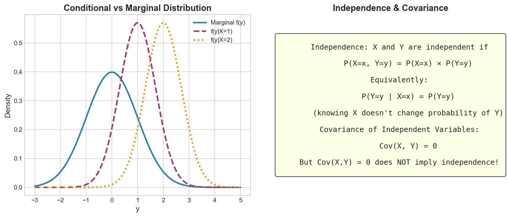

# Week 02: Independence and Expectations

**Course**: BSST1002 - Statistics II
**Level**: Foundation

---

## Visual Summary

---

## Learning Objectives
- Understand independence of random variables
- Master expectation properties for sums and products
- Apply variance rules for sums of random variables

---

## 1. Independence of Random Variables

### 1.1 Theory

**Independent random variables** have no relationship — knowing one tells you nothing about the other.

### 1.2 Mathematical Definition

$X$ and $Y$ are **independent** if and only if:

$$p_{X,Y}(x,y) = p_X(x) \cdot p_Y(y) \quad \forall x, y$$

### 1.3 Equivalent Conditions

| Condition | Formula |
|-----------|---------|
| **Joint = Product of Marginals** | $p_{X,Y}(x,y) = p_X(x) \cdot p_Y(y)$ |
| **Conditional = Marginal** | $p_{Y|X}(y|x) = p_Y(y)$ |
| **Covariance = 0** | $\text{Cov}(X,Y) = 0$ (necessary but not sufficient) |

### 1.4 Testing for Independence

To verify independence:
1. Compute joint distribution $p_{X,Y}(x,y)$
2. Compute marginals $p_X(x)$ and $p_Y(y)$
3. Check if $p_{X,Y}(x,y) = p_X(x) \cdot p_Y(y)$ for **all** $(x,y)$

### 1.5 Important Note

**Zero covariance ≠ Independence**

$\text{Cov}(X,Y) = 0$ means no *linear* relationship, but there could be a non-linear dependence.

Independence $\Rightarrow$ $\text{Cov}(X,Y) = 0$, but the converse is NOT true.

### 1.6 Supply Chain Application

**Retail Context**:
- Are demands at **different stores** independent?
- If **yes** → pooling inventory reduces variability (risk pooling)
- If **no** → must model the dependence structure

---

## 2. Expectations of Sums

### 2.1 Linearity of Expectation

**Always true** (regardless of dependence):

$$E[X + Y] = E[X] + E[Y]$$

$$E[aX + bY + c] = aE[X] + bE[Y] + c$$

### 2.2 Generalization

For any random variables $X_1, X_2, \ldots, X_n$:

$$E\left[\sum_{i=1}^n X_i\right] = \sum_{i=1}^n E[X_i]$$

### 2.3 Supply Chain Application

**Retail Context**:
- **Total expected demand** = sum of individual expected demands
- Works regardless of whether demands are correlated

---

## 3. Expectations of Products

### 3.1 General Case

$$E[XY] = E[X]E[Y] + \text{Cov}(X,Y)$$

### 3.2 If Independent

When $X$ and $Y$ are independent:

$$E[XY] = E[X] \cdot E[Y]$$

### 3.3 Generalization

For independent $X_1, X_2, \ldots, X_n$:

$$E\left[\prod_{i=1}^n X_i\right] = \prod_{i=1}^n E[X_i]$$

---

## 4. Variance of Sums

### 4.1 General Formula

$$\text{Var}(X + Y) = \text{Var}(X) + \text{Var}(Y) + 2\text{Cov}(X,Y)$$

### 4.2 If Independent

When $X$ and $Y$ are independent ($\text{Cov}(X,Y) = 0$):

$$\text{Var}(X + Y) = \text{Var}(X) + \text{Var}(Y)$$

### 4.3 Generalization

For $n$ independent random variables:

$$\text{Var}\left(\sum_{i=1}^n X_i\right) = \sum_{i=1}^n \text{Var}(X_i)$$

### 4.4 Standard Deviation of Sum

For independent variables:

$$\sigma_{X+Y} = \sqrt{\sigma_X^2 + \sigma_Y^2}$$

**Note**: Standard deviations do NOT add linearly!

---

## 5. Risk Pooling (Square Root Law)

### 5.1 Theory

When demands are independent and identically distributed (i.i.d.), pooling reduces relative variability.

### 5.2 Mathematical Result

For $n$ i.i.d. random variables with mean $\mu$ and std $\sigma$:

| Measure | Decentralized ($n$ locations) | Centralized (1 location) |
|---------|-------------------------------|--------------------------|
| Total Mean | $n\mu$ | $n\mu$ |
| Total Variance | $n\sigma^2$ | $n\sigma^2$ |
| Total Std Dev | $\sqrt{n}\sigma$ | $\sqrt{n}\sigma$ |
| CV (relative variability) | $\sigma/\mu$ per location | $\sigma/(\sqrt{n}\mu)$ overall |

### 5.3 The Square Root Law

**Safety stock scales with $\sqrt{n}$**, not $n$:

$$SS_{centralized} = SS_{single} \times \sqrt{n}$$

vs

$$SS_{decentralized} = SS_{single} \times n$$

**Savings ratio**: $\sqrt{n}/n = 1/\sqrt{n}$

### 5.4 Supply Chain Application

**Retail Context**:
- **Centralized inventory** is more efficient than decentralized
- **10 stores** centralized need $\sqrt{10} \approx 3.16$ times the safety stock of one store
- **10 stores** decentralized need $10$ times the safety stock
- **Savings**: About 68% reduction in safety stock

---

## Summary Table

| Concept | Formula | Condition |
|---------|---------|-----------|
| **Independence** | $p_{X,Y} = p_X \cdot p_Y$ | Definition |
| **E[X + Y]** | $E[X] + E[Y]$ | Always |
| **E[XY]** | $E[X] \cdot E[Y]$ | If independent |
| **Var(X + Y)** | $\text{Var}(X) + \text{Var}(Y)$ | If independent |
| **Var(X + Y)** | $\text{Var}(X) + \text{Var}(Y) + 2\text{Cov}(X,Y)$ | General |

---

## Key Takeaways

1. **Independence**: Joint = product of marginals; conditioning doesn't change distribution
2. **Expectation is always linear**: $E[X+Y] = E[X] + E[Y]$ regardless of dependence
3. **Variance of sum**: Includes covariance terms unless independent
4. **Risk pooling**: Centralized inventory reduces safety stock by $\sqrt{n}$ factor

---

## Next Week Preview

Week 3 covers more on **Expectations and Functions** of random variables.

---

*IIT Madras BS Degree in Data Science*
