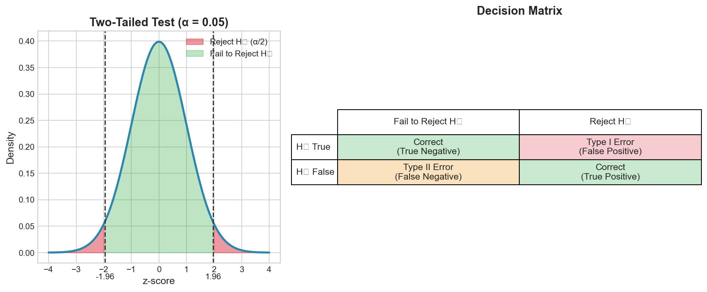

# Week 08: Hypothesis Testing I

**Course**: BSST1002 - Statistics II
**Level**: Foundation Level

---

## Visual Summary

---

## Learning Objectives
- Understand the hypothesis testing framework and its components
- Formulate null and alternative hypotheses correctly
- Perform one-sample tests for means (z-test and t-test)
- Distinguish between Type I and Type II errors

---

## 1. Hypothesis Testing Framework

### 1.1 Theory

**Hypothesis testing** is a formal statistical procedure for evaluating claims about population parameters using sample data.

**Key Concept**: We assume the null hypothesis is true and assess whether the observed data provides sufficient evidence against it.

### 1.2 Components of Hypothesis Testing

| Component | Description |
|-----------|-------------|
| **Null Hypothesis ($H_0$)** | The status quo or default assumption |
| **Alternative Hypothesis ($H_1$ or $H_a$)** | The claim we want to test/prove |
| **Test Statistic** | A value calculated from sample data |
| **p-value** | Probability of observing data as extreme or more extreme, given $H_0$ is true |
| **Significance Level (α)** | Threshold for rejecting $H_0$ (commonly 0.05) |

### 1.3 Mathematical Definition

$$\text{p-value} = P(\text{data as extreme or more extreme} \mid H_0 \text{ true})$$

**Decision Rule**:
- **Reject $H_0$** if p-value < α
- **Fail to reject $H_0$** if p-value ≥ α

### 1.4 Types of Alternative Hypotheses

| Type | Notation | Rejection Region |
|------|----------|------------------|
| Two-tailed | $H_1: \mu \neq \mu_0$ | Both tails |
| Left-tailed | $H_1: \mu < \mu_0$ | Left tail only |
| Right-tailed | $H_1: \mu > \mu_0$ | Right tail only |

### 1.5 Supply Chain Application

**Retail Context**:
- Testing if a new process improved lead time
- Evaluating if a marketing campaign increased conversion rate
- Assessing if a supplier meets quality standards
- Verifying if warehouse throughput meets targets

---

## 2. One-Sample Tests

### 2.1 Theory

**One-sample tests** compare a sample statistic to a hypothesized population value. Used when we have one sample and want to test a claim about the population parameter.

### 2.2 Mathematical Definition

**One-Sample z-test** (σ known):

$$z = \frac{\bar{X} - \mu_0}{\sigma/\sqrt{n}}$$

Where:
- $\bar{X}$ = sample mean
- $\mu_0$ = hypothesized population mean
- $\sigma$ = known population standard deviation
- $n$ = sample size

**One-Sample t-test** (σ unknown):

$$t = \frac{\bar{X} - \mu_0}{s/\sqrt{n}}$$

Where:
- $s$ = sample standard deviation
- Follows $t_{n-1}$ distribution under $H_0$

### 2.3 Steps for Hypothesis Testing

1. **State the hypotheses**: Define $H_0$ and $H_1$
2. **Choose significance level**: Set α (typically 0.05)
3. **Calculate test statistic**: Compute z or t from sample data
4. **Find p-value**: Probability under null distribution
5. **Make decision**: Compare p-value to α
6. **State conclusion**: Interpret in context

### 2.4 Supply Chain Application

**Retail Context**:
- **SLA Compliance**: Test if average lead time differs from SLA (e.g., $H_0: \mu = 5$ days)
- **Quality Control**: Test if defect rate exceeds acceptable threshold
- **Performance Standards**: Test if order processing time meets targets

---

## 3. Type I and Type II Errors

### 3.1 Theory

When making decisions based on hypothesis tests, two types of errors can occur:

| Decision | $H_0$ True | $H_0$ False |
|----------|------------|-------------|
| **Reject $H_0$** | Type I Error (α) | Correct Decision (Power) |
| **Fail to Reject $H_0$** | Correct Decision | Type II Error (β) |

### 3.2 Error Definitions

**Type I Error (α)**: Rejecting $H_0$ when it is actually true
- Also called: False Positive, "False Alarm"
- Probability: α (significance level)

**Type II Error (β)**: Failing to reject $H_0$ when it is actually false
- Also called: False Negative, "Missed Detection"
- Probability: β

**Power (1 - β)**: Probability of correctly rejecting a false $H_0$
- Higher power = better ability to detect true effects

### 3.3 Trade-off Between Errors

$$\text{Decreasing } \alpha \implies \text{Increasing } \beta$$

- Lowering α (stricter threshold) reduces false positives but increases false negatives
- The only way to reduce both errors is to **increase sample size**

### 3.4 Factors Affecting Power

| Factor | Effect on Power |
|--------|-----------------|
| Increase sample size (n) | Increases power |
| Increase significance level (α) | Increases power |
| Increase effect size | Increases power |
| Decrease variability (σ) | Increases power |

### 3.5 Supply Chain Context for Errors

| Error Type | Supply Chain Example | Consequence |
|------------|---------------------|-------------|
| Type I | Reject good supplier | Lose reliable partner |
| Type II | Accept bad supplier | Quality issues, returns |
| Type I | Flag normal process as faulty | Unnecessary intervention |
| Type II | Miss actual process failure | Production disruption |

---

## 4. Critical Value Approach

### 4.1 Alternative to p-value Method

Instead of computing p-values, we can compare the test statistic to critical values:

**Two-tailed test** (α = 0.05):
- Reject $H_0$ if $|z| > z_{0.025} = 1.96$

**One-tailed test** (α = 0.05):
- Right-tailed: Reject $H_0$ if $z > z_{0.05} = 1.645$
- Left-tailed: Reject $H_0$ if $z < -z_{0.05} = -1.645$

---

## Summary

| Concept | Definition | Key Formula/Insight |
|---------|------------|---------------------|
| Null Hypothesis ($H_0$) | Status quo assumption | What we assume true |
| Alternative Hypothesis ($H_1$) | Claim to test | What we want to prove |
| p-value | P(data \| $H_0$ true) | Reject if p < α |
| z-test | Test with known σ | $z = \frac{\bar{X} - \mu_0}{\sigma/\sqrt{n}}$ |
| t-test | Test with unknown σ | $t = \frac{\bar{X} - \mu_0}{s/\sqrt{n}}$ |
| Type I Error | Reject true $H_0$ | Probability = α |
| Type II Error | Fail to reject false $H_0$ | Probability = β |
| Power | Detect true effect | Power = 1 - β |

## Key Takeaways
- Hypothesis tests evaluate claims about population parameters using sample evidence
- The p-value represents the probability of observing the data (or more extreme) if $H_0$ is true
- Type I error (false positive) and Type II error (false negative) represent different decision mistakes
- There is a trade-off between α and β; increasing sample size reduces both errors

## Next Week Preview
Week 9 covers **Hypothesis Testing II** - two-sample tests comparing groups and introduction to ANOVA.

---
*IIT Madras BS Degree in Data Science*
