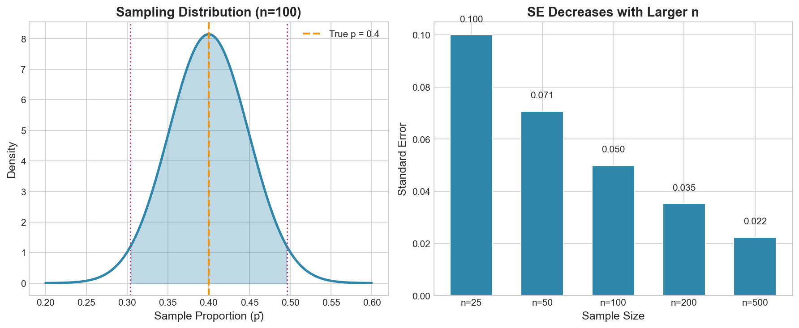

# Week 09: Hypothesis Testing II

**Course**: BSST1002 - Statistics II
**Level**: Foundation Level

---

## Visual Summary

---

## Learning Objectives
- Perform two-sample t-tests for comparing independent groups
- Apply paired t-tests for matched or before/after comparisons
- Use ANOVA to compare means across multiple groups
- Choose the appropriate test based on study design

---

## 1. Two-Sample t-Tests

### 1.1 Theory

**Two-sample t-tests** compare the means of two independent groups to determine if the difference is statistically significant.

**Key Assumption**: The two samples are independent (observations in one group don't affect the other).

### 1.2 Mathematical Definition

**Pooled Two-Sample t-Test** (assuming equal variances):

$$t = \frac{\bar{X}_1 - \bar{X}_2}{s_p\sqrt{\frac{1}{n_1} + \frac{1}{n_2}}}$$

Where the **pooled standard deviation** is:

$$s_p = \sqrt{\frac{(n_1-1)s_1^2 + (n_2-1)s_2^2}{n_1 + n_2 - 2}}$$

**Degrees of Freedom**: $df = n_1 + n_2 - 2$

### 1.3 Welch's t-Test (Unequal Variances)

When variances are unequal, use Welch's t-test:

$$t = \frac{\bar{X}_1 - \bar{X}_2}{\sqrt{\frac{s_1^2}{n_1} + \frac{s_2^2}{n_2}}}$$

With approximate degrees of freedom (Welch-Satterthwaite):

$$df \approx \frac{\left(\frac{s_1^2}{n_1} + \frac{s_2^2}{n_2}\right)^2}{\frac{(s_1^2/n_1)^2}{n_1-1} + \frac{(s_2^2/n_2)^2}{n_2-1}}$$

### 1.4 Hypotheses

| Type | Null Hypothesis | Alternative Hypothesis |
|------|-----------------|------------------------|
| Two-tailed | $H_0: \mu_1 = \mu_2$ | $H_1: \mu_1 \neq \mu_2$ |
| Left-tailed | $H_0: \mu_1 \geq \mu_2$ | $H_1: \mu_1 < \mu_2$ |
| Right-tailed | $H_0: \mu_1 \leq \mu_2$ | $H_1: \mu_1 > \mu_2$ |

### 1.5 Supply Chain Application

**Retail Context**:
- Compare lead times between two suppliers
- Compare sales performance between two regions
- Compare fulfillment times between warehouses
- Compare customer satisfaction scores between channels

---

## 2. Paired t-Tests

### 2.1 Theory

**Paired t-tests** are used when observations are naturally paired or matched:
- Before/after measurements on the same subjects
- Matched pairs (e.g., same store, different time periods)
- Twin studies or matched case-control designs

**Key Idea**: Analyze the differences within pairs, reducing variability from individual differences.

### 2.2 Mathematical Definition

For paired observations $(X_{1i}, X_{2i})$, compute differences:

$$d_i = X_{1i} - X_{2i}$$

**Paired t-statistic**:

$$t = \frac{\bar{d}}{s_d / \sqrt{n}}$$

Where:
- $\bar{d}$ = mean of differences
- $s_d$ = standard deviation of differences
- $n$ = number of pairs

**Degrees of Freedom**: $df = n - 1$

### 2.3 Hypotheses

| Type | Null Hypothesis | Alternative Hypothesis |
|------|-----------------|------------------------|
| Two-tailed | $H_0: \mu_d = 0$ | $H_1: \mu_d \neq 0$ |
| Left-tailed | $H_0: \mu_d \geq 0$ | $H_1: \mu_d < 0$ |
| Right-tailed | $H_0: \mu_d \leq 0$ | $H_1: \mu_d > 0$ |

### 2.4 Supply Chain Application

**Retail Context**:
- Before/after process improvement analysis
- Same store sales across different periods
- A/B test results on the same customers
- Training effectiveness (pre-test vs post-test)

---

## 3. Analysis of Variance (ANOVA)

### 3.1 Theory

**ANOVA** (Analysis of Variance) compares means across **three or more groups** simultaneously.

**Why not multiple t-tests?**
- Multiple t-tests inflate Type I error rate
- With k groups: $\binom{k}{2}$ pairwise comparisons
- ANOVA controls overall error rate

### 3.2 Mathematical Definition

**F-statistic**:

$$F = \frac{\text{Between-group variance (MSB)}}{\text{Within-group variance (MSW)}}$$

Where:
- **MSB** (Mean Square Between): Variance due to differences between group means
- **MSW** (Mean Square Within): Variance due to differences within groups

### 3.3 ANOVA Table

| Source | Sum of Squares | df | Mean Square | F |
|--------|---------------|-----|-------------|---|
| Between | SSB | k - 1 | MSB = SSB/(k-1) | MSB/MSW |
| Within | SSW | N - k | MSW = SSW/(N-k) | |
| Total | SST | N - 1 | | |

Where:
- $k$ = number of groups
- $N$ = total sample size
- $SST = SSB + SSW$

### 3.4 Hypotheses

$$H_0: \mu_1 = \mu_2 = \cdots = \mu_k$$
$$H_1: \text{At least one mean is different}$$

### 3.5 Assumptions of ANOVA

1. **Independence**: Observations are independent
2. **Normality**: Each group is approximately normally distributed
3. **Homogeneity of Variance**: Equal variances across groups (Levene's test)

### 3.6 Post-Hoc Tests

If ANOVA is significant, use post-hoc tests to identify which groups differ:

| Test | Description |
|------|-------------|
| **Tukey's HSD** | Controls family-wise error rate; all pairwise comparisons |
| **Bonferroni** | Conservative adjustment; α/m for m comparisons |
| **Scheffé** | Most conservative; for complex contrasts |
| **Dunnett's** | Compare all groups to a control group |

### 3.7 Supply Chain Application

**Retail Context**:
- Compare performance across multiple warehouses
- Analyze sales differences across product categories
- Compare lead times across multiple suppliers
- Evaluate demand patterns across different time periods

---

## 4. Choosing the Right Test

| Scenario | Test | Key Characteristic |
|----------|------|-------------------|
| One sample vs. known value | One-sample t-test | Single group |
| Two independent groups | Two-sample t-test | Unrelated samples |
| Two related/paired groups | Paired t-test | Before/after, matched pairs |
| Three or more groups | One-way ANOVA | Multiple independent groups |
| Categorical variables | Chi-square test | Association between categories |

---

## Summary

| Concept | Formula | Use Case |
|---------|---------|----------|
| Two-sample t-test | $t = \frac{\bar{X}_1 - \bar{X}_2}{s_p\sqrt{1/n_1 + 1/n_2}}$ | Compare two independent groups |
| Paired t-test | $t = \frac{\bar{d}}{s_d/\sqrt{n}}$ | Before/after, matched pairs |
| ANOVA F-statistic | $F = \frac{MSB}{MSW}$ | Compare 3+ groups |
| Post-hoc tests | Tukey, Bonferroni, etc. | Identify which groups differ |

## Key Takeaways
- Two-sample t-tests compare means of independent groups; paired t-tests compare matched observations
- Paired t-tests are more powerful when pairing is appropriate (controls for individual variation)
- ANOVA extends comparison to multiple groups while controlling Type I error
- Post-hoc tests are needed after significant ANOVA to identify specific group differences

## Next Week Preview
Week 10 covers **Simple Regression** - modeling and quantifying relationships between variables.

---
*IIT Madras BS Degree in Data Science*
