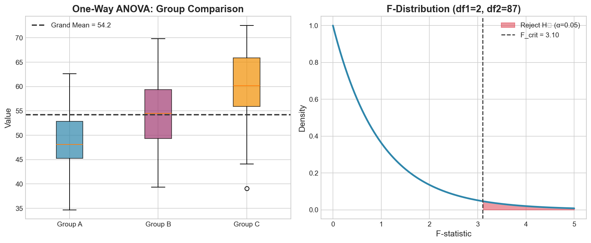

# Week 11: Multiple Regression

**Course**: BSST1002 - Statistics II
**Level**: Foundation Level

---

## Visual Summary

---

## Learning Objectives
- Extend simple regression to multiple predictor variables
- Interpret partial regression coefficients
- Handle categorical predictors using dummy variables
- Perform model selection using adjusted R²

---

## 1. Multiple Regression Model

### 1.1 Theory

**Multiple regression** extends simple regression by including multiple predictor variables to explain variation in the response. This allows us to:
- Control for confounding variables
- Model complex relationships
- Improve prediction accuracy

### 1.2 Mathematical Definition

**Population Model**:

$$Y = \beta_0 + \beta_1 X_1 + \beta_2 X_2 + \cdots + \beta_p X_p + \epsilon$$

Where:
- $Y$ = response variable
- $X_1, X_2, \ldots, X_p$ = predictor variables
- $\beta_0$ = intercept
- $\beta_1, \beta_2, \ldots, \beta_p$ = partial regression coefficients
- $\epsilon$ = error term, $\epsilon \sim N(0, \sigma^2)$
- $p$ = number of predictors

**Matrix Form**:

$$\mathbf{Y} = \mathbf{X}\boldsymbol{\beta} + \boldsymbol{\epsilon}$$

**OLS Estimate**:

$$\hat{\boldsymbol{\beta}} = (\mathbf{X}^T\mathbf{X})^{-1}\mathbf{X}^T\mathbf{Y}$$

### 1.3 Partial Regression Coefficients

**Key Interpretation**: $\beta_j$ represents the expected change in Y for a one-unit increase in $X_j$, **holding all other predictors constant**.

This "ceteris paribus" interpretation is crucial:
- Simple regression: Total effect of X on Y
- Multiple regression: Partial effect, controlling for other variables

### 1.4 Supply Chain Application

**Retail Context**:
- **Demand Model**: Demand as function of price, promotion, seasonality, competition
- **Revenue Model**: Revenue driven by multiple factors (traffic, conversion, basket size)
- **Cost Model**: Total cost as function of volume, distance, fuel price
- **Lead Time Model**: Delivery time affected by distance, order size, carrier

---

## 2. Categorical Predictors and Dummy Variables

### 2.1 Theory

Categorical (qualitative) variables cannot be used directly in regression. We encode them as **dummy variables** (also called indicator variables).

**Rule**: For a categorical variable with $k$ categories, create $k-1$ dummy variables.

### 2.2 Dummy Variable Encoding

**Example**: Region with categories {North, South, West}

| Observation | Region | D_South | D_West |
|-------------|--------|---------|--------|
| 1 | North | 0 | 0 |
| 2 | South | 1 | 0 |
| 3 | West | 0 | 1 |
| 4 | North | 0 | 0 |

- **Reference Category**: North (both dummies = 0)
- **D_South = 1**: Indicates South region
- **D_West = 1**: Indicates West region

### 2.3 Interpreting Dummy Coefficients

**Model**: $Y = \beta_0 + \beta_1 \cdot D_{South} + \beta_2 \cdot D_{West} + \epsilon$

| Coefficient | Interpretation |
|-------------|----------------|
| $\beta_0$ | Mean Y for reference category (North) |
| $\beta_1$ | Difference in mean Y: South vs. North |
| $\beta_2$ | Difference in mean Y: West vs. North |

### 2.4 Why k-1 Dummies?

Using k dummies creates **perfect multicollinearity** (dummy trap):
$$D_{North} + D_{South} + D_{West} = 1 \text{ (always)}$$

This makes the matrix $\mathbf{X}^T\mathbf{X}$ singular (non-invertible).

---

## 3. Model Selection

### 3.1 Theory

Adding more predictors always increases R², but may lead to **overfitting**. We need criteria that balance fit and complexity.

### 3.2 Adjusted R²

**Adjusted R²** penalizes for adding variables that don't improve the model:

$$R^2_{adj} = 1 - \frac{(1-R^2)(n-1)}{n-p-1}$$

Where:
- $n$ = sample size
- $p$ = number of predictors
- $R^2$ = regular coefficient of determination

**Properties**:
- $R^2_{adj} \leq R^2$ always
- $R^2_{adj}$ can decrease when adding useless predictors
- Prefer model with higher $R^2_{adj}$

### 3.3 Other Model Selection Criteria

| Criterion | Formula | Goal |
|-----------|---------|------|
| **AIC** | $n \ln(SS_{res}/n) + 2p$ | Minimize |
| **BIC** | $n \ln(SS_{res}/n) + p \ln(n)$ | Minimize |
| **Mallows' Cp** | $\frac{SS_{res}}{MSE_{full}} - n + 2(p+1)$ | Close to p+1 |

- **AIC** (Akaike Information Criterion): Balances fit and complexity
- **BIC** (Bayesian Information Criterion): Stronger penalty for complexity
- BIC tends to select simpler models than AIC

### 3.4 Variable Selection Methods

| Method | Description |
|--------|-------------|
| **Forward Selection** | Start empty, add one variable at a time |
| **Backward Elimination** | Start full, remove one variable at a time |
| **Stepwise** | Combination of forward and backward |
| **Best Subsets** | Evaluate all possible combinations |

---

## 4. Multicollinearity

### 4.1 Definition

**Multicollinearity** occurs when predictor variables are highly correlated with each other.

### 4.2 Problems Caused

- Inflated standard errors of coefficients
- Unstable coefficient estimates
- Difficulty interpreting individual effects
- Coefficients may have unexpected signs

### 4.3 Detection

**Variance Inflation Factor (VIF)**:

$$VIF_j = \frac{1}{1 - R^2_j}$$

Where $R^2_j$ is the R² from regressing $X_j$ on all other predictors.

| VIF Value | Interpretation |
|-----------|----------------|
| 1 | No correlation |
| 1 - 5 | Moderate correlation |
| 5 - 10 | High correlation (concern) |
| > 10 | Severe multicollinearity |

### 4.4 Solutions

- Remove highly correlated predictors
- Combine correlated variables (e.g., PCA)
- Use regularization (Ridge, Lasso)
- Collect more data

---

## 5. Model Assumptions

### 5.1 Assumptions for Multiple Regression

1. **Linearity**: Y is linear in the predictors
2. **Independence**: Observations are independent
3. **Homoscedasticity**: Constant variance of residuals
4. **Normality**: Residuals are normally distributed
5. **No Multicollinearity**: Predictors not highly correlated

### 5.2 Diagnostic Checks

| Assumption | Diagnostic |
|------------|------------|
| Linearity | Residual vs. fitted plot, partial regression plots |
| Homoscedasticity | Residual vs. fitted plot (no funnel shape) |
| Normality | Q-Q plot of residuals |
| Multicollinearity | VIF values, correlation matrix |

---

## Summary

| Concept | Formula/Definition | Key Insight |
|---------|-------------------|-------------|
| Multiple Regression | $Y = \beta_0 + \sum \beta_j X_j + \epsilon$ | Multiple predictors |
| Partial Coefficient | $\beta_j$ | Effect holding others constant |
| Dummy Variables | k-1 dummies for k categories | Encode categorical predictors |
| Adjusted R² | $1 - \frac{(1-R^2)(n-1)}{n-p-1}$ | Penalizes for complexity |
| VIF | $\frac{1}{1-R^2_j}$ | Detects multicollinearity |

## Key Takeaways
- Multiple regression includes several predictors: Y = β₀ + β₁X₁ + β₂X₂ + ... + ε
- Partial coefficients represent the effect of each variable holding others constant
- Categorical variables require dummy encoding (k-1 dummies for k categories)
- Model selection balances fit and complexity; use adjusted R², AIC, or BIC

## Next Week Preview
Week 12 covers **Review and Applications** - comprehensive review with supply chain case studies.

---
*IIT Madras BS Degree in Data Science*
