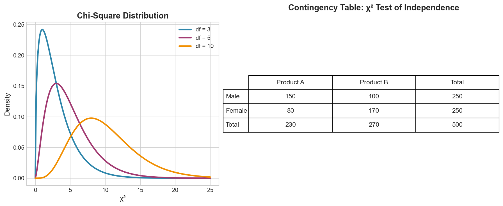

# Week 12: Review and Applications

**Course**: BSST1002 - Statistics II
**Level**: Foundation Level

---

## Visual Summary

---

## Learning Objectives
- Review all key concepts from Statistics II
- Integrate statistical methods for real-world applications
- Apply comprehensive analysis to supply chain problems
- Prepare for advanced courses in data science

---

## Part 1: Joint Distributions Review (Weeks 1-5)

### Key Concepts

| Topic | Key Formula/Concept |
|-------|---------------------|
| **Joint PMF/PDF** | $p_{X,Y}(x,y)$ or $f_{X,Y}(x,y)$ |
| **Marginal Distribution** | Sum/integrate out other variables |
| **Conditional Distribution** | $p_{Y|X}(y|x) = \frac{p_{X,Y}(x,y)}{p_X(x)}$ |
| **Independence** | $p_{X,Y}(x,y) = p_X(x) \cdot p_Y(y)$ |
| **Covariance** | $Cov(X,Y) = E[XY] - E[X]E[Y]$ |
| **Correlation** | $\rho = \frac{Cov(X,Y)}{\sigma_X \sigma_Y}$ |

### Limit Theorems

| Theorem | Statement |
|---------|-----------|
| **Law of Large Numbers** | $\bar{X}_n \xrightarrow{p} \mu$ as $n \to \infty$ |
| **Central Limit Theorem** | $\frac{\bar{X}_n - \mu}{\sigma/\sqrt{n}} \xrightarrow{d} N(0,1)$ |

---

## Part 2: Estimation Review (Weeks 6-7)

### Point Estimation Methods

| Method | Approach |
|--------|----------|
| **Maximum Likelihood (MLE)** | Maximize $L(\theta) = \prod f(x_i; \theta)$ |
| **Method of Moments (MoM)** | Match sample moments to population moments |

### Estimator Properties

| Property | Definition |
|----------|------------|
| **Unbiased** | $E[\hat{\theta}] = \theta$ |
| **Consistent** | $\hat{\theta} \xrightarrow{p} \theta$ as $n \to \infty$ |
| **Efficient** | Achieves minimum variance (Cramér-Rao bound) |

### Confidence Intervals

| Parameter | Formula |
|-----------|---------|
| **Mean (σ unknown)** | $\bar{X} \pm t_{\alpha/2, n-1} \cdot \frac{s}{\sqrt{n}}$ |
| **Mean (σ known)** | $\bar{X} \pm z_{\alpha/2} \cdot \frac{\sigma}{\sqrt{n}}$ |
| **Proportion** | $\hat{p} \pm z_{\alpha/2} \sqrt{\frac{\hat{p}(1-\hat{p})}{n}}$ |

---

## Part 3: Hypothesis Testing Review (Weeks 8-9)

### Framework

| Component | Description |
|-----------|-------------|
| **Null Hypothesis ($H_0$)** | Status quo assumption |
| **Alternative ($H_1$)** | Claim to test |
| **p-value** | $P(\text{data as extreme} \mid H_0 \text{ true})$ |
| **Decision** | Reject $H_0$ if p-value < α |

### Types of Errors

| | $H_0$ True | $H_0$ False |
|---|------------|-------------|
| **Reject $H_0$** | Type I Error (α) | Correct (Power) |
| **Fail to Reject** | Correct | Type II Error (β) |

### Test Statistics

| Test | Statistic | Use Case |
|------|-----------|----------|
| **One-sample t** | $t = \frac{\bar{X} - \mu_0}{s/\sqrt{n}}$ | One sample vs. hypothesized value |
| **Two-sample t** | $t = \frac{\bar{X}_1 - \bar{X}_2}{s_p\sqrt{1/n_1 + 1/n_2}}$ | Compare two independent groups |
| **Paired t** | $t = \frac{\bar{d}}{s_d/\sqrt{n}}$ | Before/after, matched pairs |
| **ANOVA F** | $F = \frac{MSB}{MSW}$ | Compare 3+ groups |

---

## Part 4: Regression Review (Weeks 10-11)

### Simple Linear Regression

$$Y = \beta_0 + \beta_1 X + \epsilon$$

| Component | Formula |
|-----------|---------|
| **Slope** | $\hat{\beta}_1 = r \cdot \frac{s_Y}{s_X}$ |
| **Intercept** | $\hat{\beta}_0 = \bar{Y} - \hat{\beta}_1 \bar{X}$ |
| **R²** | $R^2 = 1 - \frac{SS_{res}}{SS_{tot}}$ |

### Multiple Regression

$$Y = \beta_0 + \beta_1 X_1 + \beta_2 X_2 + \cdots + \beta_p X_p + \epsilon$$

| Concept | Key Point |
|---------|-----------|
| **Partial Coefficient** | Effect of $X_j$ holding others constant |
| **Dummy Variables** | k-1 dummies for k categories |
| **Adjusted R²** | $R^2_{adj} = 1 - \frac{(1-R^2)(n-1)}{n-p-1}$ |
| **VIF** | Detect multicollinearity; concern if VIF > 5 |

### Regression Assumptions

1. Linearity
2. Independence
3. Homoscedasticity (constant variance)
4. Normality of residuals
5. No multicollinearity (multiple regression)

---

## Comprehensive Formula Sheet

### Estimation Formulas

| Formula | Description |
|---------|-------------|
| $\bar{X} \pm t_{\alpha/2} \frac{s}{\sqrt{n}}$ | CI for mean (σ unknown) |
| $\hat{p} \pm z_{\alpha/2} \sqrt{\frac{\hat{p}(1-\hat{p})}{n}}$ | CI for proportion |
| $n = \left(\frac{z_{\alpha/2} \cdot \sigma}{E}\right)^2$ | Sample size for mean |

### Hypothesis Test Formulas

| Test | Statistic |
|------|-----------|
| One-sample t | $t = \frac{\bar{X} - \mu_0}{s/\sqrt{n}}$ |
| Two-sample t (pooled) | $t = \frac{\bar{X}_1 - \bar{X}_2}{s_p\sqrt{1/n_1 + 1/n_2}}$ |
| Paired t | $t = \frac{\bar{d}}{s_d/\sqrt{n}}$ |
| ANOVA | $F = \frac{MSB}{MSW}$ |

### Regression Formulas

| Formula | Description |
|---------|-------------|
| $\hat{\beta}_1 = \frac{\sum(x_i - \bar{x})(y_i - \bar{y})}{\sum(x_i - \bar{x})^2}$ | Slope (OLS) |
| $\hat{\beta}_1 = r\frac{s_Y}{s_X}$ | Slope (correlation form) |
| $R^2 = 1 - \frac{SS_{res}}{SS_{tot}}$ | Coefficient of determination |
| $s_e = \sqrt{\frac{SS_{res}}{n-2}}$ | Standard error of estimate |

---

## Supply Chain Applications Summary

| Statistical Method | Supply Chain Application |
|--------------------|-------------------------|
| **Joint Distributions** | Model dependencies between demand and lead time |
| **Confidence Intervals** | Quantify uncertainty in demand forecasts |
| **Hypothesis Testing** | Evaluate supplier performance, test process improvements |
| **Regression** | Build demand models, price-elasticity analysis |
| **ANOVA** | Compare performance across warehouses/suppliers |

---

## Course Conclusion

### Statistics I + II Foundation Covered

| Course | Key Topics |
|--------|------------|
| **Statistics I** | Data types, descriptive statistics, probability, distributions |
| **Statistics II** | Joint distributions, estimation, hypothesis testing, regression |

### Skills Acquired

- ✅ Summarize and visualize data appropriately
- ✅ Work with probability distributions (discrete and continuous)
- ✅ Analyze relationships between multiple random variables
- ✅ Construct confidence intervals for means and proportions
- ✅ Perform hypothesis tests and interpret results
- ✅ Build and interpret regression models

### Ready for Advanced Topics

- Machine Learning and Predictive Modeling
- Time Series Analysis and Forecasting
- A/B Testing and Experimental Design
- Bayesian Statistics
- Multivariate Analysis

---

## Key Takeaways

- Joint distributions capture relationships between random variables; independence simplifies analysis
- Point estimators should be unbiased and consistent; MLE and MoM are primary estimation methods
- Hypothesis testing provides formal framework for making decisions with uncertainty
- Regression models relationships; always check assumptions before interpreting results

---

*Congratulations on completing Statistics II!*
*IIT Madras BS Degree in Data Science*
